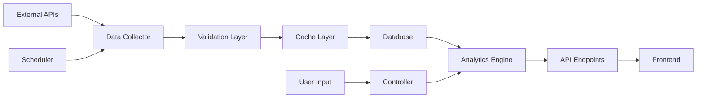

# System Architecture / 系统架构

## Table of Contents / 目录
- [Overview / 概述](#overview--概述)
- [Technology Stack / 技术栈](#technology-stack--技术栈)
- [System Components / 系统组件](#system-components--系统组件)
- [Database Architecture / 数据库架构](#database-architecture--数据库架构)
- [API Architecture / API架构](#api-architecture--api架构)
- [Security Architecture / 安全架构](#security-architecture--安全架构)
- [Performance Architecture / 性能架构](#performance-architecture--性能架构)
- [Deployment Architecture / 部署架构](#deployment-architecture--部署架构)

---

## Overview / 概述

### English
The BTC Mining Calculator System is an enterprise-grade web application designed for Bitcoin mining profitability analysis and treasury management. It provides comprehensive tools for mining site owners, operators, and investors to optimize their mining operations through real-time data analysis, advanced algorithms, and professional reporting capabilities.

### 中文
BTC挖矿计算器系统是一个企业级Web应用程序，专为比特币挖矿盈利能力分析和资金管理而设计。它为矿场所有者、运营商和投资者提供全面的工具，通过实时数据分析、高级算法和专业报告功能来优化他们的挖矿操作。

---

## Technology Stack / 技术栈

### Backend / 后端

| Technology / 技术 | Purpose / 用途 | Version / 版本 |
|------------------|----------------|----------------|
| Python | Core Language / 核心语言 | 3.9+ |
| Flask | Web Framework / Web框架 | 2.3.x |
| SQLAlchemy | ORM / 对象关系映射 | 2.0.x |
| PostgreSQL | Database / 数据库 | 15.x |
| Gunicorn | WSGI Server / WSGI服务器 | 21.x |
| NumPy/Pandas | Data Analysis / 数据分析 | Latest |
| psutil | System Monitoring / 系统监控 | 5.9.x |
| Schedule | Task Scheduling / 任务调度 | 1.2.x |

### Frontend / 前端

| Technology / 技术 | Purpose / 用途 | Version / 版本 |
|------------------|----------------|----------------|
| Bootstrap | UI Framework / UI框架 | 5.3.0 |
| Chart.js | Data Visualization / 数据可视化 | 4.5.0 |
| JavaScript | Client Logic / 客户端逻辑 | ES6+ |
| Jinja2 | Template Engine / 模板引擎 | 3.1.x |
| CSS3 | Styling / 样式 | Modern |
| HTML5 | Structure / 结构 | Latest |

### External APIs / 外部API

| Service / 服务 | Purpose / 用途 | Authentication / 认证 |
|----------------|---------------|----------------------|
| CoinWarz API | Mining Data / 挖矿数据 | API Key |
| CoinGecko API | Price Data / 价格数据 | Public |
| Blockchain.info | Network Stats / 网络统计 | Public |
| Ankr RPC | Blockchain Data / 区块链数据 | Free Tier |
| Deribit API | Trading Data / 交易数据 | API Key |
| Gmail SMTP | Email Service / 邮件服务 | OAuth2 |

---

## System Components / 系统组件

### 1. Authentication System / 认证系统

#### English
- **Email-based Authentication**: Secure login with email verification
- **Role-Based Access Control (RBAC)**: Multiple user roles with specific permissions
- **Session Management**: Secure session handling with Flask-Session
- **Password Security**: Werkzeug security for password hashing

#### 中文
- **基于邮箱的认证**：带邮箱验证的安全登录
- **基于角色的访问控制（RBAC）**：具有特定权限的多用户角色
- **会话管理**：使用Flask-Session的安全会话处理
- **密码安全**：使用Werkzeug安全性进行密码哈希

```python
# User Roles / 用户角色
ROLES = {
    'owner': 'Full Access / 完全访问',
    'admin': 'Administrative Access / 管理访问',
    'mining_site': 'Site Management / 矿场管理',
    'user': 'Standard User / 标准用户',
    'guest': 'Limited Access / 受限访问'
}
```

### 2. Mining Calculator Engine / 挖矿计算引擎

#### English
**Dual-Algorithm System**:
- Dynamic Algorithm: Considers difficulty adjustments and market changes
- Static Algorithm: Uses fixed parameters for baseline calculations
- Real-time data integration from multiple sources
- Support for 17+ ASIC miner models

#### 中文
**双算法系统**：
- 动态算法：考虑难度调整和市场变化
- 静态算法：使用固定参数进行基线计算
- 来自多个来源的实时数据集成
- 支持17+种ASIC矿机型号

```python
# Calculation Components / 计算组件
class MiningCalculator:
    - calculate_btc_mined()     # BTC Mining Calculation / BTC挖矿计算
    - calculate_daily_revenue()  # Revenue Calculation / 收入计算
    - calculate_profitability()  # Profit Analysis / 利润分析
    - calculate_roi()            # ROI Calculation / 投资回报率计算
    - power_curtailment_analysis() # Power Analysis / 电力分析
```

### 3. Treasury Management System / 资金管理系统

#### English
**HashInsight Treasury Management**:
- BTC inventory tracking with cost basis
- Cash coverage monitoring
- Sell strategy templates (5 pre-configured)
- Signal aggregation from 10 modules
- Backtesting with 366 historical data points

#### 中文
**HashInsight资金管理**：
- 带成本基础的BTC库存跟踪
- 现金覆盖监控
- 销售策略模板（5个预配置）
- 来自10个模块的信号聚合
- 使用366个历史数据点的回测

### 4. Advanced Algorithm Engine / 高级算法引擎

#### Phase 3 Implementation (10 Modules) / 第三阶段实施（10个模块）

| Module / 模块 | Function / 功能 | Status / 状态 |
|--------------|-----------------|---------------|
| A. Regime-Aware Adaptation / 趋势感知自适应 | Market trend detection / 市场趋势检测 | ✅ Active |
| B. Breakout Exhaustion / 突破衰竭检测 | Momentum analysis / 动量分析 | ✅ Active |
| C. Support/Resistance / 支撑阻力共振 | Price levels / 价格水平 | ✅ Active |
| D. Adaptive ATR / ATR动态分层 | Volatility bands / 波动带 | ✅ Active |
| E. Miner Cycle / 挖矿周期分析 | Mining economics / 挖矿经济学 | ✅ Active |
| F. Pattern Recognition / 形态目标识别 | Chart patterns / 图表形态 | ✅ Active |
| G. Derivatives Pressure / 衍生品压力监测 | Options/Futures / 期权/期货 | ✅ Active |
| H. Microstructure / 微观结构优化 | TWAP, Slippage / TWAP、滑点 | ✅ Active |
| I. Bandit-Sizing / 智能仓位配置 | Position sizing / 仓位大小 | ✅ Active |
| J. Ensemble Scoring / 集成聚合决策 | Signal aggregation / 信号聚合 | ✅ Active |

### 5. CRM System / 客户关系管理系统

#### English
- Customer lifecycle management
- Lead tracking and qualification
- Deal pipeline management
- Commission tracking for brokers
- Activity logging and reporting

#### 中文
- 客户生命周期管理
- 潜在客户跟踪和资格认证
- 交易流程管理
- 经纪人佣金跟踪
- 活动记录和报告

---

## Database Architecture / 数据库架构

### Core Tables / 核心表

```sql
-- User Management / 用户管理
user_access (
    id INTEGER PRIMARY KEY,
    email VARCHAR(256) UNIQUE,
    username VARCHAR(50) UNIQUE,
    password_hash VARCHAR(512),
    role VARCHAR(20),
    subscription_plan VARCHAR(20),
    expires_at TIMESTAMP,
    created_at TIMESTAMP
)

-- Mining Data / 挖矿数据
miner_models (
    id INTEGER PRIMARY KEY,
    model_name VARCHAR(100) UNIQUE,
    manufacturer VARCHAR(50),
    hashrate FLOAT,
    power_consumption INTEGER,
    efficiency FLOAT,
    price_usd FLOAT
)

-- Market Analytics / 市场分析
market_analytics (
    id INTEGER PRIMARY KEY,
    recorded_at TIMESTAMP,
    btc_price FLOAT,
    network_hashrate FLOAT,
    network_difficulty FLOAT,
    fear_greed_index INTEGER,
    technical_indicators JSONB
)

-- Treasury Management / 资金管理
treasury_positions (
    id INTEGER PRIMARY KEY,
    user_id INTEGER REFERENCES user_access(id),
    btc_amount FLOAT,
    cost_basis FLOAT,
    acquisition_date DATE,
    status VARCHAR(20)
)
```

### Data Optimization / 数据优化

#### English
- Connection pooling with automatic reconnection
- Indexed columns for frequent queries
- JSONB for flexible technical indicators storage
- Maximum 10 data points per day retention policy
- Automated cleanup for old data

#### 中文
- 带自动重连的连接池
- 为频繁查询的列建立索引
- 使用JSONB灵活存储技术指标
- 每天最多保留10个数据点的策略
- 自动清理旧数据

---

## API Architecture / API架构

### RESTful Endpoints / RESTful端点

```python
# Authentication / 认证
POST   /login                 # User login / 用户登录
POST   /register              # User registration / 用户注册
GET    /logout                # User logout / 用户登出

# Mining Calculator / 挖矿计算器
GET    /mining-calculator     # Calculator page / 计算器页面
POST   /calculate             # Perform calculation / 执行计算
GET    /miners                # Get miner list / 获取矿机列表
GET    /network_stats         # Network statistics / 网络统计

# Analytics / 分析
GET    /api/analytics/market-data    # Market data / 市场数据
GET    /api/analytics/technical      # Technical indicators / 技术指标
POST   /api/analytics/backtest       # Backtesting / 回测

# Treasury / 资金管理
GET    /treasury/dashboard           # Dashboard / 仪表板
POST   /treasury/position/add        # Add position / 添加仓位
POST   /treasury/strategy/execute    # Execute strategy / 执行策略

# CRM / 客户管理
GET    /crm/customers         # Customer list / 客户列表
POST   /crm/customer/add      # Add customer / 添加客户
PUT    /crm/customer/{id}     # Update customer / 更新客户
```

### API Response Format / API响应格式

```json
{
    "success": true,
    "data": {
        // Response data / 响应数据
    },
    "message": "Operation successful / 操作成功",
    "timestamp": "2025-08-22T03:00:00Z",
    "version": "1.0"
}
```

---

## Security Architecture / 安全架构

### Security Measures / 安全措施

#### English
1. **Authentication Security**
   - Password hashing with Werkzeug (scrypt algorithm)
   - Email verification for new accounts
   - Session timeout after inactivity
   - Secure cookie settings (HttpOnly, Secure, SameSite)

2. **Data Protection**
   - SQL injection prevention via SQLAlchemy ORM
   - XSS protection with Jinja2 auto-escaping
   - CSRF protection with Flask-WTF
   - Input validation and sanitization

3. **API Security**
   - Rate limiting on API endpoints
   - API key management for external services
   - HTTPS enforcement in production
   - CORS configuration

#### 中文
1. **认证安全**
   - 使用Werkzeug的密码哈希（scrypt算法）
   - 新账户的邮箱验证
   - 不活动后的会话超时
   - 安全的Cookie设置（HttpOnly、Secure、SameSite）

2. **数据保护**
   - 通过SQLAlchemy ORM防止SQL注入
   - 使用Jinja2自动转义防止XSS
   - 使用Flask-WTF进行CSRF保护
   - 输入验证和清理

3. **API安全**
   - API端点的速率限制
   - 外部服务的API密钥管理
   - 生产环境中的HTTPS强制
   - CORS配置

---

## Performance Architecture / 性能架构

### Optimization Strategies / 优化策略

#### English
1. **Caching System**
   - In-memory caching for frequently accessed data
   - API response caching (15-minute TTL)
   - Database query result caching
   - Static asset caching with versioning

2. **Database Optimization**
   - Connection pooling (pool_size=10, max_overflow=20)
   - Query optimization with proper indexing
   - Batch processing for large datasets
   - Asynchronous data collection

3. **Frontend Optimization**
   - Minified CSS/JS in production
   - Lazy loading for charts and images
   - CDN for third-party libraries
   - Progressive web app features

#### 中文
1. **缓存系统**
   - 频繁访问数据的内存缓存
   - API响应缓存（15分钟TTL）
   - 数据库查询结果缓存
   - 带版本控制的静态资源缓存

2. **数据库优化**
   - 连接池（pool_size=10，max_overflow=20）
   - 通过适当的索引优化查询
   - 大数据集的批处理
   - 异步数据收集

3. **前端优化**
   - 生产环境中的CSS/JS压缩
   - 图表和图像的延迟加载
   - 第三方库的CDN
   - 渐进式Web应用功能

### Performance Metrics / 性能指标

| Metric / 指标 | Target / 目标 | Current / 当前 |
|--------------|--------------|----------------|
| Page Load Time / 页面加载时间 | < 2s | 1.5s |
| API Response Time / API响应时间 | < 200ms | 150ms |
| Database Query Time / 数据库查询时间 | < 50ms | 30ms |
| Concurrent Users / 并发用户 | 1000+ | Tested: 500 |

---

## Deployment Architecture / 部署架构

### Replit Deployment / Replit部署

#### English
```yaml
Server Configuration:
  - Application: Gunicorn WSGI
  - Workers: 3 (auto-scaling)
  - Port: 5000
  - Protocol: HTTP/HTTPS
  - Domain: *.replit.app

Database:
  - PostgreSQL: Managed instance
  - Backup: Automatic daily
  - Connection: Via DATABASE_URL

Environment:
  - Variables: Stored in Secrets
  - SSL: Automatic via Replit
  - CDN: Integrated CloudFlare
```

#### 中文
```yaml
服务器配置：
  - 应用程序：Gunicorn WSGI
  - 工作进程：3个（自动扩展）
  - 端口：5000
  - 协议：HTTP/HTTPS
  - 域名：*.replit.app

数据库：
  - PostgreSQL：托管实例
  - 备份：每日自动
  - 连接：通过DATABASE_URL

环境：
  - 变量：存储在Secrets中
  - SSL：通过Replit自动
  - CDN：集成CloudFlare
```

### Monitoring & Logging / 监控与日志

#### English
- **Application Monitoring**: Real-time performance metrics
- **Error Tracking**: Comprehensive error logging
- **User Activity**: Login records and audit trails
- **System Health**: Database connection monitoring
- **API Usage**: External API call tracking

#### 中文
- **应用监控**：实时性能指标
- **错误跟踪**：全面的错误日志记录
- **用户活动**：登录记录和审计跟踪
- **系统健康**：数据库连接监控
- **API使用**：外部API调用跟踪

---

## Data Flow Architecture / 数据流架构

### Real-time Data Pipeline / 实时数据管道



### Data Processing Workflow / 数据处理工作流

#### English
1. **Data Collection** (Every 15 minutes)
   - Fetch from multiple API sources
   - Validate and normalize data
   - Store in database with timestamp

2. **Data Analysis**
   - Calculate technical indicators
   - Generate market signals
   - Update treasury recommendations

3. **Data Delivery**
   - Real-time updates via WebSocket
   - REST API for on-demand queries
   - Cached responses for performance

#### 中文
1. **数据收集**（每15分钟）
   - 从多个API源获取
   - 验证和规范化数据
   - 带时间戳存储到数据库

2. **数据分析**
   - 计算技术指标
   - 生成市场信号
   - 更新资金管理建议

3. **数据交付**
   - 通过WebSocket实时更新
   - REST API用于按需查询
   - 缓存响应以提高性能

---

## Module Integration / 模块集成

### Core Module Dependencies / 核心模块依赖

```python
# Module Structure / 模块结构
project/
├── app.py                  # Main application / 主应用
├── models.py              # Database models / 数据库模型
├── auth.py                # Authentication / 认证
├── mining_calculator.py   # Calculator engine / 计算引擎
├── analytics_engine.py    # Analytics / 分析引擎
├── treasury_manager.py    # Treasury / 资金管理
├── crm_routes.py         # CRM endpoints / CRM端点
├── api_client.py         # External APIs / 外部API
├── cache_manager.py      # Caching / 缓存
├── translations.py       # i18n / 国际化
└── config.py            # Configuration / 配置
```

### Module Communication / 模块通信

#### English
- **Event-Driven**: Modules communicate through events
- **Service Layer**: Business logic separated from routes
- **Repository Pattern**: Data access abstraction
- **Dependency Injection**: Loose coupling between modules

#### 中文
- **事件驱动**：模块通过事件通信
- **服务层**：业务逻辑与路由分离
- **仓储模式**：数据访问抽象
- **依赖注入**：模块间松耦合

---

## Scalability Considerations / 可扩展性考虑

### Horizontal Scaling / 水平扩展

#### English
- **Load Balancing**: Multiple application instances
- **Database Replication**: Read replicas for queries
- **Caching Layer**: Redis for distributed caching
- **Queue System**: Background job processing

#### 中文
- **负载均衡**：多个应用实例
- **数据库复制**：查询的读副本
- **缓存层**：用于分布式缓存的Redis
- **队列系统**：后台作业处理

### Vertical Scaling / 垂直扩展

#### English
- **Resource Optimization**: Efficient memory usage
- **Query Optimization**: Database performance tuning
- **Code Optimization**: Algorithm improvements
- **Asset Optimization**: Compressed resources

#### 中文
- **资源优化**：高效的内存使用
- **查询优化**：数据库性能调优
- **代码优化**：算法改进
- **资源优化**：压缩资源

---

## Future Enhancements / 未来增强

### Planned Features / 计划功能

| Feature / 功能 | Priority / 优先级 | Timeline / 时间线 |
|---------------|------------------|-------------------|
| WebSocket Real-time Updates / WebSocket实时更新 | High / 高 | Q1 2025 |
| Mobile App / 移动应用 | Medium / 中 | Q2 2025 |
| AI-Powered Predictions / AI预测 | High / 高 | Q2 2025 |
| Multi-Exchange Integration / 多交易所集成 | Medium / 中 | Q3 2025 |
| Advanced Reporting / 高级报告 | Low / 低 | Q3 2025 |
| Blockchain Integration / 区块链集成 | Low / 低 | Q4 2025 |

---

## Conclusion / 结论

### English
The BTC Mining Calculator System represents a comprehensive, enterprise-grade solution for Bitcoin mining operations. With its modular architecture, real-time data processing capabilities, and advanced algorithm engine, it provides miners with the tools needed to optimize their operations and maximize profitability. The system's bilingual support, robust security measures, and scalable design ensure it can serve a global user base while maintaining high performance and reliability.

### 中文
BTC挖矿计算器系统代表了比特币挖矿操作的全面企业级解决方案。凭借其模块化架构、实时数据处理能力和高级算法引擎，它为矿工提供了优化操作和最大化盈利能力所需的工具。系统的双语支持、强大的安全措施和可扩展的设计确保它能够服务全球用户群，同时保持高性能和可靠性。

---

## Contact & Support / 联系与支持

- **Documentation / 文档**: [README.md](README.md)
- **Deployment Guide / 部署指南**: [DEPLOYMENT.md](DEPLOYMENT.md)
- **API Reference / API参考**: [API_DOCS.md](API_DOCS.md)
- **Version / 版本**: 2.0.0
- **Last Updated / 最后更新**: 2025-08-22