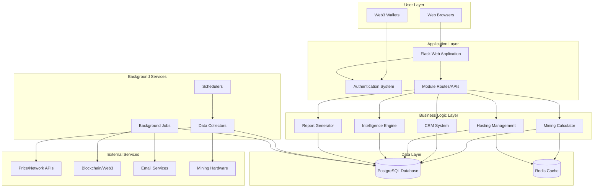
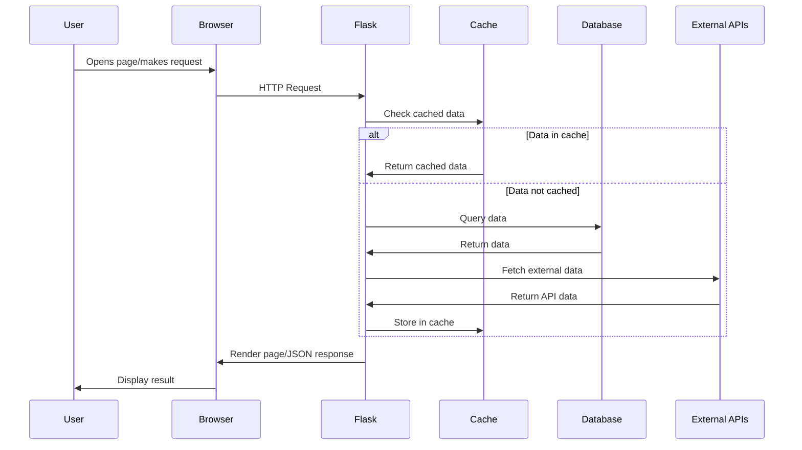
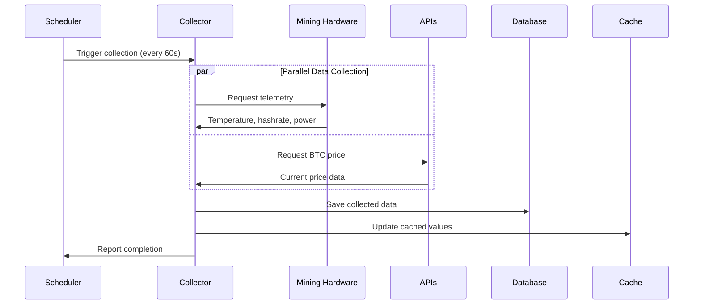
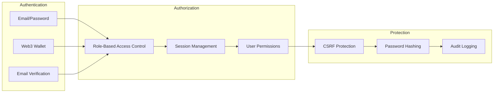

# Architecture Overview - HashInsight Enterprise

> **Audience**: Business stakeholders, managers, new team members, non-technical users

## 🎯 What is HashInsight Enterprise?

HashInsight Enterprise is an **enterprise-grade web application** designed for Bitcoin mining farm owners, operators, and clients. It provides comprehensive tools for:

- **Mining profitability analysis** with real-time data
- **Customer relationship management (CRM)**
- **Large-scale mining farm hosting** (6000+ miners)
- **Smart energy management** with automated power curtailment
- **Technical analysis** and price forecasting
- **Professional reporting** in multiple formats
- **Blockchain transparency** via Web3 integration

## 🏗️ High-Level System Architecture

## 📦 Core System Components

### 1. **Web Application (Flask)**
- **Purpose**: Main user interface and API server
- **Technology**: Python Flask framework
- **Features**: 
  - Server-side rendering with Jinja2 templates
  - RESTful API endpoints
  - Session management
  - Security middleware

### 2. **Database (PostgreSQL)**
- **Purpose**: Primary data storage
- **Contents**:
  - User accounts and authentication
  - Mining equipment data (6000+ miners)
  - CRM data (leads, deals, invoices)
  - Telemetry and performance metrics
  - Financial transactions
  - System configuration

### 3. **Cache Layer (Redis)**
- **Purpose**: Performance optimization
- **Functions**:
  - API response caching
  - Session storage
  - Background job queue
  - Real-time data buffering

### 4. **Background Services**
- **Purpose**: Automated tasks and data collection
- **Services**:
  - Real-time telemetry collection (every 60s)
  - Price and network data updates (every 15min)
  - Smart power curtailment execution
  - Report generation
  - Email notifications

### 5. **External Integrations**
- **Market Data**: CoinGecko, Blockchain.info, OKX, Binance
- **Blockchain**: Base L2 network, IPFS storage
- **Email**: Gmail SMTP
- **Hardware**: CGMiner API for miner telemetry

## 🔄 How It Works - Simple Flow

### User Request Flow

### Background Data Collection

## 🎨 System Modules

### **Calculator Module** 📊
Calculate mining profitability for 19+ ASIC models with real-time BTC prices and network difficulty.

**Key Features**:
- Single miner calculation
- Batch calculation for multiple miners
- ROI analysis and break-even points
- Historical price integration

### **CRM Module** 👥
Manage customer relationships, sales pipeline, and client communications.

**Key Features**:
- Lead and deal management
- Invoice generation
- Customer profiles
- KPI dashboards with Chart.js

### **Hosting Module** 🏭
Complete mining farm management for large-scale operations (6000+ miners).

**Key Features**:
- Real-time miner monitoring
- Batch operations (start, stop, approve)
- Telemetry visualization
- Smart pagination (301 pages × 20 miners)
- Collapsible sidebar for better UX
- Operation audit trail

### **Smart Curtailment Module** ⚡
Automated energy management with intelligent miner shutdown/recovery.

**Key Features**:
- Manual curtailment triggering
- Automatic recovery scheduling
- Performance Priority strategy (shutdown inefficient miners first)
- ARIMA forecasting for planning
- Background scheduler

### **Analytics Module** 📈
Technical analysis platform with 10+ indicators and market insights.

**Key Features**:
- Real-time BTC price tracking
- Technical indicators (RSI, MACD, Bollinger Bands, etc.)
- Multi-exchange data aggregation
- Signal generation

### **Intelligence Layer** 🧠
AI-powered recommendations and forecasting.

**Key Features**:
- ARIMA price/difficulty forecasting
- Anomaly detection
- Power optimization suggestions
- ROI explanation engine
- Event-driven architecture

### **Treasury Module** 💰
Bitcoin inventory management and sell strategy optimization.

**Key Features**:
- BTC holdings tracking
- Cost basis analysis
- Sell strategy templates
- Backtesting engine

### **Reporting Module** 📄
Professional report generation in multiple formats.

**Key Features**:
- PDF reports
- Excel spreadsheets
- PowerPoint presentations
- Role-specific dashboards

## 🔐 Security Architecture

### User Roles
1. **Owner** - Full system access
2. **Admin** - Administrative functions
3. **User** - Standard access
4. **Client** - Limited client portal access
5. **Guest** - Public access only

## 🌐 Technology Stack Summary

| Category | Technology | Purpose |
|----------|-----------|---------|
| **Backend Framework** | Flask (Python) | Web application server |
| **Template Engine** | Jinja2 | Server-side HTML rendering |
| **Database** | PostgreSQL | Primary data storage |
| **ORM** | SQLAlchemy | Database abstraction |
| **Cache** | Redis | Performance optimization |
| **Frontend** | Bootstrap 5 | Responsive UI framework |
| **Charts** | Chart.js | Data visualization |
| **Job Queue** | RQ, APScheduler | Background task processing |
| **Web Server** | Gunicorn | WSGI HTTP server |
| **Blockchain** | Web3.py | Ethereum/Base L2 integration |
| **ML/Forecasting** | statsmodels, XGBoost | AI predictions |

## 📊 System Capabilities

### Scale
- **6,000+ miners** per hosting farm
- **301 pages** of device management with smart pagination
- **100 concurrent users** supported
- **Real-time updates** every 60 seconds
- **19+ ASIC models** with detailed specifications

### Performance
- **Redis caching** for sub-second response times
- **Intelligent API fallbacks** for 99.9% uptime
- **Batch operations** for bulk management
- **Optimized queries** with SQLAlchemy

### Availability
- **Multi-source data** with automatic failover
- **Background data collection** ensures fresh data
- **Session persistence** across page loads
- **Error handling** with user-friendly messages

## 🌍 User Experience

### Bilingual Support
- **English** and **Chinese** (中文)
- Dynamic language switching
- Localized content and UI

### Responsive Design
- **Mobile-first** approach
- **Tablet-optimized** layouts
- **Desktop** full-feature experience
- **Dark theme** BTC-branded UI (#1a1d2e background, #f7931a gold)

### Accessibility
- **Collapsible sidebar** for screen space optimization
- **Smart pagination** with boundary awareness
- **Quick search** and filters
- **Keyboard navigation** support

## 🔄 Data Flow Overview

1. **User Request** → Flask receives HTTP request
2. **Authentication** → Verify user session/credentials
3. **Authorization** → Check user permissions
4. **Business Logic** → Process request in appropriate module
5. **Data Access** → Check cache → Query database if needed
6. **External Data** → Fetch from APIs if required
7. **Response** → Render template or return JSON
8. **Cache Update** → Store results for future requests

## 📈 Future Scalability

The system is designed for growth:
- **Modular architecture** allows adding new features
- **Database normalization** supports efficient scaling
- **Caching strategy** handles increased load
- **Background jobs** process heavy tasks asynchronously
- **API design** enables third-party integrations

## 🎯 Next Steps

To dive deeper into the architecture:

1. **Technical Teams**: Read [System Architecture](./system-architecture.md)
2. **Developers**: Review [Module Guide](./module-guide.md)
3. **Database Teams**: Study [Database Architecture](./database-schema.md)
4. **Integration Teams**: Check [External Integrations](./external-integrations.md)

---

*This overview provides a high-level understanding of HashInsight Enterprise. For detailed technical specifications, please refer to the other documentation files in this folder.*
