# Data Flow & Process Flows

> **Audience**: Developers, system integrators, DevOps engineers

## 🔄 Overview

This document explains how data flows through the HashInsight Enterprise system, covering:
- End-to-end request processing
- Background data collection pipelines
- Real-time telemetry flows
- Event-driven architecture
- Cache invalidation patterns

## 📊 User-Initiated Request Flows

### Flow 1: Mining Calculator Request

**User Story**: User calculates profitability for Antminer S19 Pro

```mermaid
sequenceDiagram
    actor User
    participant Browser
    participant Flask Route
    participant Calculator Service
    participant Cache Manager
    participant Database
    participant CoinGecko API
    participant Blockchain.info API
    
    User->>Browser: Enter miner model + electricity cost
    Browser->>Flask Route: POST /calculator/calculate
    
    Flask Route->>Calculator Service: calculate_profitability()
    
    par Fetch BTC Price
        Calculator Service->>Cache Manager: get('btc_price')
        alt Price in cache (< 5 min old)
            Cache Manager->>Calculator Service: Return cached price
        else Price stale/missing
            Calculator Service->>CoinGecko API: GET /simple/price
            CoinGecko API->>Calculator Service: $92,477
            Calculator Service->>Cache Manager: set('btc_price', $92,477, 300s)
        end
    and Fetch Network Difficulty
        Calculator Service->>Cache Manager: get('network_difficulty')
        alt Difficulty in cache
            Cache Manager->>Calculator Service: Return cached difficulty
        else Difficulty stale
            Calculator Service->>Blockchain.info API: GET /stats
            Blockchain.info API->>Calculator Service: 152.27T
            Calculator Service->>Cache Manager: set('network_difficulty', 152.27T, 900s)
        end
    and Fetch Miner Specs
        Calculator Service->>Database: SELECT * FROM miner_models WHERE id = 2
        Database->>Calculator Service: S19 Pro specs (110 TH/s, 3250W)
    end
    
    Calculator Service->>Calculator Service: Calculate profitability
    Note over Calculator Service: Daily Revenue = (110 TH/s / 991.6 EH/s) × 450 BTC<br/>Daily Cost = 3.25kW × 24h × $0.10<br/>Net Profit = Revenue - Cost<br/>ROI = Investment / Annual Profit
    
    Calculator Service->>Database: INSERT INTO calculation_history
    Calculator Service->>Flask Route: Return results
    Flask Route->>Browser: Render calculator.html with results
    Browser->>User: Display profitability metrics
```



**Key Metrics**:
- **Cache Hit Rate**: 85% for BTC price, 90% for difficulty
- **Response Time**: < 200ms with cache, < 1s without
- **API Calls**: 0-2 per request (cached vs. fresh)

### Flow 2: Hosting - Miner Detail Page

**User Story**: User views real-time performance of a specific miner


**Smart Telemetry API Fallback**:
```python
# If last 24h is empty, fallback to last 30 days
def get_miner_telemetry(miner_id):
    # Try last 24 hours
    telemetry = MinerTelemetry.query.filter(
        MinerTelemetry.miner_id == miner_id,
        MinerTelemetry.recorded_at > datetime.utcnow() - timedelta(hours=24)
    ).order_by(MinerTelemetry.recorded_at.desc()).limit(50).all()
    
    if not telemetry:
        # Fallback: last 30 days
        telemetry = MinerTelemetry.query.filter(
            MinerTelemetry.miner_id == miner_id,
            MinerTelemetry.recorded_at > datetime.utcnow() - timedelta(days=30)
        ).order_by(MinerTelemetry.recorded_at.desc()).limit(50).all()
    
    return telemetry
```

### Flow 3: CRM - Create Deal from Lead

**User Story**: Sales team converts a qualified lead into a deal


## 🔁 Background Data Collection Pipelines

### Pipeline 1: Real-Time Miner Telemetry Collection

**Frequency**: Every 60 seconds (APScheduler)

```mermaid
sequenceDiagram
    participant Scheduler
    participant Lock Manager
    participant CGMiner Collector
    participant Mining Hardware
    participant Database
    participant Cache
    participant Alerting
    
    Scheduler->>Lock Manager: Acquire lock 'cgminer_scheduler_lock'
    
    alt Lock acquired
        Lock Manager->>Scheduler: Lock granted (PID 8682)
        
        Scheduler->>CGMiner Collector: _collect_telemetry_job()
        
        CGMiner Collector->>Database: SELECT * FROM hosting_miners<br/>WHERE status = 'active'<br/>AND cgminer_enabled = true
        Database->>CGMiner Collector: 8 active miners
        
        loop For each miner
            CGMiner Collector->>Mining Hardware: TCP connect to 192.168.1.100:4028<br/>Send: {"command":"summary"}
            
            alt Connection successful
                Mining Hardware->>CGMiner Collector: JSON response<br/>{hashrate: 110.5, temp: 72.3, power: 3200}
                CGMiner Collector->>Database: INSERT INTO miner_telemetry<br/>(miner_id, hashrate, temp, power, recorded_at)
                
                CGMiner Collector->>Cache: set('miner_20_latest', data, 120s)
                
                CGMiner Collector->>Alerting: Check thresholds
                alt Temperature > 80°C
                    Alerting->>Email Service: Send alert email
                end
            else Connection timeout
                CGMiner Collector->>Database: INSERT INTO miner_operation_log<br/>(miner_id, operation='connection_failed')
                CGMiner Collector->>Alerting: Mark miner as offline
            end
        end
        
        CGMiner Collector->>Scheduler: Report completion (8 processed)
        Scheduler->>Lock Manager: Refresh heartbeat
        
    else Lock held by another process
        Lock Manager->>Scheduler: Lock denied (PID 7860 owns it)
        Scheduler->>Scheduler: Skip execution (prevent duplicates)
    end
```



**Distributed Lock Mechanism**:
```python
class SchedulerLock:
    def acquire_lock(self, key, timeout=60):
        # Check if lock exists and not expired
        existing_lock = SchedulerLockModel.query.filter_by(lock_key=key).first()
        
        if existing_lock and not existing_lock.is_expired:
            return None  # Another process holds the lock
        
        # Create or update lock
        lock = SchedulerLockModel(
            lock_key=key,
            process_id=os.getpid(),
            hostname=socket.gethostname(),
            expires_at=datetime.utcnow() + timedelta(seconds=timeout)
        )
        db.session.merge(lock)
        db.session.commit()
        return lock
```

### Pipeline 2: Market Data Analytics Collection

**Frequency**: Every 15 minutes


**Code Implementation**:
```python
# modules/analytics/engines/analytics_engine.py
class AnalyticsEngine:
    def collect_and_analyze(self):
        # Collect market data
        btc_price = self._collect_btc_price()
        hashrate = self._collect_network_hashrate()
        difficulty = self._collect_difficulty()
        exchange_data = self._collect_exchange_data()
        
        # Save to database
        market_data = MarketAnalytics(
            btc_price=btc_price,
            network_hashrate=hashrate,
            network_difficulty=difficulty,
            volume_24h=exchange_data['total_volume']
        )
        db.session.add(market_data)
        
        # Calculate technical indicators
        indicators = self._calculate_indicators()
        db.session.add(indicators)
        
        db.session.commit()
        
        # Update cache
        cache_manager.set('latest_btc_price', btc_price, timeout=300)
        cache_manager.set('latest_market_data', market_data.to_dict(), timeout=600)
```

### Pipeline 3: Smart Curtailment Automation

**Frequency**: Every 1 minute (check for pending plans)


## 🔔 Event-Driven Architecture

### Intelligence Layer Event Publishing


**Implementation**:
```python
# intelligence/db_hooks.py
from sqlalchemy import event

def register_hooks(db):
    # User events
    @event.listens_for(UserMiner, 'after_insert')
    def publish_user_miner_created(mapper, connection, target):
        publish_event('user_miner.created', {
            'user_id': target.user_id,
            'miner_id': target.miner_id,
            'timestamp': datetime.utcnow().isoformat()
        })
    
    # Miner events
    @event.listens_for(HostingMiner, 'after_update')
    def publish_miner_updated(mapper, connection, target):
        if target.status == 'offline':
            publish_event('miner.offline', {
                'miner_id': target.id,
                'site_id': target.site_id,
                'last_seen': target.updated_at.isoformat()
            })

def publish_event(event_type, payload):
    outbox_event = OutboxEvent(
        event_type=event_type,
        payload=json.dumps(payload),
        status='pending'
    )
    db.session.add(outbox_event)
```

## 💾 Cache Invalidation Patterns

### Pattern 1: Time-Based Expiration (TTL)

```python
# Automatically expires after timeout
cache_manager.set('btc_price', 92477, timeout=300)  # 5 minutes

# Next request after 5 minutes will miss cache
price = cache_manager.get('btc_price')  # None (expired)
```

### Pattern 2: Write-Through Invalidation

```python
# When data changes, update both database and cache
def update_miner_status(miner_id, new_status):
    # Update database
    miner = HostingMiner.query.get(miner_id)
    miner.status = new_status
    db.session.commit()
    
    # Invalidate cache
    cache_manager.delete(f'miner_{miner_id}_details')
    cache_manager.delete(f'site_{miner.site_id}_active_miners')
```

### Pattern 3: Event-Driven Invalidation

```python
@event.listens_for(MinerTelemetry, 'after_insert')
def invalidate_telemetry_cache(mapper, connection, target):
    # Clear cached telemetry when new data arrives
    cache_manager.delete(f'miner_{target.miner_id}_telemetry_24h')
    cache_manager.delete(f'site_{target.miner.site_id}_telemetry_summary')
```

## 🔄 Data Consistency Patterns

### Database Transactions

```python
# Atomic operations with rollback on error
try:
    db.session.begin()
    
    # Multiple related operations
    deal = CRMDeal(...)
    db.session.add(deal)
    
    lead.status = 'converted'
    
    activity = CRMActivity(deal_id=deal.id, ...)
    db.session.add(activity)
    
    db.session.commit()  # All or nothing
    
except Exception as e:
    db.session.rollback()
    logger.error(f"Transaction failed: {e}")
    raise
```

### Distributed Lock for Background Jobs

```python
# Prevent duplicate execution across multiple workers
with scheduler_lock.acquire('telemetry_collection'):
    if scheduler_lock.is_locked():
        # Execute telemetry collection
        collect_all_telemetry()
    else:
        # Another worker is running it, skip
        pass
```

---

*This document provides comprehensive data flow patterns. For module-specific flows, refer to [Module Guide](./module-guide.md).*
