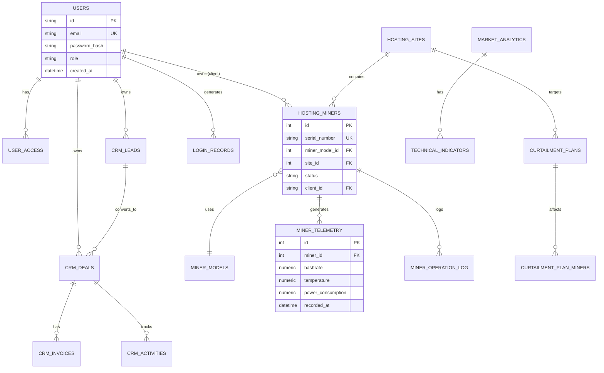

# Database Architecture & Schema

> **Audience**: Database administrators, backend developers, data engineers

## 🗄️ Database Overview

**Database Type**: PostgreSQL (Replit-hosted)  
**ORM**: SQLAlchemy  
**Migration Strategy**: `db.create_all()` for development, manual migrations for production  
**Connection**: Via `DATABASE_URL` environment variable

## 📊 Entity Relationship Diagram



## 📋 Complete Schema Reference

### 1. Authentication & Users

#### users
**Purpose**: User accounts and authentication

| Column | Type | Constraints | Description |
|--------|------|-------------|-------------|
| id | TEXT | PRIMARY KEY | Unique user identifier (UUID) |
| email | TEXT | UNIQUE, NOT NULL | User email address |
| password_hash | TEXT | NOT NULL | Bcrypt password hash (256 chars) |
| role | VARCHAR | DEFAULT 'user' | User role (owner/admin/user/client/guest) |
| name | TEXT | | Full name |
| role_id | TEXT | | Legacy role reference |
| status | ENUM UserStatus | DEFAULT 'ACTIVE' | Account status |
| created_at | TIMESTAMP | DEFAULT NOW() | Account creation time |
| updated_at | TIMESTAMP | | Last update time |

**Indexes**:
- `idx_users_email` ON (email)
- `idx_users_role` ON (role)

#### user_access
**Purpose**: Time-based user access permissions

| Column | Type | Constraints | Description |
|--------|------|-------------|-------------|
| id | SERIAL | PRIMARY KEY | Access record ID |
| user_id | TEXT | FK → users.id | User reference |
| access_start_date | TIMESTAMP | | Access begins |
| access_end_date | TIMESTAMP | | Access expires |
| granted_by | TEXT | FK → users.id | Who granted access |
| created_at | TIMESTAMP | DEFAULT NOW() | Record creation |

**Indexes**:
- `idx_user_access_user` ON (user_id)
- `idx_user_access_dates` ON (access_start_date, access_end_date)

#### login_records
**Purpose**: Audit trail of login attempts

| Column | Type | Constraints | Description |
|--------|------|-------------|-------------|
| id | SERIAL | PRIMARY KEY | Login record ID |
| email | TEXT | | Email used for login |
| success | BOOLEAN | | Login success/failure |
| login_time | TIMESTAMP | DEFAULT NOW() | Timestamp of attempt |
| ip_address | TEXT | | Client IP address |
| location | TEXT | | Geolocation (city, country) |

---

### 2. Hosting Services

#### hosting_sites
**Purpose**: Mining farm locations

| Column | Type | Constraints | Description |
|--------|------|-------------|-------------|
| id | SERIAL | PRIMARY KEY | Site ID |
| name | TEXT | NOT NULL | Site name |
| location | TEXT | | Physical location |
| capacity_mw | NUMERIC(10,2) | | Power capacity in MW |
| total_miners | INTEGER | DEFAULT 0 | Total miner count |
| active_miners | INTEGER | DEFAULT 0 | Currently active |
| created_at | TIMESTAMP | DEFAULT NOW() | Site creation |

**Indexes**:
- `idx_hosting_sites_name` ON (name)

#### miner_models
**Purpose**: ASIC miner specifications

| Column | Type | Constraints | Description |
|--------|------|-------------|-------------|
| id | SERIAL | PRIMARY KEY | Model ID |
| name | TEXT | NOT NULL, UNIQUE | Model name (e.g., "S19 Pro") |
| manufacturer | TEXT | | Manufacturer (Bitmain, MicroBT) |
| hashrate | NUMERIC(10,2) | | Hashrate in TH/s |
| power_consumption | NUMERIC(10,2) | | Power in Watts |
| efficiency | NUMERIC(10,4) | | J/TH efficiency |
| release_date | DATE | | Market release date |
| msrp | NUMERIC(10,2) | | Manufacturer suggested price |

**Indexes**:
- `idx_miner_models_name` ON (name)

#### hosting_miners
**Purpose**: Individual miner tracking

| Column | Type | Constraints | Description |
|--------|------|-------------|-------------|
| id | SERIAL | PRIMARY KEY | Miner ID |
| serial_number | TEXT | UNIQUE, NOT NULL | Unique serial number |
| miner_model_id | INTEGER | FK → miner_models.id | Model reference |
| site_id | INTEGER | FK → hosting_sites.id | Site location |
| status | TEXT | DEFAULT 'active' | active/offline/maintenance/curtailed |
| cgminer_ip | TEXT | | CGMiner API IP address |
| cgminer_port | INTEGER | DEFAULT 4028 | CGMiner API port |
| cgminer_enabled | BOOLEAN | DEFAULT FALSE | Enable telemetry collection |
| client_id | TEXT | FK → users.id | Owner (for client view) |
| purchase_date | DATE | | Acquisition date |
| warranty_expiry | DATE | | Warranty end date |
| created_at | TIMESTAMP | DEFAULT NOW() | Record creation |
| updated_at | TIMESTAMP | | Last update |

**Indexes**:
- `idx_hosting_miners_serial` ON (serial_number)
- `idx_hosting_miners_site` ON (site_id)
- `idx_hosting_miners_status` ON (status)
- `idx_hosting_miners_client` ON (client_id)

#### miner_telemetry
**Purpose**: Real-time performance metrics

| Column | Type | Constraints | Description |
|--------|------|-------------|-------------|
| id | SERIAL | PRIMARY KEY | Telemetry ID |
| miner_id | INTEGER | FK → hosting_miners.id | Miner reference |
| hashrate | NUMERIC(10,2) | | Hashrate in TH/s |
| temperature | NUMERIC(5,2) | | Temperature in °C |
| power_consumption | NUMERIC(10,2) | | Power in Watts |
| fan_speed | NUMERIC(10,2) | | Fan RPM |
| recorded_at | TIMESTAMP | DEFAULT NOW() | Collection timestamp |

**Indexes**:
- `idx_telemetry_miner` ON (miner_id)
- `idx_telemetry_recorded` ON (recorded_at DESC)
- `idx_telemetry_miner_time` ON (miner_id, recorded_at DESC)

**Partition Strategy** (for scale):
```sql
-- For 6000 miners × 24h/day × 60 records/hour = 8.64M rows/day
-- Consider partitioning by recorded_at (daily/weekly)
CREATE TABLE miner_telemetry_2025_11 PARTITION OF miner_telemetry
    FOR VALUES FROM ('2025-11-01') TO ('2025-12-01');
```

#### miner_operation_log
**Purpose**: Audit trail for miner operations

| Column | Type | Constraints | Description |
|--------|------|-------------|-------------|
| id | SERIAL | PRIMARY KEY | Log ID |
| miner_id | INTEGER | FK → hosting_miners.id | Miner reference |
| operation | TEXT | | Operation type (start/shutdown/approve) |
| performed_by | TEXT | FK → users.id | User who performed action |
| details | TEXT | | Additional details |
| timestamp | TIMESTAMP | DEFAULT NOW() | Operation time |

**Indexes**:
- `idx_operation_log_miner` ON (miner_id)
- `idx_operation_log_time` ON (timestamp DESC)

---

### 3. Smart Curtailment

#### curtailment_plans
**Purpose**: Power reduction plans

| Column | Type | Constraints | Description |
|--------|------|-------------|-------------|
| id | SERIAL | PRIMARY KEY | Plan ID |
| site_id | INTEGER | FK → hosting_sites.id | Target site |
| plan_type | TEXT | | manual/scheduled/automatic |
| target_power_reduction | NUMERIC(10,2) | | Target MW reduction |
| status | TEXT | DEFAULT 'pending' | pending/approved/executing/executed/cancelled |
| scheduled_time | TIMESTAMP | | Planned execution time |
| executed_at | TIMESTAMP | | Actual execution time |
| recovery_time | TIMESTAMP | | Planned recovery time |
| miners_affected | INTEGER | | Count of affected miners |
| power_reduced | NUMERIC(10,2) | | Actual MW reduced |
| created_by | TEXT | FK → users.id | Plan creator |
| created_at | TIMESTAMP | DEFAULT NOW() | Creation time |

**Indexes**:
- `idx_curtailment_site` ON (site_id)
- `idx_curtailment_status` ON (status)
- `idx_curtailment_scheduled` ON (scheduled_time)

#### curtailment_plan_miners
**Purpose**: Many-to-many relationship for affected miners

| Column | Type | Constraints | Description |
|--------|------|-------------|-------------|
| id | SERIAL | PRIMARY KEY | Record ID |
| plan_id | INTEGER | FK → curtailment_plans.id | Plan reference |
| miner_id | INTEGER | FK → hosting_miners.id | Miner reference |
| shutdown_order | INTEGER | | Shutdown sequence |

---

### 4. CRM System

#### crm_leads
**Purpose**: Sales lead tracking

| Column | Type | Constraints | Description |
|--------|------|-------------|-------------|
| id | SERIAL | PRIMARY KEY | Lead ID |
| name | TEXT | NOT NULL | Contact name |
| email | TEXT | | Email address |
| phone | TEXT | | Phone number |
| company | TEXT | | Company name |
| status | TEXT | DEFAULT 'new' | new/contacted/qualified/converted/lost |
| source | TEXT | | Lead source (website/referral/cold_call) |
| score | INTEGER | | Lead score (0-100) |
| owner_id | TEXT | FK → users.id | Sales rep assigned |
| created_at | TIMESTAMP | DEFAULT NOW() | Lead creation |
| updated_at | TIMESTAMP | | Last update |

#### crm_deals
**Purpose**: Sales opportunity pipeline

| Column | Type | Constraints | Description |
|--------|------|-------------|-------------|
| id | SERIAL | PRIMARY KEY | Deal ID |
| lead_id | INTEGER | FK → crm_leads.id | Source lead |
| title | TEXT | NOT NULL | Deal title |
| value | NUMERIC(12,2) | | Deal value in USD |
| stage | TEXT | DEFAULT 'discovery' | discovery/proposal/negotiation/closed_won/closed_lost |
| probability | INTEGER | | Win probability (0-100%) |
| expected_close_date | DATE | | Expected close |
| owner_id | TEXT | FK → users.id | Sales rep |
| created_at | TIMESTAMP | DEFAULT NOW() | Deal creation |
| closed_at | TIMESTAMP | | Close date |

#### crm_invoices
**Purpose**: Invoice generation and tracking

| Column | Type | Constraints | Description |
|--------|------|-------------|-------------|
| id | SERIAL | PRIMARY KEY | Invoice ID |
| deal_id | INTEGER | FK → crm_deals.id | Related deal |
| invoice_number | TEXT | UNIQUE, NOT NULL | Invoice number |
| amount | NUMERIC(12,2) | NOT NULL | Invoice amount |
| status | TEXT | DEFAULT 'draft' | draft/sent/paid/overdue |
| issue_date | DATE | | Issue date |
| due_date | DATE | | Payment due date |
| paid_date | DATE | | Actual payment date |
| pdf_path | TEXT | | Path to PDF file |

---

### 5. Analytics & Market Data

#### market_analytics
**Purpose**: BTC price and network statistics

| Column | Type | Constraints | Description |
|--------|------|-------------|-------------|
| id | SERIAL | PRIMARY KEY | Analytics ID |
| btc_price | NUMERIC(12,2) | | BTC price in USD |
| network_hashrate | NUMERIC(10,2) | | Network hashrate in EH/s |
| network_difficulty | NUMERIC(20,2) | | Mining difficulty |
| block_reward | NUMERIC(10,8) | | Current block reward |
| volume_24h | NUMERIC(15,2) | | 24h trading volume |
| created_at | TIMESTAMP | DEFAULT NOW() | Collection timestamp |

**Indexes**:
- `idx_market_analytics_time` ON (created_at DESC)

#### technical_indicators
**Purpose**: Technical analysis indicators

| Column | Type | Constraints | Description |
|--------|------|-------------|-------------|
| id | SERIAL | PRIMARY KEY | Indicator ID |
| analytics_id | INTEGER | FK → market_analytics.id | Market data reference |
| rsi | NUMERIC(5,2) | | RSI (0-100) |
| macd | NUMERIC(10,4) | | MACD value |
| macd_signal | NUMERIC(10,4) | | MACD signal line |
| macd_histogram | NUMERIC(10,4) | | MACD histogram |
| bb_upper | NUMERIC(12,2) | | Bollinger upper band |
| bb_middle | NUMERIC(12,2) | | Bollinger middle band |
| bb_lower | NUMERIC(12,2) | | Bollinger lower band |
| ema_12 | NUMERIC(12,2) | | 12-period EMA |
| ema_26 | NUMERIC(12,2) | | 26-period EMA |
| signal | TEXT | | BUY/SELL/NEUTRAL |
| created_at | TIMESTAMP | DEFAULT NOW() | Calculation time |

---

### 6. Intelligence & Events

#### scheduler_locks
**Purpose**: Distributed locking for background jobs

| Column | Type | Constraints | Description |
|--------|------|-------------|-------------|
| lock_key | TEXT | PRIMARY KEY | Lock identifier |
| process_id | INTEGER | NOT NULL | OS process ID |
| hostname | TEXT | NOT NULL | Server hostname |
| acquired_at | TIMESTAMP | DEFAULT NOW() | Lock acquisition time |
| expires_at | TIMESTAMP | NOT NULL | Lock expiration |
| last_heartbeat | TIMESTAMP | DEFAULT NOW() | Last heartbeat update |
| lock_version | INTEGER | DEFAULT 1 | Optimistic locking version |

**Usage**:
```python
lock = SchedulerLock.acquire('cgminer_collector', timeout=120)
if lock:
    # Execute job
    lock.refresh_heartbeat()
else:
    # Another process holds the lock
    pass
```

#### outbox_events
**Purpose**: Event sourcing and CDC

| Column | Type | Constraints | Description |
|--------|------|-------------|-------------|
| id | SERIAL | PRIMARY KEY | Event ID |
| event_type | TEXT | NOT NULL | Event type (e.g., 'miner.offline') |
| payload | JSONB | NOT NULL | Event payload |
| status | TEXT | DEFAULT 'pending' | pending/processed/failed |
| created_at | TIMESTAMP | DEFAULT NOW() | Event creation |
| processed_at | TIMESTAMP | | Processing timestamp |

**Indexes**:
- `idx_outbox_status` ON (status)
- `idx_outbox_type` ON (event_type)

---

## 🔧 Database Configuration

### Connection Settings

```python
# config.py
SQLALCHEMY_DATABASE_URI = os.environ.get("DATABASE_URL")
SQLALCHEMY_ENGINE_OPTIONS = {
    "pool_recycle": 300,  # Recycle connections every 5 minutes
    "pool_pre_ping": True,  # Verify connection before use
    "pool_size": 10,  # Connection pool size
    "max_overflow": 20  # Max overflow connections
}
```

### Performance Tuning

```sql
-- Vacuum and analyze regularly
VACUUM ANALYZE miner_telemetry;

-- Update table statistics
ANALYZE hosting_miners;

-- Monitor table bloat
SELECT 
    schemaname, 
    tablename, 
    pg_size_pretty(pg_total_relation_size(schemaname||'.'||tablename)) AS size
FROM pg_tables
WHERE schemaname = 'public'
ORDER BY pg_total_relation_size(schemaname||'.'||tablename) DESC;
```

## 📈 Data Growth Estimates

| Table | Daily Rows | Monthly Rows | Retention |
|-------|-----------|--------------|-----------|
| miner_telemetry | 8.64M | 259M | 90 days |
| market_analytics | 96 | 2,880 | Indefinite |
| miner_operation_log | 5,000 | 150K | 1 year |
| login_records | 500 | 15K | 1 year |
| outbox_events | 10,000 | 300K | 30 days |

## 🔐 Security Considerations

1. **Password Storage**: Bcrypt hashing with work factor 12
2. **SQL Injection**: SQLAlchemy ORM prevents injection
3. **Access Control**: Row-level security via `client_id` filtering
4. **Sensitive Data**: Encryption at rest (PostgreSQL TDE)
5. **Backups**: Daily automated backups on Replit

---

*For migration procedures and schema changes, consult the development team before making structural modifications.*
