# System Overview Diagram

## Complete HashInsight Enterprise Architecture

```mermaid
graph TB
    subgraph "Client Layer"
        BROWSER[🌐 Web Browsers<br/>Desktop & Mobile]
        WALLET[👛 Web3 Wallets<br/>MetaMask]
    end
    
    subgraph "Application Server - Flask on Gunicorn"
        subgraph "Presentation Layer"
            TEMPLATES[📄 Jinja2 Templates]
            STATIC[🎨 Bootstrap 5 UI<br/>Chart.js Visualizations]
        end
        
        subgraph "Security & Middleware"
            AUTH[🔐 Authentication<br/>Email/Web3/Verification]
            RBAC[🛡️ Role-Based Access Control<br/>Owner/Admin/User/Client/Guest]
            CSRF[🔒 CSRF Protection]
            SESSION[🔑 Session Management]
        end
        
        subgraph "Core Business Modules"
            CALC[🧮 Mining Calculator<br/>19+ ASIC Models<br/>ROI Analysis]
            CRM[👥 CRM System<br/>Lead/Deal Pipeline<br/>Invoice Generation]
            HOST[🏭 Hosting Services<br/>6000+ Miners<br/>Real-time Telemetry]
            ANALYTICS[📊 Technical Analysis<br/>10+ Indicators<br/>Signal Generation]
        end
        
        subgraph "Intelligence & Optimization"
            CURTAIL[⚡ Smart Curtailment<br/>Performance Priority<br/>Auto Recovery]
            FORECAST[🔮 ARIMA Forecasting<br/>BTC Price & Difficulty]
            OPTIMIZE[🎯 PuLP Optimization<br/>Power & Efficiency]
            ANOMALY[⚠️ Anomaly Detection]
        end
        
        subgraph "Supporting Services"
            TREASURY[💰 Treasury Management<br/>BTC Inventory<br/>Sell Strategies]
            REPORT[📄 Report Generator<br/>PDF/Excel/PowerPoint]
            BILLING[💳 Billing System<br/>Crypto Payments]
            BLOCKCHAIN_SVC[⛓️ Blockchain Integration<br/>Base L2 & IPFS]
        end
    end
    
    subgraph "Data Layer"
        POSTGRES[(🗄️ PostgreSQL<br/>Users, Miners, CRM<br/>Telemetry, Analytics)]
        REDIS[(⚡ Redis Cache<br/>API Responses<br/>Session Storage<br/>Job Queue)]
    end
    
    subgraph "Background Services"
        SCHEDULER1[⏰ CGMiner Scheduler<br/>Telemetry Collection<br/>Every 60 seconds]
        SCHEDULER2[⏰ Curtailment Scheduler<br/>Plan Execution<br/>Auto Recovery]
        SCHEDULER3[⏰ Analytics Collector<br/>Market Data<br/>Every 15 minutes]
        DATACOL[📡 Data Collectors Manager<br/>Multi-threaded Collection]
    end
    
    subgraph "External APIs"
        MARKET[📈 Market Data<br/>CoinGecko, Blockchain.info<br/>Mempool.space]
        EXCHANGE[💹 Exchange APIs<br/>Binance, OKX<br/>Deribit, Bybit]
        BLOCKCHAIN_EXT[⛓️ Blockchain Networks<br/>Base L2 Sepolia<br/>Ankr RPC]
        IPFS_EXT[📦 IPFS Storage<br/>Pinata]
    end
    
    subgraph "Mining Hardware"
        CGMINER[⚙️ CGMiner APIs<br/>TCP:4028<br/>ASIC Miners]
    end
    
    subgraph "Communication"
        EMAIL[📧 Gmail SMTP<br/>Notifications<br/>Reports]
        GEO[🌍 IP-API<br/>Geolocation]
    end
    
    %% Client connections
    BROWSER --> AUTH
    WALLET --> AUTH
    
    %% Security flow
    AUTH --> RBAC
    RBAC --> CSRF
    CSRF --> SESSION
    
    %% Session to modules
    SESSION --> CALC
    SESSION --> CRM
    SESSION --> HOST
    SESSION --> ANALYTICS
    
    %% Module to services
    HOST --> CURTAIL
    HOST --> FORECAST
    CURTAIL --> OPTIMIZE
    ANALYTICS --> FORECAST
    
    %% Modules to treasury/reporting
    CALC --> TREASURY
    CALC --> REPORT
    CRM --> REPORT
    HOST --> REPORT
    HOST --> BILLING
    
    %% All modules to blockchain
    HOST --> BLOCKCHAIN_SVC
    CRM --> BLOCKCHAIN_SVC
    
    %% Data layer connections
    CALC --> POSTGRES
    CRM --> POSTGRES
    HOST --> POSTGRES
    ANALYTICS --> POSTGRES
    CURTAIL --> POSTGRES
    TREASURY --> POSTGRES
    BILLING --> POSTGRES
    
    CALC --> REDIS
    HOST --> REDIS
    ANALYTICS --> REDIS
    
    %% Background services
    SCHEDULER1 --> DATACOL
    SCHEDULER2 --> CURTAIL
    SCHEDULER3 --> ANALYTICS
    
    DATACOL --> POSTGRES
    DATACOL --> REDIS
    
    %% External connections
    DATACOL --> CGMINER
    DATACOL --> MARKET
    DATACOL --> EXCHANGE
    
    BLOCKCHAIN_SVC --> BLOCKCHAIN_EXT
    BLOCKCHAIN_SVC --> IPFS_EXT
    
    REPORT --> EMAIL
    AUTH --> EMAIL
    AUTH --> GEO
    
    %% Templates rendering
    CALC --> TEMPLATES
    CRM --> TEMPLATES
    HOST --> TEMPLATES
    ANALYTICS --> TEMPLATES
    
    TEMPLATES --> STATIC
    STATIC --> BROWSER
    
    style BROWSER fill:#4CAF50,stroke:#2E7D32,color:#fff
    style WALLET fill:#FF9800,stroke:#E65100,color:#fff
    style AUTH fill:#2196F3,stroke:#0D47A1,color:#fff
    style POSTGRES fill:#336791,stroke:#1a3a52,color:#fff
    style REDIS fill:#DC382D,stroke:#8b2119,color:#fff
    style CGMINER fill:#F44336,stroke:#b71c1c,color:#fff
    style BLOCKCHAIN_SVC fill:#9C27B0,stroke:#4A148C,color:#fff
```

## Legend

| Icon | Component Type | Examples |
|------|---------------|----------|
| 🌐 | Client Interface | Web Browsers |
| 👛 | Web3 | MetaMask Wallet |
| 🔐 | Security | Authentication |
| 🧮 | Core Module | Calculator, CRM, Hosting |
| ⚡ | Intelligence | Curtailment, Optimization |
| 🗄️ | Database | PostgreSQL |
| ⏰ | Background Job | Schedulers |
| 📈 | External API | Market Data |
| ⚙️ | Hardware | Mining Equipment |

## System Scale

- **Users**: Multi-tenant with RBAC
- **Miners**: 6000+ devices per site
- **Telemetry**: 8.64M records/day
- **API Calls**: 100+ per minute
- **Background Jobs**: 3 schedulers running continuously
