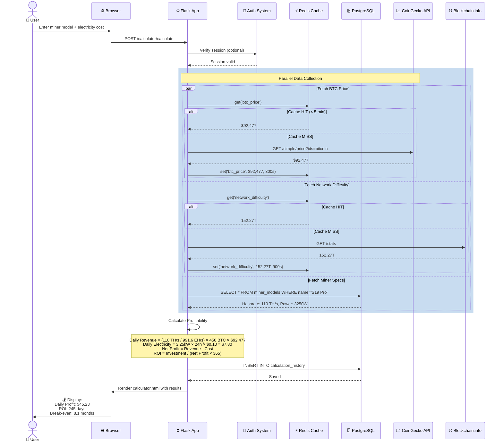

# Complete Data Flow Diagrams

## 1. User Request Flow - Mining Calculator



## 2. Background Telemetry Collection Flow

```mermaid
graph TB
    START([⏰ Scheduler Trigger<br/>Every 60 seconds])
    
    START --> LOCK{🔒 Acquire<br/>Distributed Lock}
    
    LOCK -->|Lock Acquired| QUERY[📊 Query Active Miners<br/>WHERE status='active'<br/>AND cgminer_enabled=true]
    LOCK -->|Lock Held by Other Process| SKIP([Skip Execution<br/>Prevent Duplicates])
    
    QUERY --> COUNT{Miner Count}
    
    COUNT -->|8 miners| COLLECT[🔄 For Each Miner]
    COUNT -->|0 miners| END
    
    COLLECT --> CONNECT[📡 TCP Connect<br/>IP:4028]
    
    CONNECT --> SEND[📤 Send CGMiner Command<br/>{'command': 'summary'}]
    
    SEND --> RECEIVE{Response?}
    
    RECEIVE -->|✅ Success| PARSE[📋 Parse Telemetry<br/>hashrate: 110.5 TH/s<br/>temp: 72.3°C<br/>power: 3200W<br/>fan: 5400 RPM]
    
    RECEIVE -->|❌ Timeout| OFFLINE[⚠️ Mark Offline<br/>UPDATE status='offline'<br/>Send Alert]
    
    PARSE --> SAVE[💾 Save to Database<br/>INSERT INTO miner_telemetry]
    
    SAVE --> CACHE_UPDATE[⚡ Update Cache<br/>set('miner_20_latest', data, 120s)]
    
    CACHE_UPDATE --> CHECK_THRESHOLDS{🌡️ Check<br/>Thresholds}
    
    CHECK_THRESHOLDS -->|Temp > 80°C| ALERT[🚨 Send Alert Email]
    CHECK_THRESHOLDS -->|Normal| NEXT
    
    ALERT --> NEXT{More Miners?}
    OFFLINE --> NEXT
    
    NEXT -->|Yes| COLLECT
    NEXT -->|No| REFRESH[🔄 Refresh Lock Heartbeat]
    
    REFRESH --> RELEASE[🔓 Release Lock]
    
    RELEASE --> END([✅ Collection Complete<br/>8 miners processed])
    
    style START fill:#4CAF50,stroke:#2E7D32,color:#fff
    style LOCK fill:#2196F3,stroke:#0D47A1,color:#fff
    style PARSE fill:#FF9800,stroke:#E65100,color:#fff
    style SAVE fill:#9C27B0,stroke:#4A148C,color:#fff
    style ALERT fill:#F44336,stroke:#b71c1c,color:#fff
    style END fill:#4CAF50,stroke:#2E7D32,color:#fff
```

## 3. Smart Curtailment Execution Flow

```mermaid
flowchart TB
    START([⏰ Scheduler: Check Pending Plans<br/>Every 60 seconds])
    
    START --> QUERY_PLANS[📋 Query Database<br/>SELECT * FROM curtailment_plans<br/>WHERE status='pending'<br/>AND scheduled_time <= NOW]
    
    QUERY_PLANS --> HAS_PLANS{Plans Found?}
    
    HAS_PLANS -->|No| END1([End])
    HAS_PLANS -->|Yes: 1 plan| LOAD_PLAN[📄 Load Plan Details<br/>Site: HashPower MegaFarm<br/>Target: 5 MW reduction]
    
    LOAD_PLAN --> UPDATE_STATUS[📝 Update Status<br/>status = 'executing']
    
    UPDATE_STATUS --> QUERY_MINERS[🔍 Query All Active Miners<br/>SELECT * FROM hosting_miners<br/>WHERE site_id=5 AND status='active']
    
    QUERY_MINERS --> FETCH_TELEMETRY[📊 Fetch Latest Telemetry<br/>For each miner]
    
    FETCH_TELEMETRY --> CALC_EFFICIENCY[⚙️ Calculate Efficiency<br/>efficiency = hashrate / power]
    
    CALC_EFFICIENCY --> SORT[📊 Sort by Efficiency ASC<br/>Worst performers first]
    
    SORT --> OPTIMIZE[🎯 PuLP Linear Programming<br/>━━━━━━━━━━━━━━━━━━<br/>Minimize: Hashrate Loss<br/>Subject to: Power ≥ 5000 kW<br/>Variables: shutdown[miner_id] binary]
    
    OPTIMIZE --> SOLUTION[✅ Optimization Solution<br/>━━━━━━━━━━━━━━━━━━<br/>Miners to shutdown: 1538<br/>Power reduced: 5.00 MW<br/>Hashrate loss: 169.18 TH/s<br/>Strategy: Performance Priority]
    
    SOLUTION --> BEGIN_TX[🔄 BEGIN TRANSACTION]
    
    BEGIN_TX --> LOOP{For each<br/>recommended<br/>miner}
    
    LOOP -->|Miner #1| API_CALL[📡 API Call<br/>POST /api/miner/20/shutdown]
    
    API_CALL --> API_SUCCESS{Success?}
    
    API_SUCCESS -->|✅ Yes| UPDATE_DB[💾 Update Database<br/>UPDATE hosting_miners<br/>SET status='curtailed'<br/>WHERE id=20]
    
    API_SUCCESS -->|❌ Failed| LOG_ERROR[⚠️ Log Error<br/>Continue with others]
    
    UPDATE_DB --> LOG_OP[📝 Log Operation<br/>INSERT INTO miner_operation_log<br/>operation='curtailment_shutdown']
    
    LOG_OP --> LOOP
    LOG_ERROR --> LOOP
    
    LOOP -->|More miners| API_CALL
    LOOP -->|All processed| UPDATE_PLAN[📝 Update Plan<br/>━━━━━━━━━━━━━━━━━━<br/>status = 'executed'<br/>executed_at = NOW<br/>miners_affected = 1538<br/>power_reduced = 5.00]
    
    UPDATE_PLAN --> COMMIT[✅ COMMIT TRANSACTION]
    
    COMMIT --> NOTIFY[📧 Send Notification<br/>━━━━━━━━━━━━━━━━━━<br/>To: Farm Manager<br/>Subject: Curtailment Executed<br/>Body: 5 MW reduced, 1538 miners]
    
    NOTIFY --> SCHEDULE_RECOVERY[⏰ Schedule Auto Recovery<br/>recovery_time = executed_at + 4 hours]
    
    SCHEDULE_RECOVERY --> END2([✅ Curtailment Complete])
    
    style START fill:#4CAF50,stroke:#2E7D32,color:#fff
    style OPTIMIZE fill:#FF9800,stroke:#E65100,color:#fff
    style SOLUTION fill:#2196F3,stroke:#0D47A1,color:#fff
    style COMMIT fill:#4CAF50,stroke:#2E7D32,color:#fff
    style NOTIFY fill:#9C27B0,stroke:#4A148C,color:#fff
```

## 4. Multi-Exchange Data Aggregation

```mermaid
graph TB
    TRIGGER([⏰ Scheduler Trigger<br/>Every 15 minutes])
    
    TRIGGER --> START_COLLECT[🚀 Start Collection]
    
    START_COLLECT --> PARALLEL{🔄 Parallel API Calls<br/>ThreadPoolExecutor}
    
    subgraph "Exchange 1: Binance"
        BINANCE_START[📡 Binance API Call]
        BINANCE_START --> BINANCE_FETCH[GET /api/v3/ticker/24hr<br/>symbol=BTCUSDT]
        BINANCE_FETCH --> BINANCE_RESULT[📊 Result:<br/>Price: $92,477<br/>Volume: 21,567 BTC]
    end
    
    subgraph "Exchange 2: OKX"
        OKX_START[📡 OKX API Call]
        OKX_START --> OKX_FETCH[GET /api/v5/market/ticker<br/>instId=BTC-USDT]
        OKX_FETCH --> OKX_RESULT[📊 Result:<br/>Price: $92,475<br/>Volume: 18,234 BTC]
    end
    
    subgraph "Exchange 3: Deribit"
        DERIBIT_START[📡 Deribit API Call]
        DERIBIT_START --> DERIBIT_FETCH[GET /api/v2/public/get_index<br/>currency=BTC]
        DERIBIT_FETCH --> DERIBIT_RESULT[📊 Result:<br/>Index: $92,478<br/>Options Volume: 3,456]
    end
    
    subgraph "Exchange 4: Bybit"
        BYBIT_START[📡 Bybit API Call]
        BYBIT_START --> BYBIT_FETCH[GET /v5/market/tickers<br/>symbol=BTCUSDT]
        BYBIT_FETCH --> BYBIT_RESULT[📊 Result:<br/>Price: $92,476<br/>Volume: 15,890 BTC]
    end
    
    PARALLEL --> BINANCE_START
    PARALLEL --> OKX_START
    PARALLEL --> DERIBIT_START
    PARALLEL --> BYBIT_START
    
    BINANCE_RESULT --> AGGREGATE
    OKX_RESULT --> AGGREGATE
    DERIBIT_RESULT --> AGGREGATE
    BYBIT_RESULT --> AGGREGATE
    
    AGGREGATE[📊 Aggregate Results<br/>━━━━━━━━━━━━━━━━━━<br/>Average Price: $92,476.50<br/>Total Volume: 55,691 BTC<br/>Data Completeness: 100%<br/>Sources: 4/4 exchanges]
    
    AGGREGATE --> SAVE_DB[(💾 Save to Database<br/>INSERT INTO market_analytics)]
    
    SAVE_DB --> CALC_INDICATORS[📈 Calculate Indicators<br/>RSI, MACD, Bollinger Bands]
    
    CALC_INDICATORS --> UPDATE_CACHE[⚡ Update Cache<br/>set('latest_btc_price', $92,476.50, 300s)]
    
    UPDATE_CACHE --> END([✅ Collection Complete])
    
    style PARALLEL fill:#2196F3,stroke:#0D47A1,color:#fff
    style AGGREGATE fill:#FF9800,stroke:#E65100,color:#fff
    style CALC_INDICATORS fill:#9C27B0,stroke:#4A148C,color:#fff
    style END fill:#4CAF50,stroke:#2E7D32,color:#fff
```

## Data Flow Summary

| Flow Type | Frequency | Data Sources | Cache TTL | Performance |
|-----------|-----------|--------------|-----------|-------------|
| User Requests | On-demand | Database + APIs | 5-15 min | < 200ms (cached) |
| Telemetry Collection | Every 60s | CGMiner APIs | 2 min | ~8 miners/sec |
| Market Data | Every 15 min | 4 exchanges | 5 min | ~3s total |
| Curtailment Execution | On-schedule | Database + Optimizer | N/A | ~30s for 1538 miners |
