# Database Schema - Visual Entity Relationship Diagram

## Complete Database Architecture

```mermaid
erDiagram
    %% Authentication & Users
    USERS ||--o{ USER_ACCESS : "grants access to"
    USERS ||--o{ LOGIN_RECORDS : "generates"
    USERS ||--o{ CRM_LEADS : "owns (sales rep)"
    USERS ||--o{ CRM_DEALS : "owns (sales rep)"
    USERS ||--o{ HOSTING_MINERS : "owns (client)"
    USERS ||--o{ MINER_OPERATION_LOG : "performs"
    USERS ||--o{ CURTAILMENT_PLANS : "creates"
    
    %% CRM Relationships
    CRM_LEADS ||--o{ CRM_DEALS : "converts to"
    CRM_DEALS ||--o{ CRM_INVOICES : "has"
    CRM_DEALS ||--o{ CRM_ACTIVITIES : "tracks"
    
    %% Hosting Relationships
    HOSTING_SITES ||--o{ HOSTING_MINERS : "contains"
    HOSTING_SITES ||--o{ CURTAILMENT_PLANS : "targets"
    
    MINER_MODELS ||--o{ HOSTING_MINERS : "specifies"
    
    HOSTING_MINERS ||--o{ MINER_TELEMETRY : "generates"
    HOSTING_MINERS ||--o{ MINER_OPERATION_LOG : "logs"
    HOSTING_MINERS ||--o{ CURTAILMENT_PLAN_MINERS : "affected by"
    
    %% Curtailment Relationships
    CURTAILMENT_PLANS ||--o{ CURTAILMENT_PLAN_MINERS : "includes"
    
    %% Analytics Relationships
    MARKET_ANALYTICS ||--o{ TECHNICAL_INDICATORS : "calculates"
    
    %% Users Table
    USERS {
        text id PK "UUID"
        text email UK "Unique email"
        text password_hash "Bcrypt hash (256 chars)"
        varchar role "owner/admin/user/client/guest"
        text name "Full name"
        enum status "ACTIVE/SUSPENDED/DELETED"
        timestamp created_at "Account creation"
        timestamp updated_at "Last update"
    }
    
    %% User Access Table
    USER_ACCESS {
        serial id PK
        text user_id FK "→ users.id"
        timestamp access_start_date "Access begins"
        timestamp access_end_date "Access expires"
        text granted_by FK "→ users.id (admin)"
        timestamp created_at
    }
    
    %% Login Records
    LOGIN_RECORDS {
        serial id PK
        text email "Login attempt email"
        boolean success "Login success/fail"
        timestamp login_time "Attempt timestamp"
        text ip_address "Client IP"
        text location "City, Country"
    }
    
    %% Hosting Sites
    HOSTING_SITES {
        serial id PK
        text name "Site name"
        text location "Physical location"
        numeric capacity_mw "Power capacity (MW)"
        integer total_miners "Total miner count"
        integer active_miners "Currently active"
        timestamp created_at
    }
    
    %% Miner Models
    MINER_MODELS {
        serial id PK
        text name UK "Model name (S19 Pro)"
        text manufacturer "Bitmain/MicroBT"
        numeric hashrate "TH/s"
        numeric power_consumption "Watts"
        numeric efficiency "J/TH"
        date release_date
        numeric msrp "USD"
    }
    
    %% Hosting Miners
    HOSTING_MINERS {
        serial id PK
        text serial_number UK "Unique serial"
        integer miner_model_id FK "→ miner_models.id"
        integer site_id FK "→ hosting_sites.id"
        text status "active/offline/maintenance/curtailed"
        text cgminer_ip "CGMiner API IP"
        integer cgminer_port "Default: 4028"
        boolean cgminer_enabled "Enable telemetry"
        text client_id FK "→ users.id (owner)"
        date purchase_date
        date warranty_expiry
        timestamp created_at
        timestamp updated_at
    }
    
    %% Miner Telemetry
    MINER_TELEMETRY {
        serial id PK
        integer miner_id FK "→ hosting_miners.id"
        numeric hashrate "TH/s"
        numeric temperature "Celsius"
        numeric power_consumption "Watts"
        numeric fan_speed "RPM"
        timestamp recorded_at "Collection time"
    }
    
    %% Miner Operation Log
    MINER_OPERATION_LOG {
        serial id PK
        integer miner_id FK "→ hosting_miners.id"
        text operation "start/shutdown/approve/reject"
        text performed_by FK "→ users.id"
        text details "Additional info"
        timestamp timestamp "Operation time"
    }
    
    %% Curtailment Plans
    CURTAILMENT_PLANS {
        serial id PK
        integer site_id FK "→ hosting_sites.id"
        text plan_type "manual/scheduled/automatic"
        numeric target_power_reduction "MW"
        text status "pending/approved/executing/executed/cancelled"
        timestamp scheduled_time "Planned execution"
        timestamp executed_at "Actual execution"
        timestamp recovery_time "Auto recovery time"
        integer miners_affected "Count"
        numeric power_reduced "Actual MW reduced"
        text created_by FK "→ users.id"
        timestamp created_at
    }
    
    %% Curtailment Plan Miners
    CURTAILMENT_PLAN_MINERS {
        serial id PK
        integer plan_id FK "→ curtailment_plans.id"
        integer miner_id FK "→ hosting_miners.id"
        integer shutdown_order "Sequence"
    }
    
    %% CRM Leads
    CRM_LEADS {
        serial id PK
        text name "Contact name"
        text email
        text phone
        text company
        text status "new/contacted/qualified/converted/lost"
        text source "website/referral/cold_call"
        integer score "0-100"
        text owner_id FK "→ users.id (sales rep)"
        timestamp created_at
        timestamp updated_at
    }
    
    %% CRM Deals
    CRM_DEALS {
        serial id PK
        integer lead_id FK "→ crm_leads.id"
        text title "Deal title"
        numeric value "USD"
        text stage "discovery/proposal/negotiation/closed_won/closed_lost"
        integer probability "Win % (0-100)"
        date expected_close_date
        text owner_id FK "→ users.id (sales rep)"
        timestamp created_at
        timestamp closed_at
    }
    
    %% CRM Invoices
    CRM_INVOICES {
        serial id PK
        integer deal_id FK "→ crm_deals.id"
        text invoice_number UK "Invoice #"
        numeric amount "USD"
        text status "draft/sent/paid/overdue"
        date issue_date
        date due_date
        date paid_date
        text pdf_path "PDF file path"
    }
    
    %% CRM Activities
    CRM_ACTIVITIES {
        serial id PK
        integer deal_id FK "→ crm_deals.id"
        text type "call/email/meeting/note"
        text description "Activity details"
        text performed_by FK "→ users.id"
        timestamp activity_date
    }
    
    %% Market Analytics
    MARKET_ANALYTICS {
        serial id PK
        numeric btc_price "USD"
        numeric network_hashrate "EH/s"
        numeric network_difficulty
        numeric block_reward "BTC"
        numeric volume_24h "USD"
        timestamp created_at "Collection time"
    }
    
    %% Technical Indicators
    TECHNICAL_INDICATORS {
        serial id PK
        integer analytics_id FK "→ market_analytics.id"
        numeric rsi "0-100"
        numeric macd
        numeric macd_signal
        numeric macd_histogram
        numeric bb_upper "Bollinger upper"
        numeric bb_middle "Bollinger middle"
        numeric bb_lower "Bollinger lower"
        numeric ema_12 "12-period EMA"
        numeric ema_26 "26-period EMA"
        text signal "BUY/SELL/NEUTRAL"
        timestamp created_at
    }
```



## Database Statistics

### Table Sizes (Estimated Daily Growth)


### Index Coverage


## Data Retention Policies

| Table | Retention Period | Archive Strategy |
|-------|-----------------|------------------|
| **miner_telemetry** | 90 days | Partition by month, archive to cold storage |
| **market_analytics** | Indefinite | Permanent historical data |
| **login_records** | 1 year | Delete records older than 365 days |
| **miner_operation_log** | 1 year | Archive after 1 year |
| **outbox_events** | 30 days | Delete after processing |
| **technical_indicators** | Indefinite | Linked to market_analytics |

## Critical Relationships

### 1. Hosting Ecosystem
```
hosting_sites (1) → (N) hosting_miners
    ↓
miner_models (1) → (N) hosting_miners
    ↓
hosting_miners (1) → (N) miner_telemetry (48/day × 90 days = 4,320 records)
```

### 2. Curtailment System
```
curtailment_plans (1) → (N) curtailment_plan_miners
    ↓
hosting_miners (affected by curtailment)
```

### 3. CRM Pipeline
```
users (sales rep) → crm_leads → crm_deals → crm_invoices
                                    ↓
                              crm_activities (audit trail)
```

## Performance Considerations

### Query Optimization
- **Telemetry queries**: Use `miner_id + recorded_at` composite index
- **Pagination**: Implement cursor-based pagination for large datasets
- **Aggregations**: Pre-calculate KPIs and cache results
- **Joins**: Use `joinedload()` to prevent N+1 queries

### Scaling Strategy
- **Partitioning**: Partition `miner_telemetry` by month
- **Sharding**: Consider sharding by `site_id` for multi-region
- **Read Replicas**: Use read replicas for analytics queries
- **Connection Pooling**: Pool size = 10, max overflow = 20
