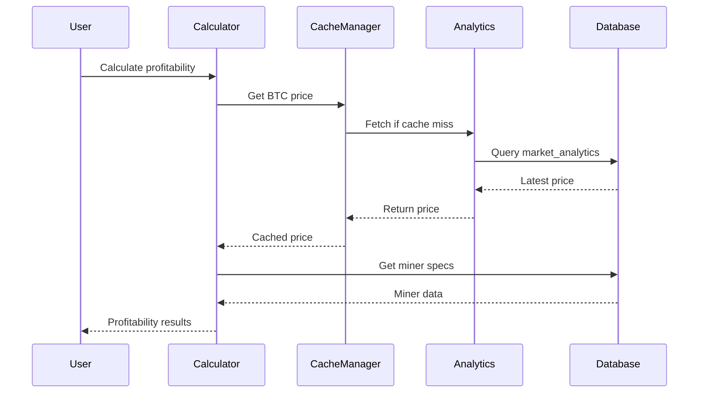
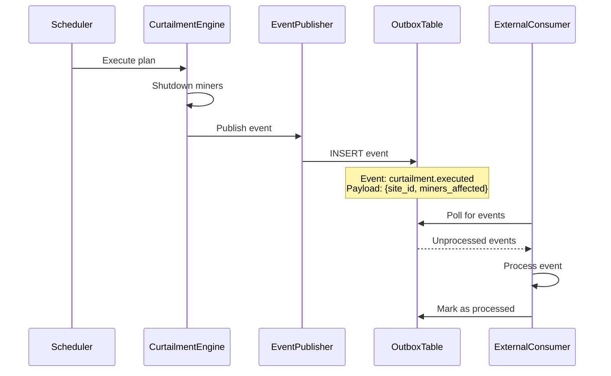
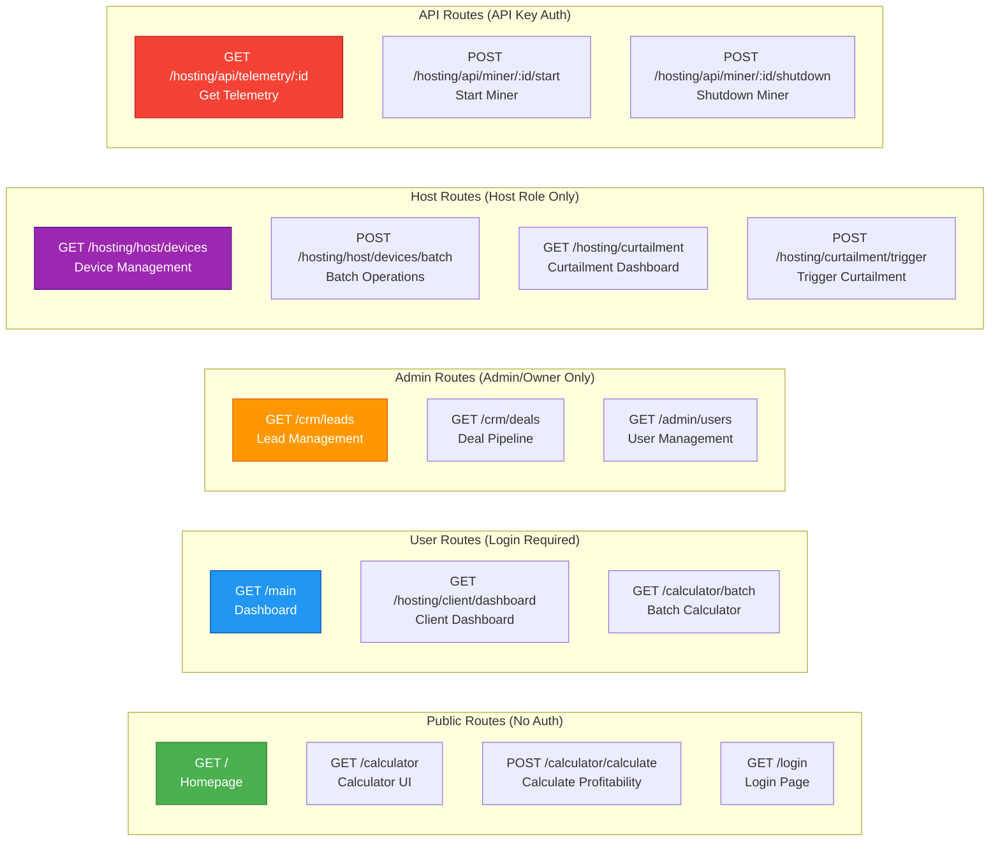
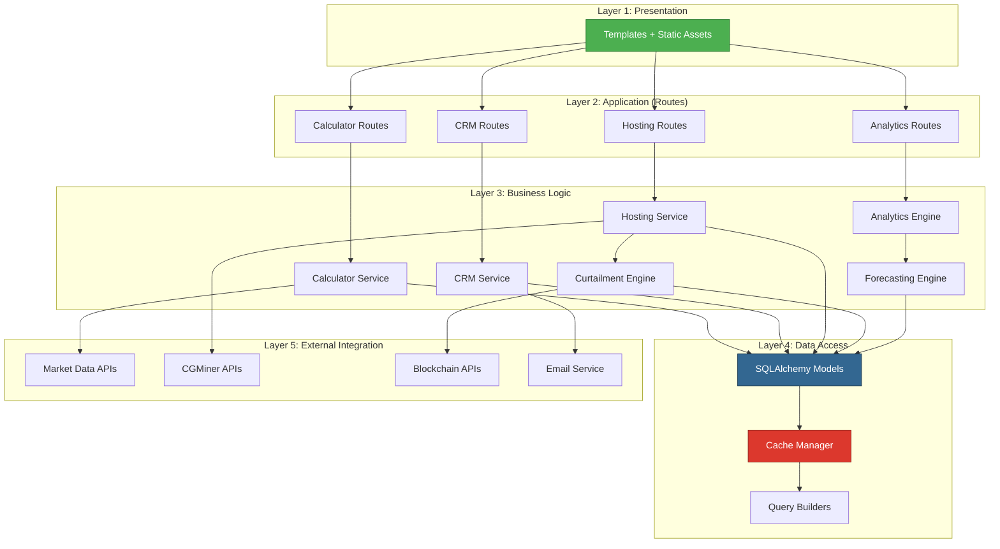
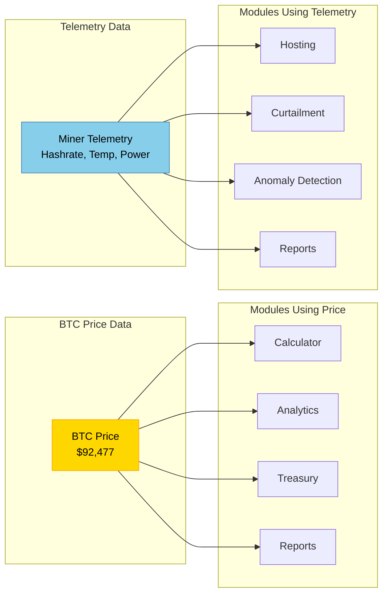

# Module Interaction & Dependencies

## Complete Module Ecosystem

```mermaid
graph TB
    subgraph "User-Facing Modules"
        CALC[🧮 Calculator Module<br/>━━━━━━━━━━━━<br/>Profitability Calculation<br/>Batch Processing<br/>ROI Analysis]
        
        CRM[👥 CRM Module<br/>━━━━━━━━━━━━<br/>Lead Management<br/>Deal Pipeline<br/>Invoice Generation]
        
        HOST[🏭 Hosting Module<br/>━━━━━━━━━━━━<br/>Device Management<br/>Real-time Telemetry<br/>Operations Dashboard]
        
        ANALYTICS[📊 Analytics Module<br/>━━━━━━━━━━━━<br/>Technical Analysis<br/>Market Indicators<br/>Signal Generation]
    end
    
    subgraph "Intelligence Layer"
        CURTAIL[⚡ Curtailment Engine<br/>━━━━━━━━━━━━<br/>Performance Priority<br/>Optimization (PuLP)<br/>Auto Recovery]
        
        FORECAST[🔮 Forecasting Engine<br/>━━━━━━━━━━━━<br/>ARIMA Models<br/>Price Prediction<br/>Difficulty Forecast]
        
        ANOMALY[⚠️ Anomaly Detection<br/>━━━━━━━━━━━━<br/>Outlier Detection<br/>Threshold Alerts<br/>Pattern Recognition]
        
        EVENTS[📡 Event Publisher<br/>━━━━━━━━━━━━<br/>Database Hooks<br/>Outbox Pattern<br/>CDC Integration]
    end
    
    subgraph "Supporting Services"
        TREASURY[💰 Treasury Module<br/>━━━━━━━━━━━━<br/>BTC Inventory<br/>Sell Strategies<br/>Backtesting Engine]
        
        REPORT[📄 Report Generator<br/>━━━━━━━━━━━━<br/>PDF Reports<br/>Excel Exports<br/>PowerPoint Decks]
        
        BILLING[💳 Billing System<br/>━━━━━━━━━━━━<br/>Hosting Fees<br/>Crypto Payments<br/>Invoice Automation]
        
        BLOCKCHAIN_MOD[⛓️ Blockchain Module<br/>━━━━━━━━━━━━<br/>Base L2 Integration<br/>IPFS Storage<br/>Data Verification]
    end
    
    subgraph "Background Services"
        CGMINER_SCHED[⏰ CGMiner Scheduler<br/>━━━━━━━━━━━━<br/>Telemetry Collection<br/>Every 60 seconds<br/>Distributed Lock]
        
        CURTAIL_SCHED[⏰ Curtailment Scheduler<br/>━━━━━━━━━━━━<br/>Plan Execution<br/>Recovery Monitor<br/>Every 60 seconds]
        
        ANALYTICS_SCHED[⏰ Analytics Scheduler<br/>━━━━━━━━━━━━<br/>Market Data Collection<br/>Indicator Calculation<br/>Every 15 minutes]
        
        DATA_COL[📡 Data Collectors<br/>━━━━━━━━━━━━<br/>Multi-threaded<br/>API Aggregation<br/>Parallel Execution]
    end
    
    subgraph "Data Layer"
        DB[(🗄️ PostgreSQL<br/>━━━━━━━━━<br/>15+ Tables<br/>Indexed Queries<br/>Transactions)]
        
        CACHE[(⚡ Redis<br/>━━━━━━━━━<br/>API Cache<br/>Sessions<br/>Job Queue)]
    end
    
    subgraph "Shared Components"
        CACHE_MGR[📦 Cache Manager<br/>━━━━━━━━━━━━<br/>Stale-While-Revalidate<br/>TTL Management<br/>Fallback Strategy]
        
        SECURITY[🔐 Security Manager<br/>━━━━━━━━━━━━<br/>CSRF Protection<br/>Session Handling<br/>RBAC Enforcement]
        
        AUTH[🔑 Auth System<br/>━━━━━━━━━━━━<br/>Email/Password<br/>Web3 Wallet<br/>Email Verification]
    end
    
    %% User Module Dependencies
    CALC --> CACHE_MGR
    CALC --> DB
    CALC --> TREASURY
    CALC --> REPORT
    
    CRM --> DB
    CRM --> BILLING
    CRM --> REPORT
    CRM --> BLOCKCHAIN_MOD
    
    HOST --> DB
    HOST --> CACHE_MGR
    HOST --> CURTAIL
    HOST --> BILLING
    HOST --> REPORT
    HOST --> BLOCKCHAIN_MOD
    
    ANALYTICS --> DB
    ANALYTICS --> CACHE_MGR
    ANALYTICS --> FORECAST
    ANALYTICS --> REPORT
    
    %% Intelligence Dependencies
    CURTAIL --> DB
    CURTAIL --> HOST
    CURTAIL --> EVENTS
    
    FORECAST --> ANALYTICS
    FORECAST --> DB
    
    ANOMALY --> DB
    ANOMALY --> EVENTS
    
    EVENTS --> DB
    EVENTS --> BLOCKCHAIN_MOD
    
    %% Supporting Service Dependencies
    TREASURY --> CALC
    TREASURY --> ANALYTICS
    TREASURY --> DB
    
    REPORT --> CALC
    REPORT --> CRM
    REPORT --> HOST
    REPORT --> ANALYTICS
    REPORT --> DB
    
    BILLING --> HOST
    BILLING --> CRM
    BILLING --> DB
    
    BLOCKCHAIN_MOD --> DB
    
    %% Background Service Dependencies
    CGMINER_SCHED --> DATA_COL
    CGMINER_SCHED --> DB
    CGMINER_SCHED --> CACHE
    CGMINER_SCHED --> ANOMALY
    
    CURTAIL_SCHED --> CURTAIL
    CURTAIL_SCHED --> DB
    
    ANALYTICS_SCHED --> DATA_COL
    ANALYTICS_SCHED --> ANALYTICS
    ANALYTICS_SCHED --> DB
    ANALYTICS_SCHED --> CACHE
    
    DATA_COL --> CACHE_MGR
    DATA_COL --> DB
    
    %% Shared Component Dependencies
    CACHE_MGR --> CACHE
    SECURITY --> DB
    AUTH --> DB
    AUTH --> SECURITY
    
    %% All modules use Auth & Security
    CALC --> AUTH
    CRM --> AUTH
    HOST --> AUTH
    ANALYTICS --> AUTH
    
    CALC --> SECURITY
    CRM --> SECURITY
    HOST --> SECURITY
    ANALYTICS --> SECURITY
    
    style CALC fill:#4CAF50,stroke:#2E7D32,color:#fff
    style CRM fill:#2196F3,stroke:#0D47A1,color:#fff
    style HOST fill:#FF9800,stroke:#E65100,color:#fff
    style ANALYTICS fill:#9C27B0,stroke:#4A148C,color:#fff
    style CURTAIL fill:#F44336,stroke:#b71c1c,color:#fff
    style DB fill:#336791,stroke:#1a3a52,color:#fff
    style CACHE fill:#DC382D,stroke:#8b2119,color:#fff
```

## Module Communication Patterns

### 1. Synchronous Communication (Request/Response)



### 2. Asynchronous Communication (Event-Driven)



## Module Dependency Matrix

| Module | Dependencies | Provides Services To | Database Tables Used |
|--------|--------------|---------------------|---------------------|
| **Calculator** | Cache Manager, Database | Treasury, Report Generator | miner_models, calculation_history |
| **CRM** | Database, Billing | Report Generator, Blockchain | crm_leads, crm_deals, crm_invoices |
| **Hosting** | Cache Manager, Database, Curtailment | Billing, Report, Blockchain | hosting_sites, hosting_miners, miner_telemetry |
| **Analytics** | Cache Manager, Database, Forecasting | Calculator, Report, Treasury | market_analytics, technical_indicators |
| **Curtailment** | Database, Optimization Engine | Hosting | curtailment_plans, curtailment_plan_miners |
| **Forecasting** | Analytics, Database | Curtailment, Treasury | market_analytics |
| **Report Generator** | Calculator, CRM, Hosting, Analytics | End Users | All tables (read-only) |
| **Blockchain** | Database | CRM, Hosting | outbox_events |

## API Endpoint Organization



## Module Layering Architecture



## Cross-Module Data Sharing

### Shared Data Objects



## Module Isolation & Boundaries

- **No Direct Module-to-Module Calls**: Modules communicate via shared services (Cache Manager, Database)
- **Event-Driven for Async**: Use Event Publisher for asynchronous cross-module communication
- **Shared Data Models**: SQLAlchemy models in `models.py` accessible to all modules
- **Service Layer Abstraction**: Business logic encapsulated in service classes
- **API Contracts**: Well-defined API endpoints for external integration
