# Authentication & Authorization Flow Diagrams

## Complete Authentication System

```mermaid
stateDiagram-v2
    [*] --> Unauthenticated
    
    Unauthenticated --> EmailPassword: Enter email + password
    Unauthenticated --> Web3Wallet: Click "Connect Wallet"
    Unauthenticated --> EmailVerification: Click "Login with Email Link"
    
    EmailPassword --> ValidateCredentials
    ValidateCredentials --> CheckPassword
    
    CheckPassword --> CreateSession: ✅ Password valid
    CheckPassword --> Unauthenticated: ❌ Invalid password
    
    Web3Wallet --> RequestWalletConnect
    RequestWalletConnect --> MetaMaskPrompt
    MetaMaskPrompt --> GenerateNonce: Wallet connected
    MetaMaskPrompt --> Unauthenticated: User rejected
    
    GenerateNonce --> SignMessage
    SignMessage --> VerifySignature
    VerifySignature --> CreateSession: ✅ Valid signature
    VerifySignature --> Unauthenticated: ❌ Invalid signature
    
    EmailVerification --> SendMagicLink
    SendMagicLink --> WaitForClick
    WaitForClick --> VerifyToken
    VerifyToken --> CreateSession: ✅ Valid token
    VerifyToken --> Unauthenticated: ❌ Expired/Invalid
    
    CreateSession --> LoadUserData
    LoadUserData --> CheckAccessPeriod
    
    CheckAccessPeriod --> SetSessionVariables: Access valid
    CheckAccessPeriod --> ShowExpiredMessage: Access expired
    
    SetSessionVariables --> Authenticated
    ShowExpiredMessage --> Unauthenticated
    
    Authenticated --> AuthorizeRequest: User makes request
    AuthorizeRequest --> CheckRole
    
    CheckRole --> AllowAccess: Role authorized
    CheckRole --> Deny403: Role not authorized
    
    AllowAccess --> ProcessRequest
    ProcessRequest --> RenderResponse
    RenderResponse --> Authenticated
    
    Deny403 --> ShowUnauthorized
    ShowUnauthorized --> Authenticated
    
    Authenticated --> Logout: Click Logout
    Logout --> ClearSession
    ClearSession --> [*]
```



## 1. Email/Password Authentication Flow

```mermaid
sequenceDiagram
    actor User as 👤 User
    participant Browser as 🌐 Browser
    participant LoginRoute as 📍 /login Route
    participant SecurityMgr as 🔐 Security Manager
    participant Database as 🗄️ Database
    participant Session as 🔑 Session Store
    participant GeoAPI as 🌍 IP-API
    
    User->>Browser: Enter email & password
    Browser->>LoginRoute: POST /login<br/>{email, password, csrf_token}
    
    LoginRoute->>SecurityMgr: validate_csrf_token(csrf_token)
    
    alt CSRF Valid
        SecurityMgr-->>LoginRoute: ✅ Token valid
        
        LoginRoute->>Database: SELECT * FROM users<br/>WHERE email = ?
        Database-->>LoginRoute: User record
        
        LoginRoute->>LoginRoute: verify_password(password, hash)
        Note over LoginRoute: Uses bcrypt.checkpw()<br/>Compare submitted password<br/>with stored hash
        
        alt Password Valid
            LoginRoute-->>LoginRoute: ✅ Password matches
            
            LoginRoute->>Database: SELECT * FROM user_access<br/>WHERE user_id = ?<br/>AND NOW() BETWEEN start AND end
            Database-->>LoginRoute: Access period record
            
            alt Access Valid
                LoginRoute->>Browser: Get client IP
                Browser-->>LoginRoute: IP: 203.0.113.45
                
                LoginRoute->>GeoAPI: GET /json/203.0.113.45
                GeoAPI-->>LoginRoute: {city: "San Francisco", country: "USA"}
                
                LoginRoute->>Database: INSERT INTO login_records<br/>(email, success=TRUE, ip, location)
                
                LoginRoute->>Session: Create session
                Note over Session: session['authenticated'] = True<br/>session['user_id'] = user.id<br/>session['role'] = user.role<br/>session['email'] = user.email<br/>session.permanent = True
                
                Session-->>LoginRoute: Session ID
                
                LoginRoute->>Browser: Set-Cookie: session=...<br/>Redirect to /main
                Browser->>User: ✅ Login successful!<br/>Show dashboard
                
            else Access Expired
                LoginRoute->>Database: INSERT INTO login_records<br/>(email, success=FALSE)
                LoginRoute->>Browser: Error: Access period expired
                Browser->>User: ⚠️ Your access has expired
            end
            
        else Password Invalid
            LoginRoute->>Database: INSERT INTO login_records<br/>(email, success=FALSE, ip, location)
            LoginRoute->>Browser: Error: Invalid credentials
            Browser->>User: ❌ Invalid email or password
        end
        
    else CSRF Invalid
        SecurityMgr-->>LoginRoute: ❌ Invalid token
        LoginRoute->>Browser: 403 Forbidden: CSRF validation failed
        Browser->>User: ⚠️ Security error, please refresh
    end
```



## 2. Web3 Wallet Authentication Flow

```mermaid
sequenceDiagram
    actor User as 👤 User
    participant Browser as 🌐 Browser (JavaScript)
    participant MetaMask as 👛 MetaMask Extension
    participant NonceAPI as 📍 /api/wallet/nonce
    participant LoginAPI as 📍 /api/wallet/login
    participant Web3Utils as ⛓️ Web3.py
    participant Database as 🗄️ Database
    participant Session as 🔑 Session Store
    
    User->>Browser: Click "Connect Wallet"
    Browser->>MetaMask: window.ethereum.request({<br/>method: 'eth_requestAccounts'<br/>})
    
    alt MetaMask Installed
        MetaMask->>User: Popup: "Connect to HashInsight?"
        User->>MetaMask: Click "Connect"
        MetaMask-->>Browser: accounts: ['0x742d35Cc...']
        
        Browser->>NonceAPI: POST /api/wallet/nonce<br/>{wallet_address: '0x742d35Cc...'}
        
        NonceAPI->>Database: SELECT * FROM users<br/>WHERE wallet_address = ?
        
        alt User Exists
            Database-->>NonceAPI: User found
        else New User
            NonceAPI->>Database: INSERT INTO users<br/>(wallet_address, role='user')
            Database-->>NonceAPI: New user created
        end
        
        NonceAPI->>NonceAPI: Generate random nonce
        Note over NonceAPI: nonce = secrets.token_hex(16)<br/>Store in temporary cache
        
        NonceAPI-->>Browser: {nonce: 'a1b2c3d4...'}
        
        Browser->>MetaMask: personal_sign(<br/>"Login to HashInsight: a1b2c3d4...",<br/>'0x742d35Cc...'<br/>)
        
        MetaMask->>User: Popup: "Sign this message"
        User->>MetaMask: Click "Sign"
        MetaMask-->>Browser: signature: '0x8f3e...'
        
        Browser->>LoginAPI: POST /api/wallet/login<br/>{<br/>  wallet_address: '0x742d35Cc...',<br/>  signature: '0x8f3e...',<br/>  nonce: 'a1b2c3d4...'<br/>}
        
        LoginAPI->>Web3Utils: Verify signature
        Note over Web3Utils: message_hash = keccak256(nonce)<br/>recovered_address = ecrecover(signature)<br/>Check: recovered == wallet_address
        
        alt Signature Valid
            Web3Utils-->>LoginAPI: ✅ Signature verified
            
            LoginAPI->>Database: SELECT * FROM users<br/>WHERE wallet_address = ?
            Database-->>LoginAPI: User data
            
            LoginAPI->>Session: Create session
            Note over Session: session['authenticated'] = True<br/>session['user_id'] = user.id<br/>session['role'] = user.role<br/>session['wallet_address'] = wallet_address<br/>session['auth_method'] = 'web3'
            
            Session-->>LoginAPI: Session ID
            
            LoginAPI-->>Browser: {success: true, redirect: '/main'}
            Browser->>User: ✅ Wallet connected!<br/>Redirect to dashboard
            
        else Signature Invalid
            Web3Utils-->>LoginAPI: ❌ Verification failed
            LoginAPI-->>Browser: {error: 'Invalid signature'}
            Browser->>User: ❌ Signature verification failed
        end
        
    else MetaMask Not Installed
        MetaMask-->>Browser: undefined
        Browser->>User: ⚠️ Please install MetaMask
    end
```



## 3. Role-Based Access Control (RBAC)

```mermaid
graph TB
    START([User Request])
    
    START --> CHECK_SESSION{Session<br/>Exists?}
    
    CHECK_SESSION -->|No| REDIRECT_LOGIN[Redirect to /login]
    CHECK_SESSION -->|Yes| GET_ROLE[Get user role from session]
    
    GET_ROLE --> ROLE_SWITCH{User Role}
    
    subgraph "Owner Permissions"
        OWNER[🔑 Owner Role<br/>Full System Access]
        OWNER_ACTIONS[✅ All Routes<br/>✅ Admin Panel<br/>✅ User Management<br/>✅ System Settings<br/>✅ Hosting Operations<br/>✅ CRM Full Access<br/>✅ Financial Reports]
    end
    
    subgraph "Admin Permissions"
        ADMIN[👔 Admin Role<br/>Administrative Access]
        ADMIN_ACTIONS[✅ Most Routes<br/>✅ User Creation<br/>✅ CRM Management<br/>✅ Hosting View<br/>✅ Reports<br/>❌ System Settings<br/>❌ Owner Functions]
    end
    
    subgraph "Host Permissions"
        HOST[🏭 Host Role<br/>Hosting Operations]
        HOST_ACTIONS[✅ Device Management<br/>✅ Curtailment Control<br/>✅ Telemetry View<br/>✅ Operations Dashboard<br/>❌ CRM Access<br/>❌ User Management<br/>❌ Financial Settings]
    end
    
    subgraph "User Permissions"
        USER[👤 User Role<br/>Standard Access]
        USER_ACTIONS[✅ Calculator<br/>✅ Personal Dashboard<br/>✅ Own Profile<br/>✅ Public Reports<br/>❌ CRM<br/>❌ Hosting<br/>❌ Admin Functions]
    end
    
    subgraph "Client Permissions"
        CLIENT[🤝 Client Role<br/>Client Portal]
        CLIENT_ACTIONS[✅ Client Dashboard<br/>✅ Own Miners View<br/>✅ Own Telemetry<br/>✅ Support Tickets<br/>❌ All Other Modules]
    end
    
    subgraph "Guest Permissions"
        GUEST[🌐 Guest Role<br/>Public Access Only]
        GUEST_ACTIONS[✅ Homepage<br/>✅ Calculator<br/>✅ Public Pages<br/>❌ Dashboard<br/>❌ All Other Features]
    end
    
    ROLE_SWITCH -->|owner| OWNER
    ROLE_SWITCH -->|admin| ADMIN
    ROLE_SWITCH -->|host| HOST
    ROLE_SWITCH -->|user| USER
    ROLE_SWITCH -->|client| CLIENT
    ROLE_SWITCH -->|guest| GUEST
    
    OWNER --> OWNER_ACTIONS
    ADMIN --> ADMIN_ACTIONS
    HOST --> HOST_ACTIONS
    USER --> USER_ACTIONS
    CLIENT --> CLIENT_ACTIONS
    GUEST --> GUEST_ACTIONS
    
    OWNER_ACTIONS --> AUTHORIZE{Route<br/>Allowed?}
    ADMIN_ACTIONS --> AUTHORIZE
    HOST_ACTIONS --> AUTHORIZE
    USER_ACTIONS --> AUTHORIZE
    CLIENT_ACTIONS --> AUTHORIZE
    GUEST_ACTIONS --> AUTHORIZE
    
    AUTHORIZE -->|Yes| PROCESS[Process Request]
    AUTHORIZE -->|No| DENY_403[403 Forbidden<br/>Show "Unauthorized"]
    
    PROCESS --> RESPONSE([Return Response])
    
    REDIRECT_LOGIN --> END1([End])
    DENY_403 --> END2([End])
    RESPONSE --> END3([End])
    
    style OWNER fill:#FFD700,stroke:#FFA500,color:#000
    style ADMIN fill:#4CAF50,stroke:#2E7D32,color:#fff
    style HOST fill:#2196F3,stroke:#0D47A1,color:#fff
    style USER fill:#9C27B0,stroke:#4A148C,color:#fff
    style CLIENT fill:#FF9800,stroke:#E65100,color:#fff
    style GUEST fill:#757575,stroke:#424242,color:#fff
```

## 4. Session Management & Security

```mermaid
graph TB
    subgraph "Session Creation"
        LOGIN[User Logs In]
        GEN_SESSION[Generate Session ID<br/>secrets.token_hex(32)]
        STORE_SESSION[Store in Session Store<br/>Redis or Server-side]
        SET_COOKIE[Set HTTP-Only Cookie<br/>SameSite=None<br/>Secure=True]
    end
    
    subgraph "Session Validation"
        REQUEST[Incoming Request]
        READ_COOKIE[Read Session Cookie]
        LOOKUP_SESSION[Lookup in Session Store]
        VALIDATE{Valid &<br/>Not Expired?}
        LOAD_USER[Load User Data<br/>from Session]
        CHECK_ACCESS[Check Access Period<br/>start_date <= NOW <= end_date]
    end
    
    subgraph "Session Security"
        CSRF_GEN[Generate CSRF Token<br/>Per Session]
        CSRF_VALIDATE[Validate on POST/PUT/DELETE]
        ROTATE_SESSION[Rotate Session ID<br/>After Sensitive Actions]
        TIMEOUT[Session Timeout<br/>24 hours]
    end
    
    subgraph "Session Termination"
        LOGOUT[User Clicks Logout]
        CLEAR_SESSION[Clear Session Data]
        DELETE_COOKIE[Delete Cookie]
        REDIRECT_HOME[Redirect to Homepage]
    end
    
    LOGIN --> GEN_SESSION
    GEN_SESSION --> STORE_SESSION
    STORE_SESSION --> SET_COOKIE
    SET_COOKIE --> CSRF_GEN
    
    REQUEST --> READ_COOKIE
    READ_COOKIE --> LOOKUP_SESSION
    LOOKUP_SESSION --> VALIDATE
    VALIDATE -->|Yes| LOAD_USER
    VALIDATE -->|No| REDIRECT_LOGIN[Redirect to Login]
    LOAD_USER --> CHECK_ACCESS
    CHECK_ACCESS -->|Valid| ALLOW_ACCESS[Allow Access]
    CHECK_ACCESS -->|Expired| SHOW_EXPIRED[Show Expired Message]
    
    ALLOW_ACCESS --> CSRF_VALIDATE
    CSRF_VALIDATE --> ROTATE_SESSION
    ROTATE_SESSION --> TIMEOUT
    
    LOGOUT --> CLEAR_SESSION
    CLEAR_SESSION --> DELETE_COOKIE
    DELETE_COOKIE --> REDIRECT_HOME
    
    style LOGIN fill:#4CAF50,stroke:#2E7D32,color:#fff
    style VALIDATE fill:#2196F3,stroke:#0D47A1,color:#fff
    style CSRF_VALIDATE fill:#FF9800,stroke:#E65100,color:#fff
    style LOGOUT fill:#F44336,stroke:#b71c1c,color:#fff
```

## Security Features

### 1. Password Security
- **Algorithm**: Bcrypt with work factor 12
- **Hash Length**: 256 characters
- **Salt**: Automatically generated per password
- **Verification**: Constant-time comparison

### 2. CSRF Protection
- **Token Generation**: `secrets.token_hex(16)` per session
- **Validation**: Required for POST/PUT/DELETE
- **Storage**: Server-side session storage
- **Exception**: `/login` route (iframe compatibility)

### 3. Session Security
- **Cookie Attributes**:
  - `HttpOnly=True` (prevent XSS)
  - `Secure=True` (HTTPS only)
  - `SameSite=None` (iframe support)
- **Session Timeout**: 24 hours
- **Session Rotation**: After role changes

### 4. Web3 Security
- **Nonce**: Random 16-byte hex string
- **Signature Verification**: ECDSA signature recovery
- **Address Verification**: Recovered address must match
- **Replay Protection**: Nonce used only once

## Access Period Management


## Authentication Metrics

| Metric | Value | Notes |
|--------|-------|-------|
| **Session Timeout** | 24 hours | Permanent session |
| **CSRF Token TTL** | Session lifetime | Tied to session |
| **Web3 Nonce TTL** | 5 minutes | Temporary cache |
| **Password Hash Time** | ~100ms | Bcrypt work factor 12 |
| **Login Attempts** | Unlimited | Consider rate limiting |
| **Session Rotation** | After role change | Security best practice |
