# Deployment & Infrastructure Architecture

## 1. Replit Deployment Architecture

```mermaid
graph TB
    subgraph "User Devices"
        DESKTOP[💻 Desktop Browsers<br/>Chrome, Firefox, Safari]
        MOBILE[📱 Mobile Browsers<br/>iOS Safari, Android Chrome]
        WALLET_APP[👛 Web3 Wallets<br/>MetaMask Extension]
    end
    
    subgraph "Replit Platform"
        subgraph "Edge & Load Balancing"
            CDN[🌐 Replit CDN<br/>Static Asset Delivery]
            LB[⚖️ Load Balancer<br/>HTTPS Termination]
        end
        
        subgraph "Application Container"
            GUNICORN[🔧 Gunicorn WSGI Server<br/>━━━━━━━━━━━━━━━━━━<br/>Binding: 0.0.0.0:5000<br/>Workers: 1 (with reload)<br/>Worker Class: sync<br/>Timeout: 120s]
            
            subgraph "Flask Application Instance"
                FLASK_APP[⚙️ Flask App<br/>app.py - 7269 lines]
                BLUEPRINTS[📦 Blueprints<br/>Calculator, CRM, Hosting,<br/>Analytics, Intelligence]
                MIDDLEWARE[🛡️ Security Middleware<br/>CSRF, Session, CORS]
            end
            
            subgraph "Background Services"
                SCHED1[⏰ APScheduler<br/>CGMiner Telemetry<br/>Every 60s]
                SCHED2[⏰ APScheduler<br/>Curtailment Plans<br/>Every 60s]
                SCHED3[⏰ APScheduler<br/>Market Data<br/>Every 15min]
            end
        end
        
        subgraph "Managed Services"
            POSTGRES[(🗄️ PostgreSQL<br/>━━━━━━━━━━━━━━━━━━<br/>Provider: Neon<br/>Connection: DATABASE_URL<br/>Pool Size: 10<br/>Auto-backup: Daily)]
            
            REDIS[(⚡ Redis<br/>━━━━━━━━━━━━━━━━━━<br/>Optional (via REDIS_URL)<br/>Fallback: In-memory SimpleCache)]
        end
        
        subgraph "File System"
            UPLOADS[📁 Uploads Directory<br/>User files, Reports]
            LOGS[📋 Logs Directory<br/>Application logs]
            STATIC[🎨 Static Files<br/>CSS, JS, Images]
        end
    end
    
    subgraph "External Services"
        subgraph "Market Data Providers"
            COINGECKO[📈 CoinGecko API<br/>api.coingecko.com]
            BLOCKCHAIN_INFO[⛓️ Blockchain.info<br/>blockchain.info]
            EXCHANGES[💹 Exchange APIs<br/>Binance, OKX, Deribit, Bybit]
        end
        
        subgraph "Blockchain Networks"
            BASE_L2[⛓️ Base L2 Sepolia<br/>Ethereum L2 Testnet]
            IPFS_SERVICE[📦 IPFS/Pinata<br/>Decentralized Storage]
            ANKR_RPC[🔗 Ankr RPC<br/>Bitcoin Node Access]
        end
        
        subgraph "Communication"
            GMAIL_SMTP[📧 Gmail SMTP<br/>smtp.gmail.com:587<br/>TLS Required]
            IPAPI[🌍 IP-API<br/>Geolocation Service]
        end
        
        subgraph "Mining Hardware"
            FARM1[🏭 Mining Farm 1<br/>HashPower MegaFarm<br/>6000 miners]
            CGMINER_NETWORK[⚙️ CGMiner APIs<br/>TCP Port 4028<br/>JSON-RPC Protocol]
        end
    end
    
    %% User connections
    DESKTOP --> CDN
    MOBILE --> CDN
    WALLET_APP --> LB
    
    CDN --> LB
    LB --> GUNICORN
    
    %% Internal application flow
    GUNICORN --> FLASK_APP
    FLASK_APP --> BLUEPRINTS
    FLASK_APP --> MIDDLEWARE
    
    GUNICORN --> SCHED1
    GUNICORN --> SCHED2
    GUNICORN --> SCHED3
    
    %% Database connections
    FLASK_APP --> POSTGRES
    BLUEPRINTS --> POSTGRES
    SCHED1 --> POSTGRES
    SCHED2 --> POSTGRES
    SCHED3 --> POSTGRES
    
    %% Cache connections
    FLASK_APP --> REDIS
    BLUEPRINTS --> REDIS
    SCHED1 --> REDIS
    SCHED3 --> REDIS
    
    %% File system
    FLASK_APP --> UPLOADS
    FLASK_APP --> LOGS
    FLASK_APP --> STATIC
    CDN --> STATIC
    
    %% External API connections
    SCHED3 --> COINGECKO
    SCHED3 --> BLOCKCHAIN_INFO
    SCHED3 --> EXCHANGES
    
    FLASK_APP --> BASE_L2
    FLASK_APP --> IPFS_SERVICE
    FLASK_APP --> ANKR_RPC
    
    FLASK_APP --> GMAIL_SMTP
    FLASK_APP --> IPAPI
    
    SCHED1 --> FARM1
    FARM1 --> CGMINER_NETWORK
    CGMINER_NETWORK --> SCHED1
    
    style GUNICORN fill:#4CAF50,stroke:#2E7D32,color:#fff
    style POSTGRES fill:#336791,stroke:#1a3a52,color:#fff
    style REDIS fill:#DC382D,stroke:#8b2119,color:#fff
    style FLASK_APP fill:#000000,stroke:#FFFFFF,color:#fff
```

## 2. Network Flow & Security

```mermaid
graph TB
    subgraph "Internet"
        USERS[👥 Users Worldwide]
        BOTS[🤖 API Clients]
    end
    
    subgraph "Replit Edge Network"
        EDGE[🌐 Edge Nodes<br/>Global Distribution]
        WAF[🛡️ Web Application Firewall<br/>DDoS Protection]
        SSL[🔒 SSL/TLS Termination<br/>HTTPS Encryption]
    end
    
    subgraph "Application Layer Security"
        RATE_LIMIT[⏱️ Rate Limiting<br/>Per IP/User]
        AUTH_MW[🔐 Authentication<br/>Session Validation]
        CSRF_MW[🛡️ CSRF Protection<br/>Token Validation]
        RBAC_MW[👮 RBAC Enforcement<br/>Role Checking]
    end
    
    subgraph "Application Processing"
        ROUTE_HANDLER[📍 Route Handler<br/>Flask Blueprint]
        BUSINESS_LOGIC[⚙️ Business Logic<br/>Service Layer]
        DATA_ACCESS[💾 Data Access<br/>SQLAlchemy ORM]
    end
    
    subgraph "Data Layer Security"
        DB_CONN[🔒 Encrypted Connection<br/>SSL/TLS to Database]
        PREPARED_STMT[🛡️ Prepared Statements<br/>SQL Injection Prevention]
        ROW_SECURITY[🔐 Row-Level Security<br/>client_id Filtering]
    end
    
    USERS --> EDGE
    BOTS --> EDGE
    
    EDGE --> WAF
    WAF --> SSL
    SSL --> RATE_LIMIT
    
    RATE_LIMIT --> AUTH_MW
    AUTH_MW --> CSRF_MW
    CSRF_MW --> RBAC_MW
    
    RBAC_MW --> ROUTE_HANDLER
    ROUTE_HANDLER --> BUSINESS_LOGIC
    BUSINESS_LOGIC --> DATA_ACCESS
    
    DATA_ACCESS --> DB_CONN
    DB_CONN --> PREPARED_STMT
    PREPARED_STMT --> ROW_SECURITY
    
    ROW_SECURITY --> DATABASE[(🗄️ PostgreSQL)]
    
    style WAF fill:#F44336,stroke:#b71c1c,color:#fff
    style SSL fill:#4CAF50,stroke:#2E7D32,color:#fff
    style AUTH_MW fill:#2196F3,stroke:#0D47A1,color:#fff
    style DATABASE fill:#336791,stroke:#1a3a52,color:#fff
```



## 3. Scaling & Performance Architecture

```mermaid
graph TB
    subgraph "Request Caching Strategy"
        REQ[Incoming Request]
        L1_CACHE{Redis<br/>Cache Hit?}
        L2_DB{Database<br/>Fresh Data?}
        L3_API{External<br/>API Call}
    end
    
    subgraph "Cache Layers"
        REDIS_CACHE[⚡ Redis Cache<br/>━━━━━━━━━━━━━━━━━━<br/>BTC Price: 5min TTL<br/>Network Stats: 15min TTL<br/>User Sessions: 24h TTL<br/>Query Results: 10min TTL]
        
        APP_CACHE[💾 Application Cache<br/>━━━━━━━━━━━━━━━━━━<br/>Miner Models: 1 day TTL<br/>Config Data: 1 hour TTL<br/>Static Data: Permanent]
    end
    
    subgraph "Database Optimization"
        DB_POOL[🏊 Connection Pool<br/>━━━━━━━━━━━━━━━━━━<br/>Size: 10 connections<br/>Max Overflow: 20<br/>Pre-ping: Enabled<br/>Recycle: 300s]
        
        DB_INDEX[📇 Strategic Indexes<br/>━━━━━━━━━━━━━━━━━━<br/>miner_id + recorded_at<br/>serial_number UNIQUE<br/>email UNIQUE<br/>status + site_id]
        
        DB_QUERY[⚙️ Query Optimization<br/>━━━━━━━━━━━━━━━━━━<br/>Eager Loading (joinedload)<br/>Pagination (limit/offset)<br/>Bulk Operations<br/>SELECT only needed columns]
    end
    
    subgraph "Background Job Optimization"
        DIST_LOCK[🔒 Distributed Locks<br/>━━━━━━━━━━━━━━━━━━<br/>Prevent Duplicate Jobs<br/>Process-based Locking<br/>Heartbeat Monitoring<br/>Auto-expiration]
        
        PARALLEL[🔄 Parallel Execution<br/>━━━━━━━━━━━━━━━━━━<br/>ThreadPoolExecutor<br/>Multi-exchange API calls<br/>Batch CGMiner queries<br/>Max Workers: 4]
    end
    
    REQ --> L1_CACHE
    L1_CACHE -->|HIT| FAST_RESPONSE[⚡ Fast Response<br/>< 50ms]
    L1_CACHE -->|MISS| L2_DB
    L2_DB -->|FOUND| MED_RESPONSE[💾 Medium Response<br/>< 200ms]
    L2_DB -->|MISS| L3_API
    L3_API --> SLOW_RESPONSE[🌐 Slow Response<br/>< 2s]
    
    L1_CACHE --> REDIS_CACHE
    L2_DB --> APP_CACHE
    
    L2_DB --> DB_POOL
    DB_POOL --> DB_INDEX
    DB_INDEX --> DB_QUERY
    
    L3_API --> DIST_LOCK
    L3_API --> PARALLEL
    
    style FAST_RESPONSE fill:#4CAF50,stroke:#2E7D32,color:#fff
    style MED_RESPONSE fill:#FF9800,stroke:#E65100,color:#fff
    style SLOW_RESPONSE fill:#F44336,stroke:#b71c1c,color:#fff
```

## 4. Environment Variables & Configuration

```mermaid
graph TB
    subgraph "Required Environment Variables"
        ENV_DB[DATABASE_URL<br/>PostgreSQL connection string]
        ENV_SESSION[SESSION_SECRET<br/>Flask session encryption key]
    end
    
    subgraph "Optional Environment Variables"
        ENV_REDIS[REDIS_URL<br/>Redis connection<br/>Falls back to in-memory cache]
        
        ENV_API[API Keys<br/>━━━━━━━━━━━━━━━━━━<br/>COINGECKO_API_KEY<br/>OKX_API_KEY<br/>BINANCE_API_KEY<br/>DERIBIT_API_KEY]
        
        ENV_BLOCKCHAIN[Blockchain Config<br/>━━━━━━━━━━━━━━━━━━<br/>BASE_L2_RPC<br/>BLOCKCHAIN_PRIVATE_KEY<br/>PINATA_JWT<br/>BLOCKCHAIN_DISABLE_IPFS]
        
        ENV_EMAIL[Email Config<br/>━━━━━━━━━━━━━━━━━━<br/>GMAIL_USER<br/>GMAIL_PASSWORD]
    end
    
    subgraph "Application Configuration"
        CONFIG_DEV[Development Config<br/>━━━━━━━━━━━━━━━━━━<br/>DEBUG = True<br/>TESTING = False<br/>Log Level = DEBUG]
        
        CONFIG_PROD[Production Config<br/>━━━━━━━━━━━━━━━━━━<br/>DEBUG = False<br/>TESTING = False<br/>Log Level = INFO]
    end
    
    ENV_DB --> CONFIG_DEV
    ENV_SESSION --> CONFIG_DEV
    ENV_REDIS --> CONFIG_DEV
    ENV_API --> CONFIG_DEV
    ENV_BLOCKCHAIN --> CONFIG_DEV
    ENV_EMAIL --> CONFIG_DEV
    
    ENV_DB --> CONFIG_PROD
    ENV_SESSION --> CONFIG_PROD
    ENV_REDIS --> CONFIG_PROD
    ENV_API --> CONFIG_PROD
    ENV_BLOCKCHAIN --> CONFIG_PROD
    ENV_EMAIL --> CONFIG_PROD
    
    CONFIG_DEV --> FLASK_APP_DEV[Flask App - Development]
    CONFIG_PROD --> FLASK_APP_PROD[Flask App - Production]
    
    style ENV_DB fill:#F44336,stroke:#b71c1c,color:#fff
    style ENV_SESSION fill:#F44336,stroke:#b71c1c,color:#fff
    style CONFIG_PROD fill:#4CAF50,stroke:#2E7D32,color:#fff
```



## 5. Monitoring & Observability

```mermaid
graph TB
    subgraph "Application Monitoring"
        APP_LOGS[📋 Application Logs<br/>━━━━━━━━━━━━━━━━━━<br/>Level: DEBUG/INFO/ERROR<br/>Format: Timestamp + Message<br/>Destination: Console + File]
        
        PERF_METRICS[📊 Performance Metrics<br/>━━━━━━━━━━━━━━━━━━<br/>Request Duration<br/>Database Query Time<br/>Cache Hit Rate<br/>API Response Time]
        
        ERROR_TRACKING[⚠️ Error Tracking<br/>━━━━━━━━━━━━━━━━━━<br/>Exception Logging<br/>Stack Traces<br/>Context Data<br/>User Impact]
    end
    
    subgraph "Infrastructure Monitoring"
        DB_HEALTH[💊 Database Health<br/>━━━━━━━━━━━━━━━━━━<br/>Connection Pool Status<br/>Query Performance<br/>Table Sizes<br/>Index Usage]
        
        CACHE_HEALTH[⚡ Cache Health<br/>━━━━━━━━━━━━━━━━━━<br/>Hit/Miss Ratio<br/>Memory Usage<br/>Eviction Rate<br/>Connection Status]
        
        SCHEDULER_HEALTH[⏰ Scheduler Health<br/>━━━━━━━━━━━━━━━━━━<br/>Job Success Rate<br/>Execution Duration<br/>Lock Status<br/>Last Run Time]
    end
    
    subgraph "External Service Monitoring"
        API_HEALTH[🌐 API Health<br/>━━━━━━━━━━━━━━━━━━<br/>Response Time<br/>Error Rate<br/>Rate Limit Usage<br/>Failover Events]
        
        BLOCKCHAIN_HEALTH[⛓️ Blockchain Health<br/>━━━━━━━━━━━━━━━━━━<br/>RPC Connection Status<br/>Transaction Success Rate<br/>IPFS Upload Success<br/>Gas Price Monitoring]
    end
    
    subgraph "Alerting"
        ALERT_CRITICAL[🚨 Critical Alerts<br/>━━━━━━━━━━━━━━━━━━<br/>Database Down<br/>Scheduler Failure<br/>Authentication Issues]
        
        ALERT_WARNING[⚠️ Warning Alerts<br/>━━━━━━━━━━━━━━━━━━<br/>High Response Time<br/>Low Cache Hit Rate<br/>API Rate Limit Near]
    end
    
    APP_LOGS --> ALERT_CRITICAL
    PERF_METRICS --> ALERT_WARNING
    ERROR_TRACKING --> ALERT_CRITICAL
    
    DB_HEALTH --> ALERT_CRITICAL
    CACHE_HEALTH --> ALERT_WARNING
    SCHEDULER_HEALTH --> ALERT_CRITICAL
    
    API_HEALTH --> ALERT_WARNING
    BLOCKCHAIN_HEALTH --> ALERT_WARNING
    
    ALERT_CRITICAL --> NOTIFY[📧 Email Notification<br/>To: Admin/Owner]
    ALERT_WARNING --> LOG_ONLY[📝 Log Only<br/>Review Later]
    
    style ALERT_CRITICAL fill:#F44336,stroke:#b71c1c,color:#fff
    style ALERT_WARNING fill:#FF9800,stroke:#E65100,color:#fff
    style NOTIFY fill:#4CAF50,stroke:#2E7D32,color:#fff
```



## Deployment Specifications

### Application Server

| Component | Configuration | Notes |
|-----------|--------------|-------|
| **WSGI Server** | Gunicorn | Production-grade |
| **Binding** | 0.0.0.0:5000 | Required for Replit |
| **Workers** | 1 (development) | Scale up for production |
| **Worker Class** | sync | Handles blocking operations |
| **Timeout** | 120 seconds | For long-running operations |
| **Reload** | Enabled | Auto-reload on code changes |

### Database Configuration

| Setting | Value | Purpose |
|---------|-------|---------|
| **Provider** | Neon (PostgreSQL) | Serverless PostgreSQL |
| **Connection Pool** | 10 connections | Concurrent request handling |
| **Max Overflow** | 20 connections | Burst capacity |
| **Pool Pre-ping** | Enabled | Verify connection before use |
| **Pool Recycle** | 300 seconds | Prevent stale connections |
| **SSL Mode** | Required | Encrypted connections |

### Resource Limits

| Resource | Development | Production (Recommended) |
|----------|------------|--------------------------|
| **Memory** | 512 MB | 2 GB |
| **CPU** | 0.5 vCPU | 2 vCPU |
| **Storage** | 1 GB | 10 GB |
| **Concurrent Users** | 10 | 100 |
| **Database Connections** | 10 | 50 |
| **Background Workers** | 3 schedulers | 6 schedulers |

## Deployment Checklist

### Pre-Deployment
- [ ] Set all required environment variables
- [ ] Configure SESSION_SECRET (strong random key)
- [ ] Set up DATABASE_URL (PostgreSQL)
- [ ] Configure optional services (Redis, IPFS, etc.)
- [ ] Review and adjust worker count
- [ ] Enable production mode (DEBUG=False)

### Post-Deployment
- [ ] Verify database migrations applied
- [ ] Test authentication flows
- [ ] Check background scheduler status
- [ ] Validate external API connections
- [ ] Monitor initial performance metrics
- [ ] Review error logs
- [ ] Test role-based access control

### Maintenance
- [ ] Weekly log review
- [ ] Monthly performance analysis
- [ ] Quarterly dependency updates
- [ ] Database vacuum and analyze
- [ ] Cache hit rate optimization
- [ ] API rate limit monitoring
