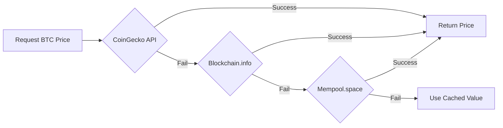

# External Integrations & APIs

> **Audience**: Integration engineers, DevOps, technical leads

## 🔌 Integration Overview

HashInsight Enterprise integrates with **15+ external services** for market data, blockchain functionality, communication, and infrastructure.

```mermaid
graph TB
    subgraph "HashInsight Enterprise"
        APP[Flask Application]
    end
    
    subgraph "Market Data APIs"
        COINGECKO[CoinGecko - Price Data]
        BLOCKCHAIN_INFO[Blockchain.info - Network Stats]
        MEMPOOL[Mempool.space - Difficulty]
        OKX[OKX Exchange API]
        BINANCE[Binance Exchange API]
        DERIBIT[Deribit Options API]
        BYBIT[Bybit Exchange API]
    end
    
    subgraph "Blockchain & Web3"
        BASE_L2[Base L2 Network - Sepolia Testnet]
        ANKR[Ankr RPC - Bitcoin Node]
        IPFS[IPFS via Pinata]
        METAMASK[MetaMask Wallet]
    end
    
    subgraph "Mining Hardware"
        CGMINER[CGMiner API - ASIC Control]
    end
    
    subgraph "Communication"
        GMAIL[Gmail SMTP - Email]
        IPAPI[IP-API - Geolocation]
    end
    
    subgraph "Infrastructure"
        POSTGRES[(Replit PostgreSQL)]
        REDIS[(Redis Cache)]
    end
    
    APP --> COINGECKO
    APP --> BLOCKCHAIN_INFO
    APP --> MEMPOOL
    APP --> OKX
    APP --> BINANCE
    APP --> DERIBIT
    APP --> BYBIT
    
    APP --> BASE_L2
    APP --> ANKR
    APP --> IPFS
    APP --> METAMASK
    
    APP --> CGMINER
    APP --> GMAIL
    APP --> IPAPI
    
    APP --> POSTGRES
    APP --> REDIS
```



## 📊 Market Data Integrations

### 1. CoinGecko API

**Purpose**: Bitcoin price and market data  
**Endpoint**: `https://api.coingecko.com/api/v3`  
**Authentication**: API key (optional, rate limits apply)  
**Rate Limits**: 50 calls/minute (free tier)

#### Endpoints Used

| Endpoint | Purpose | Frequency |
|----------|---------|-----------|
| `/simple/price` | Current BTC price | Every 5 min |
| `/coins/bitcoin/market_chart` | Historical price data | On demand |
| `/coins/bitcoin` | Detailed BTC info | Every 15 min |

#### Implementation

```python
# api/datahub/providers/coingecko.py
class CoinGeckoProvider:
    BASE_URL = "https://api.coingecko.com/api/v3"
    
    def get_btc_price(self):
        try:
            response = requests.get(
                f"{self.BASE_URL}/simple/price",
                params={
                    'ids': 'bitcoin',
                    'vs_currencies': 'usd',
                    'include_24hr_vol': 'true',
                    'include_24hr_change': 'true'
                },
                timeout=10
            )
            response.raise_for_status()
            data = response.json()
            return {
                'price': data['bitcoin']['usd'],
                'volume_24h': data['bitcoin']['usd_24h_vol'],
                'change_24h': data['bitcoin']['usd_24h_change']
            }
        except requests.exceptions.RequestException as e:
            logger.error(f"CoinGecko API failed: {e}")
            return None
```

#### Fallback Strategy



### 2. Blockchain.info API

**Purpose**: Bitcoin network statistics  
**Endpoint**: `https://blockchain.info`  
**Authentication**: None required  
**Rate Limits**: Unlimited (fair use)

#### Endpoints Used

| Endpoint | Purpose | Frequency |
|----------|---------|-----------|
| `/stats` | Network hashrate, difficulty | Every 15 min |
| `/q/getdifficulty` | Current difficulty | Every 15 min |
| `/q/hashrate` | Network hashrate | Every 15 min |

#### Implementation

```python
class BlockchainInfoProvider:
    BASE_URL = "https://blockchain.info"
    
    def get_network_stats(self):
        response = requests.get(f"{self.BASE_URL}/stats")
        data = response.json()
        
        return {
            'hashrate_eh': data['hash_rate'] / 1e18,  # Convert to EH/s
            'difficulty': data['difficulty'],
            'blocks_mined': data['n_blocks_total'],
            'timestamp': data['timestamp']
        }
```

### 3. Mempool.space API

**Purpose**: Bitcoin mempool and block data  
**Endpoint**: `https://mempool.space/api`  
**Authentication**: None required  
**Rate Limits**: None specified

#### Endpoints Used

| Endpoint | Purpose | Frequency |
|----------|---------|-----------|
| `/v1/mining/hashrate/3d` | 3-day average hashrate | Every 15 min |
| `/v1/difficulty-adjustment` | Next difficulty adjustment | Daily |
| `/v1/blocks/tip/height` | Latest block height | Every 10 min |

### 4. Exchange APIs (Multi-Exchange Aggregation)

#### OKX API
**Endpoint**: `https://www.okx.com/api/v5`  
**Authentication**: None for public endpoints  
**Purpose**: Trading volume, order book depth

#### Binance API
**Endpoint**: `https://api.binance.com/api/v3`  
**Authentication**: None for market data  
**Purpose**: Spot market data, trading pairs

#### Deribit API
**Endpoint**: `https://www.deribit.com/api/v2`  
**Authentication**: None for public endpoints  
**Purpose**: Bitcoin options, derivatives data

#### Bybit API
**Endpoint**: `https://api.bybit.com/v5`  
**Authentication**: None for market data  
**Purpose**: Perpetual contracts, trading volume

#### Multi-Exchange Collector

```python
# services/multi_exchange_collector.py
class MultiExchangeCollector:
    def collect_all(self):
        results = {}
        
        # Parallel API calls
        with ThreadPoolExecutor(max_workers=4) as executor:
            futures = {
                'okx': executor.submit(self.collect_okx),
                'binance': executor.submit(self.collect_binance),
                'deribit': executor.submit(self.collect_deribit),
                'bybit': executor.submit(self.collect_bybit)
            }
            
            for exchange, future in futures.items():
                try:
                    results[exchange] = future.result(timeout=10)
                except Exception as e:
                    logger.error(f"{exchange} failed: {e}")
                    results[exchange] = {'volume': 0, 'status': 'failed'}
        
        # Aggregate data
        total_volume = sum(r.get('volume', 0) for r in results.values())
        completeness = sum(1 for r in results.values() if r.get('status') != 'failed') / 4 * 100
        
        return {
            'total_volume': total_volume,
            'completeness': completeness,
            'exchanges': results
        }
```

---

## ⛓️ Blockchain & Web3 Integrations

### 1. Base L2 Network (Sepolia Testnet)

**Purpose**: Blockchain transparency and data verification  
**Network**: Base Sepolia (Ethereum L2)  
**RPC Endpoint**: Custom provider URL  
**Authentication**: Private key (stored securely)

#### Implementation

```python
# blockchain_integration.py
from web3 import Web3

class BlockchainIntegration:
    def __init__(self):
        self.web3 = Web3(Web3.HTTPProvider(os.environ.get('BASE_L2_RPC')))
        self.private_key = os.environ.get('BLOCKCHAIN_PRIVATE_KEY')
        self.account = self.web3.eth.account.from_key(self.private_key)
        
    def sign_data(self, data):
        # Create hash of data
        data_hash = Web3.keccak(text=json.dumps(data))
        
        # Sign with private key
        signed_message = self.account.sign_message(data_hash)
        
        return {
            'signature': signed_message.signature.hex(),
            'message_hash': data_hash.hex(),
            'signer': self.account.address
        }
    
    def verify_signature(self, data, signature):
        data_hash = Web3.keccak(text=json.dumps(data))
        recovered_address = self.web3.eth.account.recover_message(
            data_hash,
            signature=signature
        )
        return recovered_address == self.account.address
```

### 2. IPFS via Pinata

**Purpose**: Decentralized storage for reports and audit trails  
**Endpoint**: `https://api.pinata.cloud`  
**Authentication**: JWT token (PINATA_JWT)  
**Storage Limits**: Based on plan

#### Implementation

```python
class IPFSManager:
    PINATA_API = "https://api.pinata.cloud/pinning/pinJSONToIPFS"
    
    def pin_data(self, data, filename):
        if os.environ.get('BLOCKCHAIN_DISABLE_IPFS') == 'true':
            return None
            
        headers = {
            'Authorization': f'Bearer {os.environ.get("PINATA_JWT")}'
        }
        
        payload = {
            'pinataContent': data,
            'pinataMetadata': {
                'name': filename
            }
        }
        
        response = requests.post(self.PINATA_API, json=payload, headers=headers)
        return response.json()['IpfsHash']
```

### 3. Ankr RPC (Bitcoin Node Access)

**Purpose**: Bitcoin blockchain data via RPC  
**Endpoint**: `https://go.getblock.io/mainnet`  
**Authentication**: API key in URL  
**Rate Limits**: Based on plan

```python
class BitcoinRPCClient:
    def __init__(self):
        self.rpc_url = os.environ.get('ANKR_RPC_URL', 'https://go.getblock.io/mainnet')
    
    def get_blockchain_info(self):
        payload = {
            'jsonrpc': '2.0',
            'method': 'getblockchaininfo',
            'params': [],
            'id': 1
        }
        response = requests.post(self.rpc_url, json=payload)
        return response.json()['result']
```

### 4. MetaMask Wallet Integration

**Purpose**: Web3 wallet authentication  
**Type**: Client-side JavaScript integration  
**Library**: Ethers.js v5.7.2

#### Frontend Implementation

```javascript
// templates/login.html
async function connectWallet() {
    if (typeof window.ethereum === 'undefined') {
        alert('Please install MetaMask');
        return;
    }
    
    // Request account access
    const accounts = await window.ethereum.request({ 
        method: 'eth_requestAccounts' 
    });
    const walletAddress = accounts[0];
    
    // Get nonce from server
    const nonceResponse = await fetch('/api/wallet/nonce', {
        method: 'POST',
        headers: {'Content-Type': 'application/json'},
        body: JSON.stringify({ wallet_address: walletAddress })
    });
    const { nonce } = await nonceResponse.json();
    
    // Sign message
    const message = `Login to HashInsight: ${nonce}`;
    const signature = await window.ethereum.request({
        method: 'personal_sign',
        params: [message, walletAddress]
    });
    
    // Verify signature and login
    const loginResponse = await fetch('/api/wallet/login', {
        method: 'POST',
        headers: {'Content-Type': 'application/json'},
        body: JSON.stringify({ 
            wallet_address: walletAddress,
            signature: signature,
            nonce: nonce
        })
    });
    
    if (loginResponse.ok) {
        window.location.href = '/';
    }
}
```

---

## 🖥️ Mining Hardware Integration

### CGMiner API

**Purpose**: ASIC miner telemetry collection  
**Protocol**: TCP socket connection  
**Default Port**: 4028  
**Format**: JSON RPC

#### API Commands

| Command | Purpose | Response |
|---------|---------|----------|
| `summary` | Overall miner statistics | Hashrate, temp, accepted/rejected shares |
| `devs` | Individual chip/board data | Per-device stats |
| `stats` | Detailed hardware stats | Fan speeds, voltages |
| `pools` | Pool connection status | Pool URLs, user, priority |

#### Implementation

```python
# services/cgminer_collector.py
import socket
import json

class CGMinerClient:
    def get_summary(self, ip, port=4028, timeout=5):
        try:
            # Create TCP socket
            sock = socket.socket(socket.AF_INET, socket.SOCK_STREAM)
            sock.settimeout(timeout)
            sock.connect((ip, port))
            
            # Send command
            command = {'command': 'summary'}
            sock.sendall(json.dumps(command).encode() + b'\n')
            
            # Receive response
            data = b''
            while True:
                chunk = sock.recv(4096)
                if not chunk:
                    break
                data += chunk
            
            sock.close()
            
            # Parse response
            response = json.loads(data.decode())
            summary = response['SUMMARY'][0]
            
            return {
                'hashrate': summary['GHS 5s'] / 1000,  # Convert to TH/s
                'temperature': summary.get('Temperature', 0),
                'power': summary.get('Power', 0),
                'fan_speed': summary.get('Fan Speed', 0),
                'accepted_shares': summary['Accepted'],
                'rejected_shares': summary['Rejected']
            }
            
        except socket.timeout:
            raise ConnectionError(f"Connection timeout: {ip}:{port}")
        except Exception as e:
            raise ConnectionError(f"CGMiner connection failed: {e}")
```

---

## 📧 Communication Integrations

### Gmail SMTP

**Purpose**: Email notifications and reports  
**Server**: `smtp.gmail.com:587`  
**Authentication**: App-specific password  
**TLS**: Required

#### Implementation

```python
import smtplib
from email.mime.text import MIMEText
from email.mime.multipart import MIMEMultipart

class EmailService:
    def send_email(self, to, subject, body):
        msg = MIMEMultipart('alternative')
        msg['From'] = os.environ.get('GMAIL_USER')
        msg['To'] = to
        msg['Subject'] = subject
        
        msg.attach(MIMEText(body, 'html'))
        
        with smtplib.SMTP('smtp.gmail.com', 587) as server:
            server.starttls()
            server.login(
                os.environ.get('GMAIL_USER'),
                os.environ.get('GMAIL_PASSWORD')
            )
            server.send_message(msg)
```

### IP-API (Geolocation)

**Purpose**: User login geolocation  
**Endpoint**: `http://ip-api.com/json/{ip}`  
**Authentication**: None  
**Rate Limits**: 45 requests/minute

```python
def get_location_from_ip(ip_address):
    response = requests.get(f"http://ip-api.com/json/{ip_address}")
    data = response.json()
    
    if data['status'] == 'success':
        return f"{data['city']}, {data['country']}"
    return "Unknown"
```

---

## 🗄️ Infrastructure Integrations

### Replit PostgreSQL

**Connection**: Via `DATABASE_URL` environment variable  
**Provider**: Neon (serverless PostgreSQL)  
**Features**: Automatic backups, connection pooling

### Redis Cache

**Connection**: Via `REDIS_URL` (if available)  
**Fallback**: In-memory SimpleCache  
**Use Cases**: API caching, session storage, job queue

---

## 🔐 API Key Management

### Environment Variables Required

```bash
# Market Data APIs
COINGECKO_API_KEY=optional
OKX_API_KEY=optional (public endpoints)
BINANCE_API_KEY=optional (public endpoints)

# Blockchain
BASE_L2_RPC=your_base_rpc_url
BLOCKCHAIN_PRIVATE_KEY=your_private_key
PINATA_JWT=your_pinata_jwt
BLOCKCHAIN_DISABLE_IPFS=true  # Set to disable IPFS

# Email
GMAIL_USER=your_email@gmail.com
GMAIL_PASSWORD=app_specific_password

# Database
DATABASE_URL=postgresql://...
REDIS_URL=redis://... (optional)

# Infrastructure
SESSION_SECRET=random_secret_key
```

### Security Best Practices

1. **Never commit API keys** to version control
2. **Use environment variables** for all secrets
3. **Rotate keys regularly** (quarterly)
4. **Monitor API usage** for anomalies
5. **Implement rate limiting** on client side

---

## 📊 Integration Health Monitoring

```python
# services/integration_health.py
class IntegrationHealthCheck:
    def check_all(self):
        health = {}
        
        # Check market data APIs
        health['coingecko'] = self._test_api('https://api.coingecko.com/api/v3/ping')
        health['blockchain_info'] = self._test_api('https://blockchain.info/stats')
        
        # Check blockchain
        health['base_l2'] = self._test_blockchain()
        
        # Check database
        health['database'] = self._test_database()
        
        # Check redis
        health['redis'] = self._test_redis()
        
        return health
    
    def _test_api(self, url):
        try:
            response = requests.get(url, timeout=5)
            return {'status': 'healthy', 'response_time': response.elapsed.total_seconds()}
        except Exception as e:
            return {'status': 'unhealthy', 'error': str(e)}
```

---

*For API rate limits and quota management, monitor usage via dashboard at `/admin/integrations`.*
