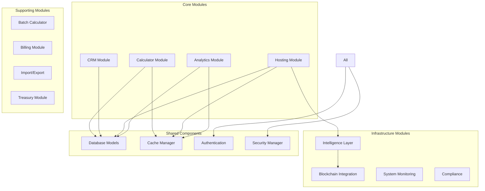
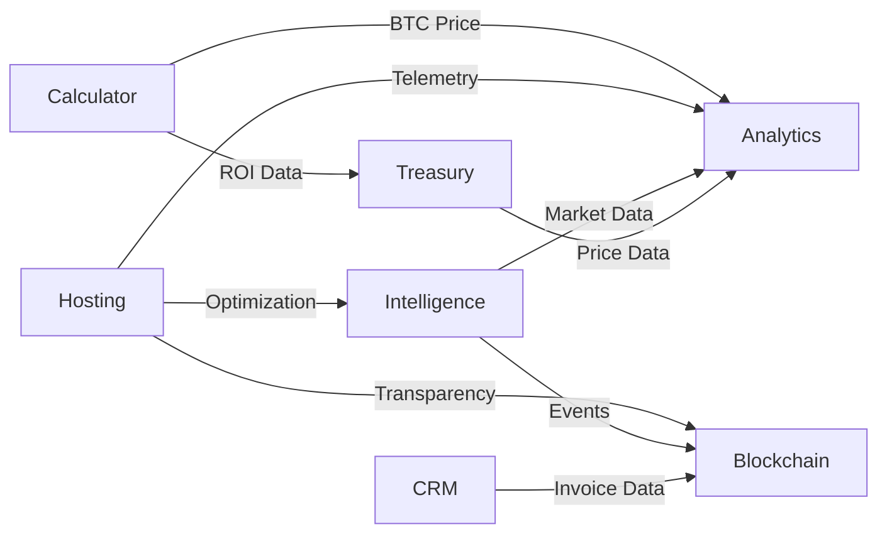

# Module Guide - Complete Module Reference

> **Audience**: Developers, technical leads, integration engineers

## 📦 Module Architecture

HashInsight Enterprise uses a **modular blueprint architecture** where each feature module is self-contained with its own:
- Routes (Flask blueprints)
- Templates
- Business logic
- Database models (shared via `models.py`)
- API endpoints



## 🧮 Module 1: Mining Calculator

**Path**: `modules/calculator/`  
**Blueprint**: `calculator_bp`  
**URL Prefix**: `/calculator`

### Purpose
Calculate Bitcoin mining profitability for 19+ ASIC models with real-time market data.

### Key Features
1. **Single Miner Calculation**
   - Input: Model selection, electricity cost
   - Output: Daily revenue, daily cost, net profit, ROI, break-even time
   
2. **Dual-Algorithm Verification**
   - Primary: CoinGecko + Blockchain.info
   - Fallback: Mempool.space + Ankr RPC
   
3. **Batch Calculation**
   - Process multiple miners simultaneously
   - Export results to Excel/CSV

### API Endpoints

| Method | Endpoint | Description | Auth Required |
|--------|----------|-------------|---------------|
| GET | `/calculator` | Display calculator UI | No |
| POST | `/calculator/calculate` | Calculate profitability | No |
| GET | `/calculator/batch` | Batch calculator UI | Yes |
| POST | `/calculator/batch/calculate` | Batch processing | Yes |

### Data Models Used
- `MinerModel` - ASIC specifications (hashrate, power, efficiency)
- `CalculationHistory` - Store user calculations

### Dependencies
- **External APIs**: CoinGecko, Blockchain.info, Mempool.space
- **Cache**: BTC price (5 min), network difficulty (15 min)
- **Services**: `MiningCalculator` service class

### Code Structure
```python
# modules/calculator/routes.py
@calculator_bp.route('/calculate', methods=['POST'])
def calculate():
    miner_model = request.form.get('miner_model')
    electricity_cost = float(request.form.get('electricity_cost'))
    
    # Fetch real-time data
    btc_price = get_btc_price()  # CoinGecko API
    network_difficulty = get_network_difficulty()  # Blockchain.info
    
    # Get miner specifications
    miner = MinerModel.query.filter_by(name=miner_model).first()
    
    # Calculate profitability
    calculator = MiningCalculator(miner, electricity_cost)
    results = calculator.calculate(btc_price, network_difficulty)
    
    return render_template('calculator/results.html', results=results)
```

### Integration Points
- **Analytics Module**: Shares BTC price data
- **Treasury Module**: Uses profitability calculations for sell strategies
- **Hosting Module**: Calculates expected revenue for hosted miners

---

## 👥 Module 2: CRM (Customer Relationship Management)

**Path**: `modules/crm/`  
**Blueprint**: `crm_bp`  
**URL Prefix**: `/crm`

### Purpose
Complete customer relationship management for mining operations sales.

### Key Features
1. **Lead Management**
   - Lead capture and qualification
   - Status tracking (new → contacted → qualified → converted/lost)
   - Lead scoring
   
2. **Deal Pipeline**
   - Deal stages (discovery → proposal → negotiation → closed)
   - Deal value tracking
   - Win/loss analysis
   
3. **Invoice Generation**
   - Professional invoice creation
   - PDF export
   - Payment tracking
   
4. **Asset Management**
   - Track customer-owned miners
   - Maintenance schedules
   - Performance reports

### API Endpoints

| Method | Endpoint | Description | Auth Required |
|--------|----------|-------------|---------------|
| GET | `/crm/leads` | List all leads | Admin/Owner |
| POST | `/crm/leads/create` | Create new lead | Admin/Owner |
| POST | `/crm/leads/{id}/convert` | Convert to deal | Admin/Owner |
| GET | `/crm/deals` | Deal pipeline view | Admin/Owner |
| POST | `/crm/deals/{id}/update` | Update deal stage | Admin/Owner |
| GET | `/crm/invoices` | Invoice list | Admin/Owner |
| POST | `/crm/invoices/generate` | Generate PDF invoice | Admin/Owner |
| GET | `/crm/dashboard` | CRM KPI dashboard | Admin/Owner |

### Data Models Used
```python
class CRMLead(db.Model):
    id = db.Column(db.Integer, primary_key=True)
    name = db.Column(db.String)
    email = db.Column(db.String)
    company = db.Column(db.String)
    status = db.Column(db.String)  # new, contacted, qualified, converted, lost
    source = db.Column(db.String)  # website, referral, cold_call
    score = db.Column(db.Integer)  # 0-100
    created_at = db.Column(db.DateTime, default=datetime.utcnow)
    
class CRMDeal(db.Model):
    id = db.Column(db.Integer, primary_key=True)
    lead_id = db.Column(db.Integer, db.ForeignKey('crm_leads.id'))
    title = db.Column(db.String)
    value = db.Column(db.Numeric)
    stage = db.Column(db.String)  # discovery, proposal, negotiation, closed_won, closed_lost
    probability = db.Column(db.Integer)  # 0-100%
    expected_close_date = db.Column(db.Date)
    owner_id = db.Column(db.String, db.ForeignKey('users.id'))
    
class CRMInvoice(db.Model):
    id = db.Column(db.Integer, primary_key=True)
    deal_id = db.Column(db.Integer, db.ForeignKey('crm_deals.id'))
    invoice_number = db.Column(db.String, unique=True)
    amount = db.Column(db.Numeric)
    status = db.Column(db.String)  # draft, sent, paid, overdue
    due_date = db.Column(db.Date)
    pdf_path = db.Column(db.String)
```

### Business Logic
```python
# CRM Service
class CRMService:
    def convert_lead_to_deal(self, lead_id, deal_value):
        lead = CRMLead.query.get(lead_id)
        
        # Create deal
        deal = CRMDeal(
            lead_id=lead_id,
            title=f"Deal for {lead.company}",
            value=deal_value,
            stage='discovery',
            probability=20
        )
        db.session.add(deal)
        
        # Update lead status
        lead.status = 'converted'
        
        # Log activity
        activity = CRMActivity(
            deal_id=deal.id,
            type='lead_converted',
            description=f"Lead {lead.name} converted to deal"
        )
        db.session.add(activity)
        
        db.session.commit()
        return deal
```

### Integration Points
- **Billing Module**: Invoice generation and payment tracking
- **Analytics Module**: Sales performance metrics
- **Email Service**: Automated notifications

---

## 🏭 Module 3: Hosting Services

**Path**: `modules/hosting/`  
**Blueprint**: `hosting_bp`  
**URL Prefix**: `/hosting`

### Purpose
Large-scale mining farm management supporting 6000+ miners per site.

### Key Features
1. **Device Management**
   - KPI Dashboard (total miners, active, offline, maintenance)
   - Quick search by serial number
   - Smart pagination (301 pages × 20 miners/page)
   - Batch operations (approve, start, shutdown, delete)
   - Single miner controls
   - Operation audit trail
   
2. **Real-Time Telemetry**
   - CGMiner data collection (every 60s)
   - Performance charts (Chart.js)
   - Efficiency monitoring
   - Temperature alerts
   
3. **Smart Power Curtailment**
   - Manual curtailment triggering
   - Automatic recovery scheduling
   - Performance Priority shutdown strategy
   - ARIMA forecasting for planning
   
4. **Hosting Operations**
   - Client dashboard (view own miners)
   - Ticketing system
   - Billing integration
   - SLA tracking

### API Endpoints

| Method | Endpoint | Description | Auth Required |
|--------|----------|-------------|---------------|
| GET | `/hosting/host/devices` | Device management UI | Host |
| POST | `/hosting/host/devices/batch` | Batch operations | Host |
| GET | `/hosting/miner/{id}/detail` | Miner detail page | Host/Client |
| POST | `/hosting/miner/{id}/start` | Start miner | Host |
| POST | `/hosting/miner/{id}/shutdown` | Shutdown miner | Host |
| GET | `/hosting/curtailment` | Curtailment dashboard | Host |
| POST | `/hosting/curtailment/trigger` | Manual curtailment | Host |
| GET | `/hosting/client/dashboard` | Client view | Client |
| GET | `/hosting/api/telemetry/{miner_id}` | Telemetry API | API Key |

### Data Models Used
```python
class HostingSite(db.Model):
    id = db.Column(db.Integer, primary_key=True)
    name = db.Column(db.String, nullable=False)
    location = db.Column(db.String)
    capacity_mw = db.Column(db.Numeric)
    total_miners = db.Column(db.Integer)
    
class HostingMiner(db.Model):
    id = db.Column(db.Integer, primary_key=True)
    serial_number = db.Column(db.String, unique=True)
    miner_model_id = db.Column(db.Integer, db.ForeignKey('miner_models.id'))
    site_id = db.Column(db.Integer, db.ForeignKey('hosting_sites.id'))
    status = db.Column(db.String)  # active, offline, maintenance, curtailed
    cgminer_ip = db.Column(db.String)
    cgminer_port = db.Column(db.Integer, default=4028)
    client_id = db.Column(db.String, db.ForeignKey('users.id'))
    
class MinerTelemetry(db.Model):
    id = db.Column(db.Integer, primary_key=True)
    miner_id = db.Column(db.Integer, db.ForeignKey('hosting_miners.id'))
    hashrate = db.Column(db.Numeric)  # TH/s
    temperature = db.Column(db.Numeric)  # Celsius
    power_consumption = db.Column(db.Numeric)  # Watts
    fan_speed = db.Column(db.Numeric)  # RPM
    recorded_at = db.Column(db.DateTime, default=datetime.utcnow)
    
class CurtailmentPlan(db.Model):
    id = db.Column(db.Integer, primary_key=True)
    site_id = db.Column(db.Integer, db.ForeignKey('hosting_sites.id'))
    plan_type = db.Column(db.String)  # manual, scheduled, automatic
    target_power_reduction = db.Column(db.Numeric)  # MW
    status = db.Column(db.String)  # pending, approved, executing, executed, cancelled
    scheduled_time = db.Column(db.DateTime)
    executed_at = db.Column(db.DateTime)
    miners_affected = db.Column(db.Integer)
    power_reduced = db.Column(db.Numeric)
```

### Background Services

#### CGMiner Telemetry Collector
```python
# services/cgminer_scheduler.py
class CGMinerSchedulerService:
    def _collect_telemetry_job(self):
        # Acquire distributed lock
        with lock_manager.acquire('cgminer_collector'):
            # Fetch all active miners with CGMiner enabled
            miners = HostingMiner.query.filter_by(
                status='active',
                cgminer_enabled=True
            ).all()
            
            for miner in miners:
                try:
                    # Connect to CGMiner API
                    telemetry = cgminer_client.get_summary(
                        miner.cgminer_ip, 
                        miner.cgminer_port
                    )
                    
                    # Save to database
                    record = MinerTelemetry(
                        miner_id=miner.id,
                        hashrate=telemetry['hashrate'],
                        temperature=telemetry['temp'],
                        power_consumption=telemetry['power'],
                        fan_speed=telemetry['fan_speed']
                    )
                    db.session.add(record)
                    
                except ConnectionError:
                    # Mark miner as offline
                    miner.status = 'offline'
                    self._send_alert(miner)
            
            db.session.commit()
```

#### Smart Curtailment Scheduler
```python
# services/curtailment_scheduler.py
class CurtailmentSchedulerService:
    def _check_pending_plans(self):
        # Find plans ready for execution
        plans = CurtailmentPlan.query.filter_by(
            status='pending'
        ).filter(
            CurtailmentPlan.scheduled_time <= datetime.utcnow()
        ).all()
        
        for plan in plans:
            # Get optimization recommendations
            from intelligence.curtailment_engine import recommend_shutdown
            
            recommendations = recommend_shutdown(
                site_id=plan.site_id,
                target_power_mw=plan.target_power_reduction
            )
            
            # Execute curtailment
            plan.status = 'executing'
            db.session.commit()
            
            for miner_id in recommendations['miners_to_shutdown']:
                self._shutdown_miner(miner_id)
            
            # Update plan
            plan.status = 'executed'
            plan.executed_at = datetime.utcnow()
            plan.miners_affected = len(recommendations['miners_to_shutdown'])
            plan.power_reduced = recommendations['actual_power_reduction']
            db.session.commit()
```

### Integration Points
- **Intelligence Module**: Optimization recommendations
- **Analytics Module**: Performance metrics
- **Billing Module**: Hosting fees calculation
- **Blockchain Module**: Transparency verification

---

## 📊 Module 4: Analytics & Technical Analysis

**Path**: `modules/analytics/`  
**Blueprint**: `analytics_bp`  
**URL Prefix**: `/analytics`

### Purpose
Comprehensive Bitcoin market analysis with 10+ technical indicators.

### Key Features
1. **Price Tracking**
   - Real-time BTC price from multiple exchanges
   - Historical price charts
   - Volume analysis
   
2. **Technical Indicators**
   - RSI (Relative Strength Index)
   - MACD (Moving Average Convergence Divergence)
   - Bollinger Bands
   - EMA/SMA (Exponential/Simple Moving Averages)
   - Stochastic Oscillator
   - ADX (Average Directional Index)
   
3. **Signal Generation**
   - Buy/sell signals
   - Trend detection
   - Support/resistance levels
   
4. **Multi-Exchange Aggregation**
   - Binance, OKX, Deribit, Bybit
   - Aggregate volume tracking
   - Price comparison

### Data Models
```python
class MarketAnalytics(db.Model):
    id = db.Column(db.Integer, primary_key=True)
    btc_price = db.Column(db.Numeric)
    network_hashrate = db.Column(db.Numeric)  # EH/s
    network_difficulty = db.Column(db.Numeric)
    volume_24h = db.Column(db.Numeric)
    created_at = db.Column(db.DateTime, default=datetime.utcnow)
    
class TechnicalIndicators(db.Model):
    id = db.Column(db.Integer, primary_key=True)
    analytics_id = db.Column(db.Integer, db.ForeignKey('market_analytics.id'))
    rsi = db.Column(db.Numeric)
    macd = db.Column(db.Numeric)
    macd_signal = db.Column(db.Numeric)
    bb_upper = db.Column(db.Numeric)
    bb_middle = db.Column(db.Numeric)
    bb_lower = db.Column(db.Numeric)
    ema_12 = db.Column(db.Numeric)
    ema_26 = db.Column(db.Numeric)
    signal = db.Column(db.String)  # BUY, SELL, NEUTRAL
```

### Integration Points
- **Calculator Module**: Uses BTC price
- **Intelligence Module**: Feeds forecasting models
- **Reporting Module**: Data for reports

---

## 🧠 Module 5: Intelligence Layer

**Path**: `intelligence/`  
**Not a Blueprint** - Event-driven service layer

### Purpose
AI-powered optimization, forecasting, and recommendations.

### Key Components

#### 1. Curtailment Engine
**File**: `intelligence/curtailment_engine.py`
```python
def recommend_shutdown(site_id, target_power_mw):
    # Fetch all active miners
    miners = HostingMiner.query.filter_by(
        site_id=site_id,
        status='active'
    ).all()
    
    # Calculate efficiency scores
    for miner in miners:
        latest_telemetry = miner.telemetry[-1]
        miner.efficiency = latest_telemetry.hashrate / latest_telemetry.power_consumption
    
    # Sort by efficiency (worst first)
    miners_sorted = sorted(miners, key=lambda m: m.efficiency)
    
    # Use PuLP for linear programming optimization
    from pulp import *
    
    prob = LpProblem("Curtailment", LpMinimize)
    
    # Decision variables: shutdown[miner_id] = 0 or 1
    shutdown = {m.id: LpVariable(f"shutdown_{m.id}", cat='Binary') for m in miners}
    
    # Objective: minimize hashrate loss
    prob += lpSum([shutdown[m.id] * get_hashrate(m) for m in miners])
    
    # Constraint: meet power reduction target
    prob += lpSum([shutdown[m.id] * get_power(m) for m in miners]) >= target_power_mw * 1000
    
    prob.solve()
    
    return {
        'miners_to_shutdown': [m.id for m in miners if shutdown[m.id].varValue == 1],
        'power_reduction': ...,
        'hashrate_loss': ...
    }
```

#### 2. Forecasting Engine
**File**: `intelligence/forecasting.py`
```python
from statsmodels.tsa.arima.model import ARIMA

def forecast_btc_price(days=30):
    # Load historical price data
    prices = MarketAnalytics.query\
        .order_by(MarketAnalytics.created_at.desc())\
        .limit(90)\
        .all()
    
    price_series = [p.btc_price for p in reversed(prices)]
    
    # Train ARIMA model
    model = ARIMA(price_series, order=(5,1,0))
    model_fit = model.fit()
    
    # Generate forecast
    forecast = model_fit.forecast(steps=days)
    
    return {
        'predictions': forecast.tolist(),
        'confidence_intervals': model_fit.get_forecast(days).conf_int()
    }
```

#### 3. Database Event Hooks
**File**: `intelligence/db_hooks.py`
```python
from sqlalchemy import event

@event.listens_for(HostingMiner, 'after_update')
def on_miner_status_change(mapper, connection, target):
    if target.status == 'offline':
        # Publish event to outbox
        publish_event('miner.offline', {
            'miner_id': target.id,
            'site_id': target.site_id,
            'timestamp': datetime.utcnow().isoformat()
        })
```

### Integration Points
- **Hosting Module**: Provides optimization recommendations
- **Analytics Module**: Consumes market data for forecasting
- **Reporting Module**: Generates AI insights for reports

---

## 🔗 Module Dependencies Matrix



---

*For detailed API specifications, refer to the inline code documentation in each module's `routes.py` file.*
