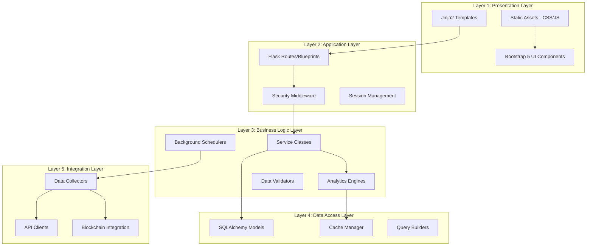
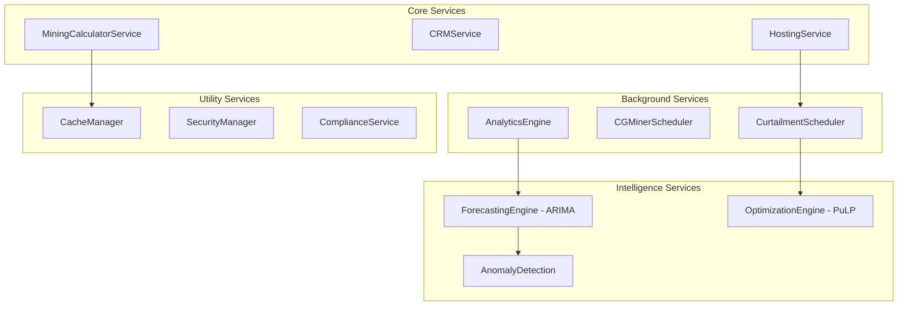
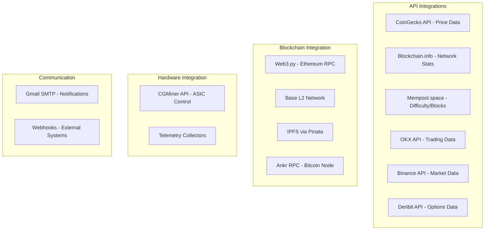
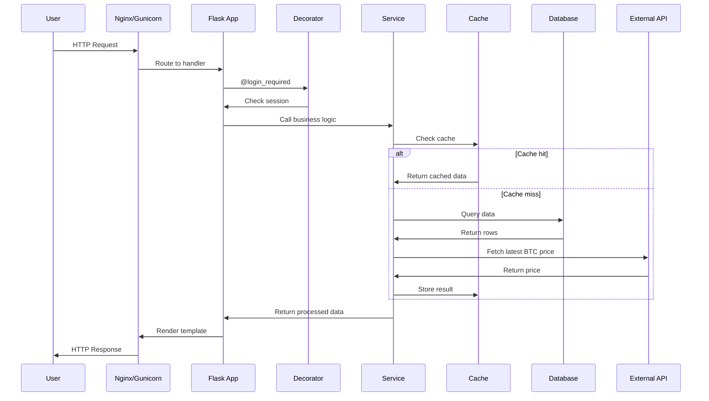
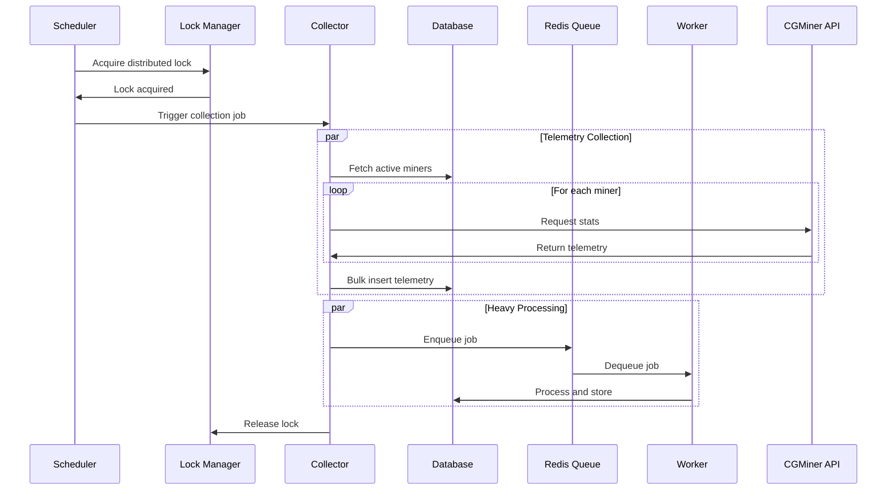
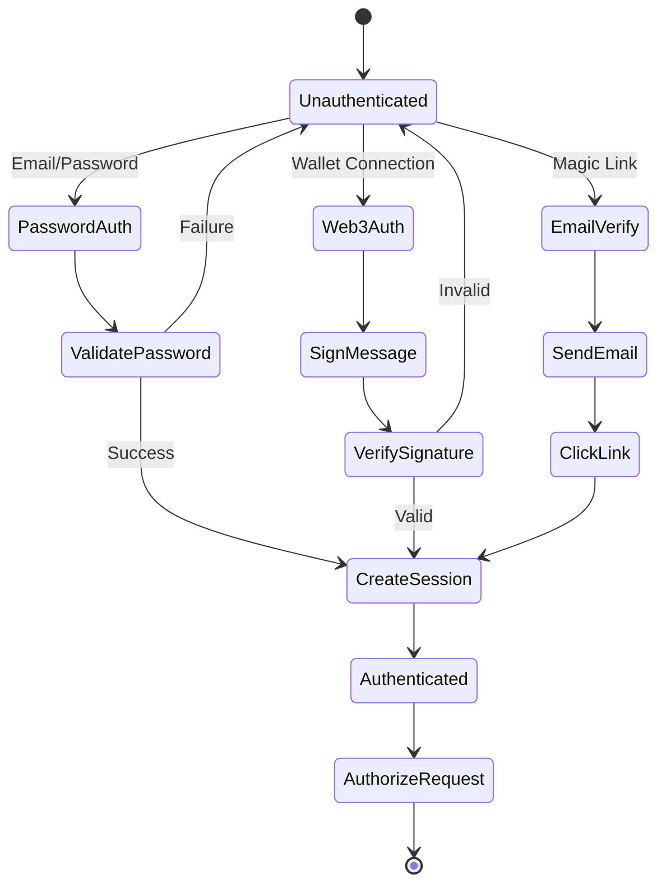
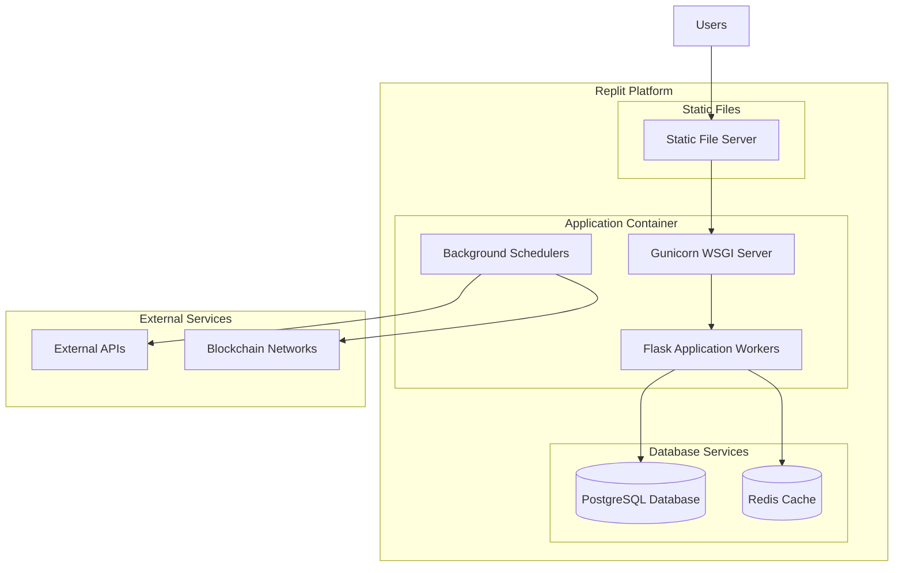

# System Architecture - Technical Deep Dive

> **Audience**: Software architects, senior developers, DevOps engineers

## 📐 Architectural Layers

HashInsight Enterprise follows a **5-layer architecture** pattern for separation of concerns and maintainability.



## 🏗️ Detailed Component Architecture

### 1. Presentation Layer

**Technology**: Jinja2, Bootstrap 5, Chart.js, CountUp.js

**Structure**:
```
templates/
├── base.html               # Base template with common layout
├── login.html             # Authentication pages
├── register.html
├── index.html             # Homepage/dashboard
├── calculator/            # Calculator module templates
│   ├── calculator.html
│   └── batch_calculator.html
├── crm/                   # CRM module templates
│   ├── leads.html
│   ├── deals.html
│   └── invoices.html
├── hosting/               # Hosting module templates
│   ├── miner_management.html
│   ├── miner_detail.html
│   ├── curtailment_dashboard.html
│   └── host_operations.html
└── analytics/             # Analytics templates
    └── technical_analysis.html

static/
├── css/
│   └── custom styles
├── js/
│   ├── chart-config.js
│   └── utilities.js
└── images/
```

**Key Features**:
- **Template inheritance** for DRY principles
- **Component reusability** via includes
- **Context processors** inject global variables
- **Responsive design** with Bootstrap grid
- **Real-time charts** with Chart.js
- **Bilingual support** with translation helpers

### 2. Application Layer

**Technology**: Flask, Flask-SQLAlchemy, Custom Middleware

**Core Files**:
- `app.py` - Main application initialization (7,269 lines)
- `config.py` - Configuration management
- `security_enhancements.py` - Security middleware
- `decorators.py` - Custom decorators (auth, RBAC)

**Architecture**:
```python
# Application initialization flow
app = Flask(__name__)
app.config.from_object(DevelopmentConfig)
db = SQLAlchemy(app)

# Security middleware
@app.before_request
def before_request_handler():
    # Language detection
    # Session initialization
    # Security checks

@app.after_request
def apply_security_headers(response):
    # CORS headers
    # Security headers
    # Session cookie configuration
    
# Context processors
@app.context_processor
def inject_csrf_token():
    return dict(csrf_token=SecurityManager.generate_csrf_token())

@app.context_processor
def inject_translator():
    return dict(t=translate, current_lang=g.language)
```

**Blueprint Registration**:
```python
# Modular blueprint architecture
app.register_blueprint(calculator_bp, url_prefix='/calculator')
app.register_blueprint(crm_bp, url_prefix='/crm')
app.register_blueprint(hosting_bp, url_prefix='/hosting')
app.register_blueprint(analytics_bp, url_prefix='/analytics')
app.register_blueprint(intelligence_bp, url_prefix='/api/intelligence')
```

### 3. Business Logic Layer

**Service-Oriented Architecture**:



**Key Service Classes**:

#### MiningCalculatorService
**File**: Integrated in `app.py`
```python
class MiningCalculator:
    def calculate_profitability(self, model, electricity_cost):
        # Fetch real-time BTC price
        # Get network difficulty
        # Calculate daily revenue
        # Compute electricity cost
        # Return ROI metrics
```

#### CurtailmentSchedulerService
**File**: `services/curtailment_scheduler.py`
```python
class CurtailmentSchedulerService:
    def __init__(self, app):
        self.scheduler = BackgroundScheduler()
        self.lock_manager = SchedulerLock()
        
    def _check_pending_plans(self):
        # Find plans scheduled for execution
        # Apply Performance Priority strategy
        # Execute curtailment via API calls
        # Update plan status
        
    def _check_recovery_plans(self):
        # Find plans due for recovery
        # Power on miners automatically
        # Clear curtailment flags
```

#### AnalyticsEngine
**File**: `modules/analytics/engines/analytics_engine.py`
```python
class AnalyticsEngine:
    def collect_market_data(self):
        # Aggregate from multiple exchanges
        # Calculate technical indicators
        # Store in database
        # Update cache
        
    def generate_signals(self):
        # RSI analysis
        # MACD crossovers
        # Bollinger Band breakouts
        # Aggregate signals
```

#### IntelligenceEngine
**File**: `intelligence/curtailment_engine.py`, `intelligence/forecasting.py`
```python
class CurtailmentEngine:
    def recommend_curtailment(self, site, power_target):
        # Fetch all miners at site
        # Calculate efficiency scores
        # Rank by Performance Priority
        # Return shutdown recommendations
        
class ForecastingEngine:
    def forecast_btc_price(self, days=30):
        # Load historical price data
        # Train ARIMA model
        # Generate predictions
        # Return forecast with confidence intervals
```

### 4. Data Access Layer

**ORM Architecture**:

**File**: `models.py` (comprehensive data models)

```python
# Core Models
class User(db.Model):
    id = db.Column(db.String, primary_key=True)
    email = db.Column(db.String, unique=True, nullable=False)
    password_hash = db.Column(db.String(256))
    role = db.Column(db.String, default='user')
    
class UserAccess(db.Model):
    id = db.Column(db.Integer, primary_key=True)
    user_id = db.Column(db.String, db.ForeignKey('users.id'))
    access_start_date = db.Column(db.DateTime)
    access_end_date = db.Column(db.DateTime)
    
# Hosting Models
class HostingSite(db.Model):
    id = db.Column(db.Integer, primary_key=True)
    name = db.Column(db.String, nullable=False)
    location = db.Column(db.String)
    capacity_mw = db.Column(db.Numeric)
    miners = db.relationship('HostingMiner', backref='site')
    
class HostingMiner(db.Model):
    id = db.Column(db.Integer, primary_key=True)
    serial_number = db.Column(db.String, unique=True)
    miner_model_id = db.Column(db.Integer, db.ForeignKey('miner_models.id'))
    site_id = db.Column(db.Integer, db.ForeignKey('hosting_sites.id'))
    status = db.Column(db.String)  # active, offline, maintenance
    telemetry = db.relationship('MinerTelemetry', backref='miner')
    
class MinerTelemetry(db.Model):
    id = db.Column(db.Integer, primary_key=True)
    miner_id = db.Column(db.Integer, db.ForeignKey('hosting_miners.id'))
    hashrate = db.Column(db.Numeric)
    temperature = db.Column(db.Numeric)
    power_consumption = db.Column(db.Numeric)
    fan_speed = db.Column(db.Numeric)
    recorded_at = db.Column(db.DateTime, default=datetime.utcnow)
    
# CRM Models
class CRMLead(db.Model):
    id = db.Column(db.Integer, primary_key=True)
    name = db.Column(db.String)
    email = db.Column(db.String)
    status = db.Column(db.String)  # new, contacted, qualified, lost
    deals = db.relationship('CRMDeal', backref='lead')
    
# Intelligence Models
class CurtailmentPlan(db.Model):
    id = db.Column(db.Integer, primary_key=True)
    site_id = db.Column(db.Integer, db.ForeignKey('hosting_sites.id'))
    plan_type = db.Column(db.String)  # manual, scheduled, automatic
    target_power_reduction = db.Column(db.Numeric)
    status = db.Column(db.String)  # pending, approved, executed, completed
    created_at = db.Column(db.DateTime, default=datetime.utcnow)
```

**Cache Management**:

**File**: `cache_manager.py`
```python
class CacheManager:
    def __init__(self, backend='simple'):
        if backend == 'redis' and REDIS_URL:
            self.cache = RedisBackend()
        else:
            self.cache = MemoryBackend()
    
    def get(self, key):
        # Retrieve from cache
        # Handle expiration
        
    def set(self, key, value, timeout=300):
        # Store in cache
        # Set TTL
        
    @cached(timeout=900)
    def expensive_operation():
        # This result is cached for 15 minutes
```

**Caching Strategy**:
- **API responses**: 15 minutes TTL
- **BTC price**: 5 minutes TTL
- **User sessions**: 24 hours TTL
- **Query results**: 10 minutes TTL

### 5. Integration Layer



**API Client Architecture**:

**File**: `api/datahub/providers/*.py`
```python
class CoinGeckoProvider:
    BASE_URL = "https://api.coingecko.com/api/v3"
    
    def get_btc_price(self):
        try:
            response = requests.get(f"{self.BASE_URL}/simple/price",
                params={'ids': 'bitcoin', 'vs_currencies': 'usd'})
            return response.json()['bitcoin']['usd']
        except Exception as e:
            # Fallback to secondary source
            return self._fallback_provider()
    
class BlockchainInfoProvider:
    def get_network_hashrate(self):
        # Fetch from blockchain.info API
        # Parse and convert units
        # Return in EH/s
```

**Blockchain Integration**:

**File**: `blockchain_integration.py`
```python
class BlockchainIntegration:
    def __init__(self):
        self.web3 = Web3(Web3.HTTPProvider(BASE_L2_RPC))
        self.encryption_key = self._load_encryption_key()
        
    def sign_hosting_data(self, data):
        # Encrypt sensitive data
        # Create hash of data
        # Sign with private key
        # Upload to IPFS (optional)
        # Record hash on blockchain
        
    def verify_signature(self, data, signature):
        # Verify blockchain signature
        # Check data integrity
```

## 🔄 Request Processing Flow

### Synchronous Request (User-Initiated)



### Asynchronous Processing (Background Jobs)



## 🔐 Security Architecture

### Authentication Flow



### Authorization (RBAC)

**File**: `decorators.py`
```python
def requires_role(allowed_roles):
    def decorator(f):
        @wraps(f)
        def decorated_function(*args, **kwargs):
            if not session.get('authenticated'):
                return redirect(url_for('login'))
            
            user_role = session.get('role', 'guest')
            if user_role not in allowed_roles:
                return render_template('unauthorized.html'), 403
            
            return f(*args, **kwargs)
        return decorated_function
    return decorator

# Usage
@app.route('/admin/users')
@requires_role(['owner', 'admin'])
def admin_users():
    # Only accessible to owners and admins
```

### CSRF Protection

**File**: `security_enhancements.py`
```python
class SecurityManager:
    @staticmethod
    def generate_csrf_token():
        session.permanent = True
        if 'csrf_token' not in session:
            session['csrf_token'] = secrets.token_hex(16)
        return session['csrf_token']
    
    @staticmethod
    def csrf_protect(f):
        @wraps(f)
        def decorated_function(*args, **kwargs):
            if request.method in ['POST', 'PUT', 'DELETE']:
                token = request.form.get('csrf_token') or \
                       request.headers.get('X-CSRF-Token')
                if not token or not SecurityManager.validate_csrf_token(token):
                    abort(403, 'CSRF token validation failed')
            return f(*args, **kwargs)
        return decorated_function
```

## 🚀 Performance Optimization

### Caching Strategy

| Data Type | TTL | Strategy |
|-----------|-----|----------|
| BTC Price | 5 min | Stale-While-Revalidate |
| Network Stats | 15 min | Cache-aside |
| User Sessions | 24 hours | Write-through |
| API Responses | 10 min | Lazy loading |
| Query Results | 15 min | Cache-aside |

### Database Optimization

```python
# Eager loading to prevent N+1 queries
miners = HostingMiner.query\
    .options(joinedload(HostingMiner.model))\
    .options(joinedload(HostingMiner.site))\
    .filter_by(status='active')\
    .all()

# Pagination for large datasets
page = request.args.get('page', 1, type=int)
per_page = 20
miners = HostingMiner.query.paginate(
    page=page, 
    per_page=per_page, 
    error_out=False
)

# Bulk operations
db.session.bulk_insert_mappings(MinerTelemetry, telemetry_records)
db.session.commit()
```

### Background Job Scheduling

**File**: `services/cgminer_scheduler.py`
```python
class CGMinerSchedulerService:
    def __init__(self, app):
        self.scheduler = BackgroundScheduler()
        
        # Every 60 seconds - telemetry collection
        self.scheduler.add_job(
            self._collect_telemetry_job,
            'interval',
            seconds=60,
            id='cgminer_telemetry_collector'
        )
        
        # Every 60 seconds - heartbeat
        self.scheduler.add_job(
            self._heartbeat_task,
            'interval',
            seconds=60,
            id='cgminer_heartbeat'
        )
        
        self.scheduler.start()
```

## 📊 Monitoring & Observability

### Logging Architecture

```python
import logging

# Configure logging
logging.basicConfig(
    level=logging.DEBUG if DEBUG else logging.INFO,
    format='%(asctime)s - %(name)s - %(levelname)s - %(message)s'
)

# Module-specific loggers
logger = logging.getLogger(__name__)

# Usage
logger.info(f"User {user.email} logged in from {ip_address}")
logger.error(f"API request failed: {error_message}")
logger.debug(f"Cache hit rate: {hit_rate}%")
```

### Performance Monitoring

**File**: `performance_monitor.py`
```python
class PerformanceMonitor:
    @staticmethod
    def track_request(route, duration):
        # Log request duration
        # Update metrics
        # Alert if threshold exceeded
```

## 🔄 Deployment Architecture



**Deployment Configuration**:
- **Web Server**: Gunicorn with sync workers
- **Binding**: 0.0.0.0:5000 (required for Replit)
- **Workers**: Single worker with reload enabled (development)
- **Database**: Replit-hosted PostgreSQL via DATABASE_URL
- **Environment**: Nix-based with Python 3.9+

## 📚 Code Organization

```
project_root/
├── app.py                      # Main Flask application (7269 lines)
├── config.py                   # Configuration classes
├── models.py                   # SQLAlchemy models
├── decorators.py               # Custom decorators
├── security_enhancements.py    # Security middleware
├── cache_manager.py            # Caching abstraction
├── blockchain_integration.py   # Web3/blockchain
│
├── modules/                    # Feature modules
│   ├── calculator/
│   │   └── routes.py
│   ├── crm/
│   │   └── routes.py
│   ├── hosting/
│   │   ├── routes.py
│   │   └── models.py
│   └── analytics/
│       ├── routes.py
│       └── engines/
│
├── services/                   # Background services
│   ├── curtailment_scheduler.py
│   ├── cgminer_scheduler.py
│   └── data_collectors_manager.py
│
├── intelligence/               # AI/ML components
│   ├── curtailment_engine.py
│   ├── forecasting.py
│   ├── db_hooks.py
│   └── events.py
│
├── api/                        # External API clients
│   └── datahub/
│       └── providers/
│
├── templates/                  # Jinja2 templates
├── static/                     # Static assets
├── migrations/                 # Database migrations
└── tests/                      # Test suites
```

---

*This technical architecture document provides deep insights into system design. For implementation details, refer to the source code and inline comments.*
