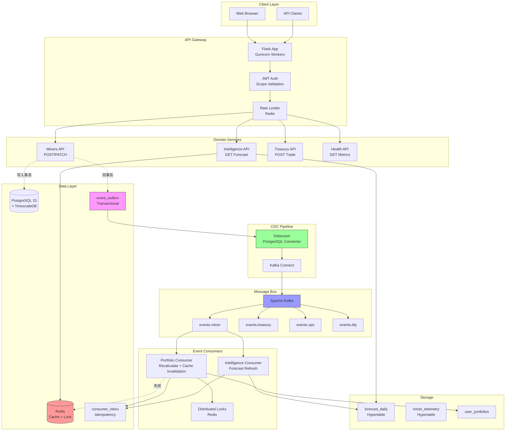
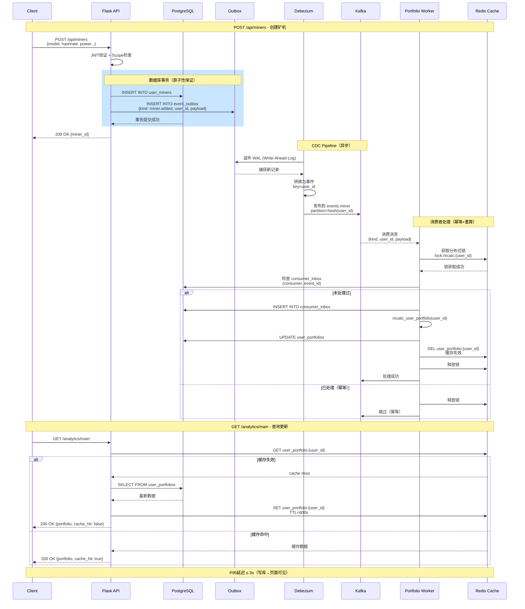
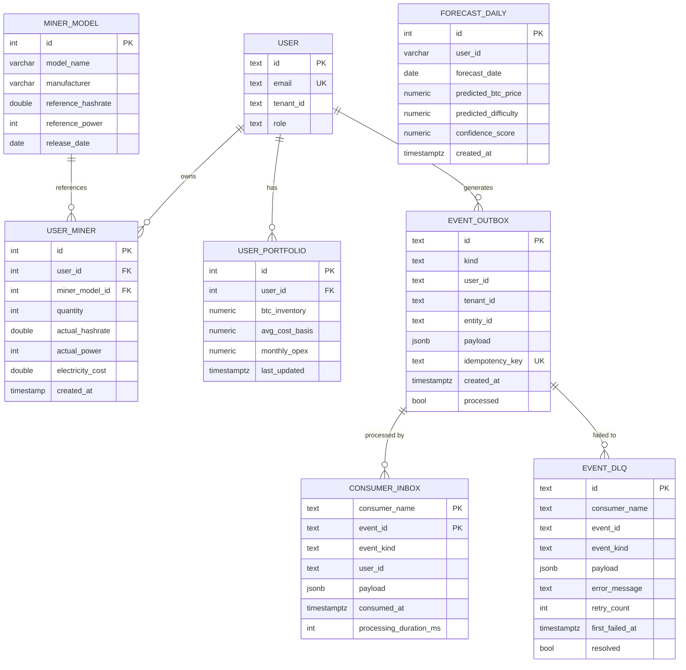

# HashInsight CDC Platform - 架构文档

## 1. 系统拓扑图



## 2. 端到端时序图



## 3. 领域模型ER图



## 4. 核心设计模式

### 4.1 Transactional Outbox模式

**问题**：如何保证数据库写入和事件发布的原子性？

**解决方案**：
1. 业务数据和事件在同一个数据库事务中写入
2. `event_outbox`表作为"发件箱"存储待发布事件
3. Debezium监听PostgreSQL WAL，自动捕获outbox变更
4. 事件通过Kafka发布，无需应用层轮询

**优点**：
- ✅ 原子性保证（事务ACID）
- ✅ 无数据丢失
- ✅ 应用层无需关心消息发送
- ✅ 支持高吞吐（批量捕获）

### 4.2 Inbox幂等模式

**问题**：如何防止消息重复消费？

**解决方案**：
1. `consumer_inbox`表记录已消费事件
2. 复合主键`(consumer_name, event_id)`确保唯一
3. 消费前先检查inbox，已存在则跳过

**优点**：
- ✅ 数据库级别幂等保证
- ✅ 支持多消费者独立去重
- ✅ 可追溯消费历史

### 4.3 分布式锁模式

**问题**：如何防止并发重算冲突？

**解决方案**：
1. Redis `SETNX` 命令实现分布式锁
2. 锁键：`lock:recalc:{user_id}`
3. TTL自动过期防止死锁
4. 获取锁后才执行重算逻辑

### 4.4 SWR缓存模式

**问题**：如何平衡缓存性能和数据新鲜度？

**解决方案**：
1. 先返回缓存数据（Stale）
2. 后台异步刷新（Revalidate）
3. 设置合理TTL（portfolio 600s, forecast 1800s）
4. 事件驱动失效（精准失效）

## 5. 性能指标

| 指标 | 目标 | 监控方式 |
|------|------|---------|
| **写库→可见延迟** | P95 ≤ 3s | `/api/health` 的 `forecast_freshness_sec` |
| **Outbox积压** | < 100 | `/api/health` 的 `outbox_backlog` |
| **消费者延迟** | < 2s | `/api/health` 的 `kafka_consumer_lag` |
| **DLQ失败率** | < 0.1% | `/api/health` 的 `dlq_count` |
| **缓存命中率** | > 80% | `/api/health` 的 `cache_hit_rate` |

## 6. 安全与合规

### 6.1 Row Level Security (RLS)

```sql
-- 多租户隔离
ALTER TABLE user_miners ENABLE ROW LEVEL SECURITY;

CREATE POLICY user_miners_tenant_policy ON user_miners
    FOR ALL
    USING (tenant_id = current_setting('app.tenant_id', true));
```

### 6.2 数据加密

- **传输加密**：TLS 1.3
- **存储加密**：PostgreSQL透明数据加密（TDE）
- **敏感字段**：矿机密码、API密钥使用KMS加密

### 6.3 审计日志

所有写操作自动记录到`audit_logs`表：
- 用户ID、租户ID
- 操作类型（CREATE/UPDATE/DELETE）
- 资源类型和ID
- IP地址、User-Agent
- 时间戳

## 7. 故障处理

### 7.1 DLQ（死信队列）

失败重试机制：
1. 首次失败：立即重试
2. 第2次失败：5秒后重试
3. 第3次失败：写入`event_dlq`表

人工干预：
```bash
# 查看DLQ
SELECT * FROM event_dlq WHERE resolved = false;

# 重放失败事件
python scripts/replay_dlq.py --event-id <id>
```

### 7.2 回溯机制

按时间窗口重放事件：
```bash
# 重放最近1小时的事件
python scripts/replay_events.py --start '2024-01-01 10:00' --end '2024-01-01 11:00'
```

## 8. 扩展性

### 8.1 水平扩展

- **API层**：无状态，可横向扩展
- **Worker层**：Kafka分区机制，增加worker自动负载均衡
- **数据库**：TimescaleDB分布式部署

### 8.2 新增事件类型

1. 在`connectors/outbox-connector.json`添加路由规则
2. 创建新Kafka主题：`events.<domain>`
3. 实现新Worker消费者
4. 更新健康检查指标
