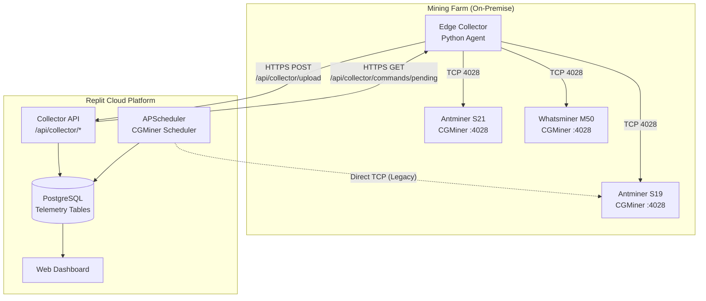
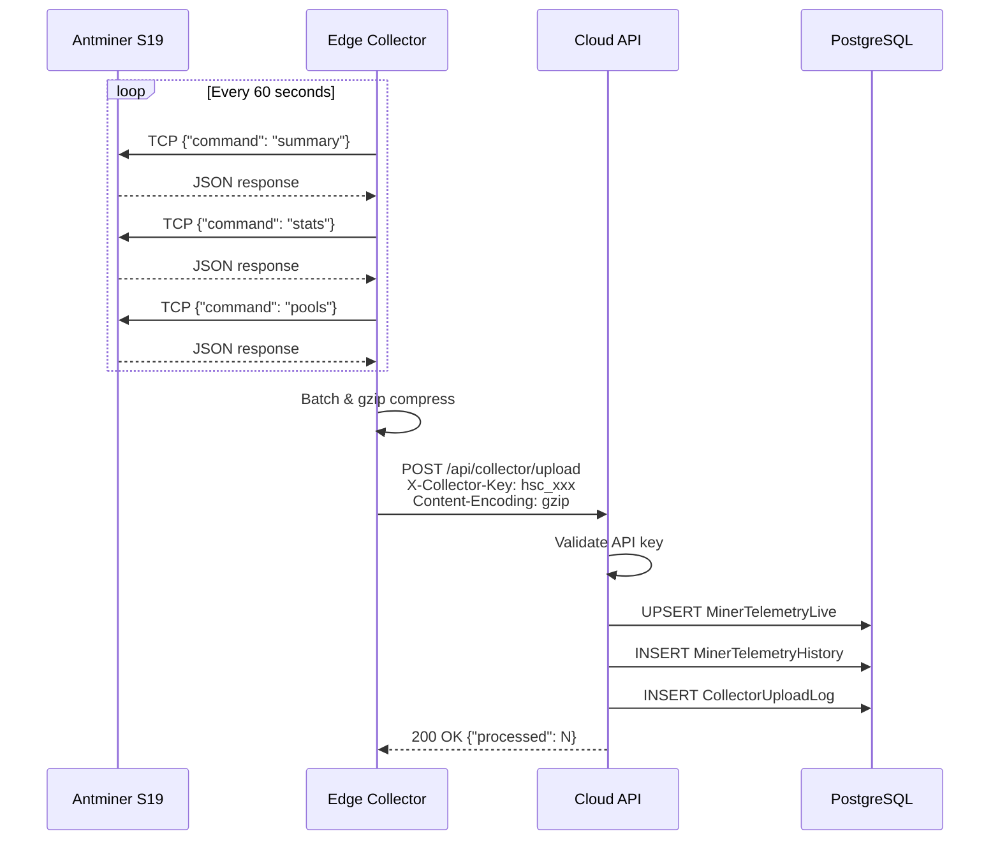
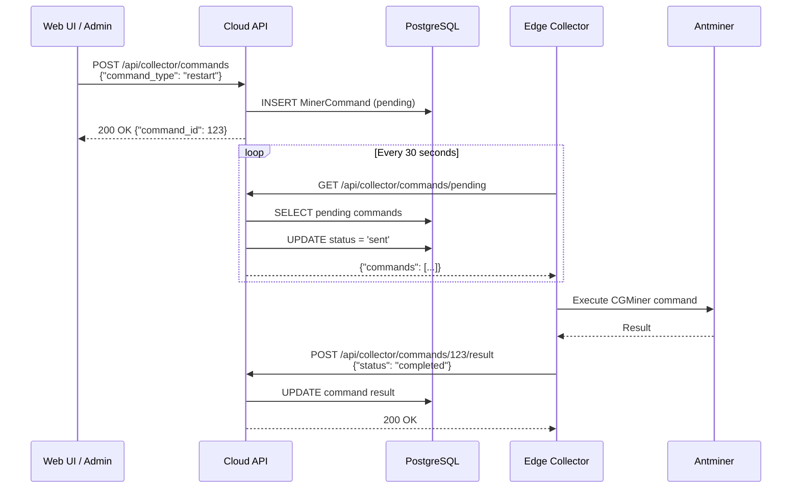
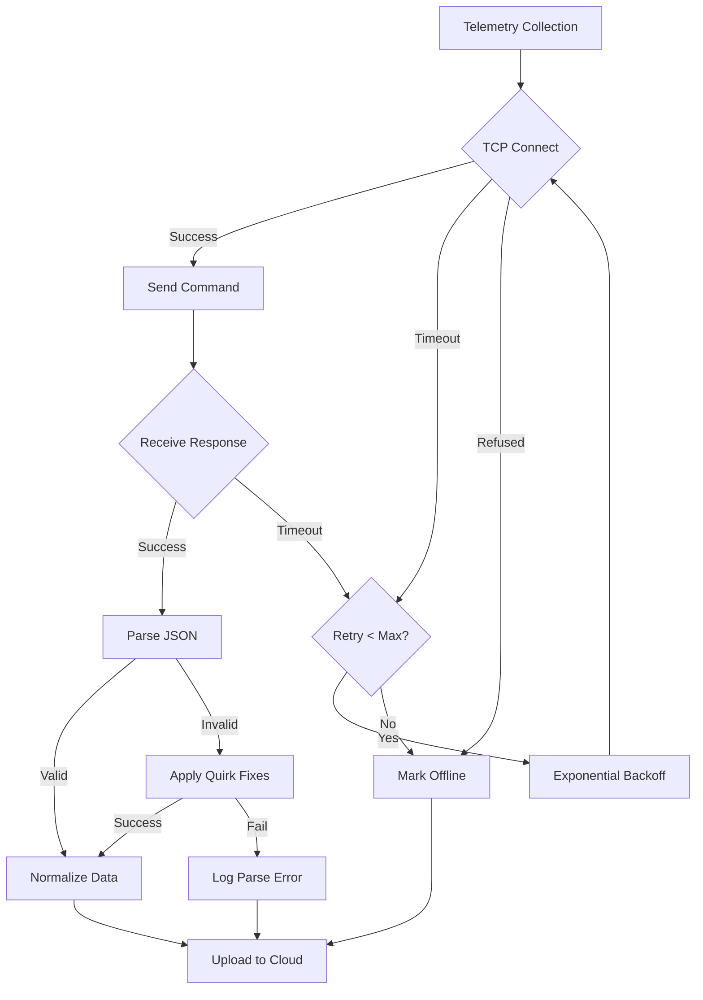
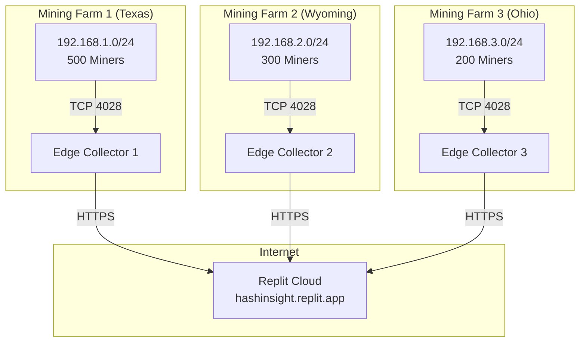

# Phase 2 - End-to-End Telemetry Flow Documentation
# 阶段2 - 端到端遥测流程文档

**Generated**: 2025-12-12  
**Repository**: HashInsight Enterprise - BTC Mining Farm Management Platform

---

## 1. System Overview / 系统概述

The telemetry system consists of two primary collection paths:

1. **Edge Collector Path** (Recommended): On-premise Python agent collects from miners → uploads to cloud
2. **Cloud Direct Path** (Legacy): Cloud scheduler directly polls miners via TCP



---

## 2. Edge Collector Flow / 边缘采集器流程

### 2.1 Telemetry Upload Flow



### 2.2 Command Control Flow (Cloud-to-Edge)



---

## 3. API Contracts / API契约

### 3.1 Telemetry Upload

**Endpoint**: `POST /api/collector/upload`

**Request Headers**:
```http
X-Collector-Key: hsc_xxxxxxxxxxxxxxxxxxxxxxxxxxxxxx
Content-Type: application/json
Content-Encoding: gzip (optional)
```

**Request Body** (JSON array):
```json
[
  {
    "miner_id": "SN123456789",
    "ip_address": "192.168.1.100",
    "online": true,
    "hashrate_ghs": 110000,
    "hashrate_5s_ghs": 108500,
    "hashrate_expected_ghs": 110000,
    "temperature_avg": 65.5,
    "temperature_min": 62.0,
    "temperature_max": 72.0,
    "temperature_chips": [62, 65, 68, 70, 72],
    "fan_speeds": [5200, 5300, 5100, 5250],
    "frequency_avg": 580,
    "accepted_shares": 12500,
    "rejected_shares": 12,
    "hardware_errors": 0,
    "uptime_seconds": 864000,
    "power_consumption": 3250,
    "efficiency": 29.5,
    "pool_url": "stratum+tcp://pool.example.com:3333",
    "worker_name": "farm1.worker001",
    "pool_latency_ms": 45,
    "boards": [
      {"id": 0, "hashrate": 36700, "temp": 65, "chips_ok": 76, "chips_total": 76},
      {"id": 1, "hashrate": 36800, "temp": 67, "chips_ok": 76, "chips_total": 76},
      {"id": 2, "hashrate": 36500, "temp": 68, "chips_ok": 75, "chips_total": 76}
    ],
    "boards_total": 3,
    "boards_healthy": 3,
    "overall_health": "healthy",
    "model": "Antminer S19 Pro",
    "firmware_version": "Vnish 1.2.3",
    "error_message": "",
    "latency_ms": 45
  }
]
```

**Response (200 OK)**:
```json
{
  "success": true,
  "data": {
    "processed": 100,
    "online": 95,
    "offline": 5,
    "processing_time_ms": 245
  }
}
```

**Error Response (401 Unauthorized)**:
```json
{
  "success": false,
  "error": "Invalid API key"
}
```

### 3.2 Fetch Pending Commands

**Endpoint**: `GET /api/collector/commands/pending`

**Request Headers**:
```http
X-Collector-Key: hsc_xxxxxxxxxxxxxxxxxxxxxxxxxxxxxx
```

**Response (200 OK)**:
```json
{
  "success": true,
  "commands": [
    {
      "command_id": 123,
      "miner_id": "SN123456789",
      "ip_address": "192.168.1.100",
      "command": "restart",
      "params": {},
      "priority": 8,
      "expires_at": "2025-12-12T15:30:00"
    }
  ],
  "count": 1
}
```

### 3.3 Report Command Result

**Endpoint**: `POST /api/collector/commands/{command_id}/result`

**Request Headers**:
```http
X-Collector-Key: hsc_xxxxxxxxxxxxxxxxxxxxxxxxxxxxxx
Content-Type: application/json
```

**Request Body**:
```json
{
  "status": "completed",
  "result_code": 0,
  "result_message": "Miner restarted successfully"
}
```

**Response (200 OK)**:
```json
{
  "success": true,
  "message": "Result reported successfully"
}
```

### 3.4 Create Control Command

**Endpoint**: `POST /api/collector/commands`

**Request Body**:
```json
{
  "miner_id": "SN123456789",
  "site_id": 1,
  "ip_address": "192.168.1.100",
  "command_type": "restart",
  "parameters": {},
  "priority": 5,
  "ttl_minutes": 30
}
```

**Valid Command Types**:
| Command | Description EN | Description ZH |
|---------|---------------|----------------|
| `enable` | Enable Mining | 启动挖矿 |
| `disable` | Disable Mining | 停止挖矿 |
| `restart` | Restart Miner | 重启矿机 |
| `reboot` | Reboot System | 重启系统 |
| `set_pool` | Switch Pool | 切换矿池 |
| `set_fan` | Set Fan Speed | 设置风扇 |
| `set_frequency` | Adjust Frequency | 调整频率 |

---

## 4. Data Storage Locations / 数据存储位置

### 4.1 PostgreSQL Tables

| Table | Purpose | Retention |
|-------|---------|-----------|
| `miner_telemetry_live` | Latest miner status snapshot | Single row per miner (upsert) |
| `miner_telemetry_history` | Time-series telemetry data | Configurable (default: 30 days) |
| `collector_keys` | API key hashes for authentication | Permanent |
| `collector_upload_logs` | Audit trail of uploads | 7 days |
| `miner_commands` | Command queue and history | 30 days |

### 4.2 Redis Cache (Optional)

| Key Pattern | Purpose | TTL |
|-------------|---------|-----|
| `telemetry:live:{site_id}` | Cached live telemetry | 60s |
| `telemetry:summary:{site_id}` | Site summary stats | 30s |
| `rate_limit:collector:{key_hash}` | Rate limiting counter | 60s |

---

## 5. CGMiner Client Comparison / CGMiner客户端对比

### 5.1 Client Implementations

| Feature | `services/cgminer_client.py` | `edge_collector/cgminer_client.py` | `tools/test_cgminer.py` |
|---------|------------------------------|-----------------------------------|------------------------|
| **Purpose** | Cloud-side hardened client | Edge collector client | Test utility |
| **Command Whitelist** | ✅ Yes | ❌ No | ❌ No |
| **Input Validation** | ✅ Host/Port | ❌ Basic | ❌ None |
| **Retry with Backoff** | ✅ Exponential + Jitter | ✅ Exponential | ❌ No |
| **Timeout** | ✅ Configurable (5s default) | ✅ Configurable (5s default) | ✅ Basic (10s) |
| **Response Size Limit** | ✅ 1MB | ❌ No | ❌ No |
| **Normalized Output** | ✅ `get_normalized_telemetry()` | ❌ Raw only | ❌ Raw only |
| **Error Types** | ✅ Structured `CGMinerError` | ✅ `CGMinerError` | ❌ Generic Exception |

### 5.2 Recommendation

Use `services/cgminer_client.py` for:
- Cloud-side direct polling (if needed)
- CLI probing tools
- Any security-sensitive operations

Use `edge_collector/cgminer_client.py` for:
- Edge collector deployments (existing usage)

---

## 6. Error Handling Flow / 错误处理流程



---

## 7. Security Considerations / 安全考虑

### 7.1 Authentication

- API keys are hashed with SHA-256 before storage
- Key format: `hsc_{base64_token}` (44 characters)
- Keys are site-scoped (one site per key)

### 7.2 Transport Security

- HTTPS required for cloud endpoints
- gzip compression for large payloads
- No sensitive data in URLs (keys in headers)

### 7.3 Input Validation (Current Gaps)

| Area | Status | Recommendation |
|------|--------|----------------|
| API Key Format | ✅ Validated | - |
| Telemetry Payload Schema | ⚠️ Minimal | Add JSON schema validation |
| Rate Limiting | ❌ None | Add per-key rate limits |
| Payload Size | ⚠️ Only gzip limit | Add explicit size check |

---

## 8. Monitoring & Observability / 监控与可观测性

### 8.1 Current Metrics

- `CollectorUploadLog`: Upload audit with timing
- `MinerCommand.status`: Command execution tracking
- `MinerTelemetryLive.updated_at`: Freshness indicator

### 8.2 Recommended Additions

| Metric | Type | Description |
|--------|------|-------------|
| `collector_upload_total` | Counter | Total uploads by site |
| `collector_upload_latency_ms` | Histogram | Upload processing time |
| `miner_poll_latency_ms` | Histogram | CGMiner TCP latency |
| `miner_poll_errors_total` | Counter | Polling failures by type |
| `command_execution_total` | Counter | Commands by type/status |

---

## 9. UI Integration Points / UI集成点

### 9.1 Dashboard Data Sources

| Widget | Data Source | Refresh |
|--------|------------|---------|
| Miner Count / Status | `GET /api/collector/summary/{site_id}` | 30s |
| Live Miner List | `GET /api/collector/live/{site_id}` | 30s |
| Alert List | `GET /api/collector/alerts` | 60s |
| Collection Stats | `GET /api/collector/stats` | 60s |
| Command History | `GET /api/collector/commands/history` | Manual |

### 9.2 Command Control

| Action | Endpoint | Auth |
|--------|----------|------|
| Create Command | `POST /api/collector/commands` | Session |
| Batch Commands | `POST /api/collector/commands/batch` | Session |
| Cancel Command | `DELETE /api/collector/commands/{id}` | Session |

---

## 10. Deployment Topology / 部署拓扑



---

## 11. Summary / 总结

The HashInsight Enterprise telemetry system provides:

✅ **Scalable Collection**: Edge collectors enable efficient on-premise polling  
✅ **Bidirectional Control**: Cloud-to-edge command queue for remote management  
✅ **Secure Transport**: API key authentication with HTTPS transport  
✅ **Audit Trail**: Complete upload and command logging  
✅ **Hardened Client**: New `services/cgminer_client.py` with security features  

**Remaining Work**:
- Phase 3: Add input validation and rate limiting
- Phase 4: Document reliability patterns and add metrics
