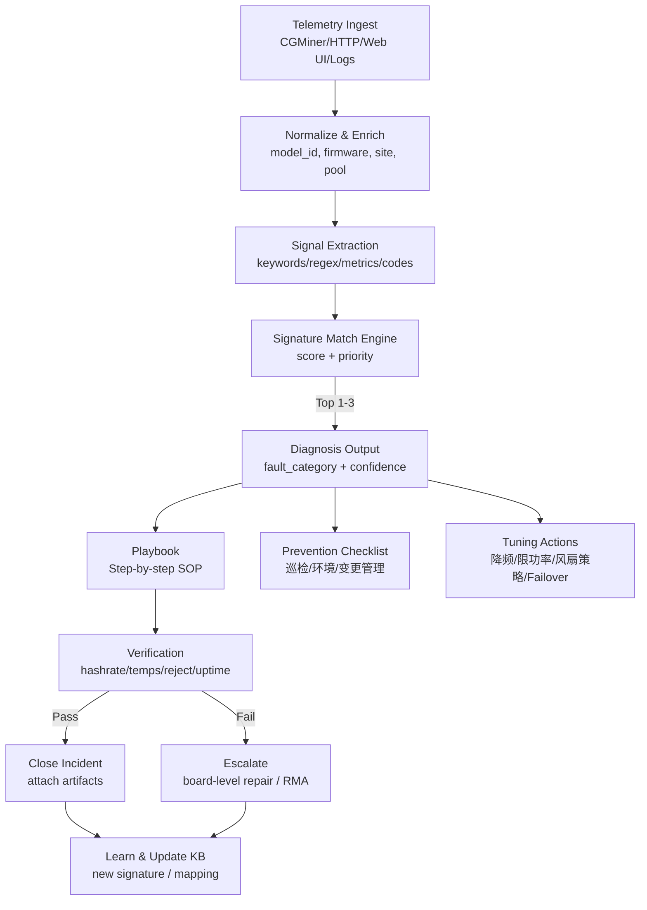

# HashInsight Miner Diagnosis & Playbook Flow (v0.2)

> 目标：你的 App 能做到  
> **“哪台机器有问题 → 报什么错 → 怎样修 → 怎样避免 → 怎样调 setup”**

## 输出给运维人员（建议 UI 结构）
- **Summary**：Machine / Severity / Category / Confidence
- **What happened**：匹配到的日志片段、指标异常（温度、掉链、拒绝率、重启次数…）
- **How to fix (Playbook)**：按步骤展开（带安全提示）
- **How to prevent**：巡检与环境、变更管理建议
- **How to tune setup**：降频/限功率/Failover/NTP-DNS 基线
- **Evidence pack**：截图/日志/测点记录（用于 RCA + 维修交接）
